# 学习图谱一：SGLang 核心链路流程图

这份图谱把已注释的主链路接成一张全景图，再拆成 16 张主要环节图。**先看 F00 确定位置，再沿子图中的方法和源码链接阅读；科普图只辅助看结构，不替代流程。** 与之配套的是[核心概念科普图册](<学习图谱二：SGLang核心概念科普图册.md>)；组批的实体关系与分配顺序单独见[组批请求的数据模型](<思考一：关于组批请求的数据模型.md>)。

## 范围、依据与读图约定

核对版本：当前分支 `learn`，源码 `969b42d3a`；本地主分支与 `origin/main` 均为 `6388b6cfb`。两者共同祖先为 `2380121e9`。学习范围依据 `git diff main...HEAD` 中本分支新增的代码注释和说明材料，流程事实依据当前工作树可执行代码；不是用两端直接相减，把主分支后续的上游代码变化都视作学习内容。本轮开始时工作树干净。

```bash
git merge-base main HEAD
git diff main...HEAD -- python/sglang user_guide_zh docs/learn
```

扫描这批分支差异中的 Markdown，找到 45 份包含 Mermaid 的材料，共 97 个图块。这里重组的是**核心生成链路**：启动与配置 → 请求转换 → 分词与 IPC → 调度组批 → 槽位与缓存 → 前向与采样 → 结果处理 → 文本回包。已有中文注释集中在这些外层衔接和部分预算/缓存方法；模型层内、分配函数、图回放等细节按需补齐，每节注明依据。AI 写过文档、同文件里出现过注释，都不能证明整段实现已经精读。

主路径为普通 Python 文本生成：单 tokenizer worker、一个 TP 组、无流水线并行、无 PD 分离、无投机解码。TP 组可有多个 rank；进程图只展开其代表 Scheduler。启用 Overlap 时看 F14 的时间关系。基础 RadixCache 与 FlashAttention 是 F08/F12 的代表实现；**Qwen 3.5 的混合层按配置使用相应的缓存/状态后端**，不把全部层强行套进普通 MHA 池。分支文章已有素材保留在末尾的扩展入口中。

- 节点写“动作 + 核心对象”；菱形是条件，边上的字说明选择原因。
- `Fxx` 是图索引，不是运行时步骤号。总览是逻辑全景；涉及实际先后的地方由子图展开。
- 请求流、索引映射与 GPU 数据读写是不同关系。每图说明虚线含义，不能把所有箭头都理解为跨进程函数调用。
- 源码链接以本次核对版本为准，代码继续修改后行号可能变化；方法名用于再次定位。

## 统一模块配色

所有流程图均从左向右展开（LR）。同一模块在各图使用固定的浅色底与深色边框；颜色表示节点主要由谁负责，不表示执行先后、进程边界或学习进度。复合动作按主责任模块着色，纯跨图连接使用中性灰，具体分工仍以节点文字与箭头为准。

| 模块 | 固定颜色（填充 / 边框） | 代表对象或职责 |
|---|---|---|
| 启动与配置 | 石板灰蓝 `#E8EDF3` / `#475569` | ServerArgs、Engine 启动编排、就绪等待 |
| API 与协议适配 | 蓝色 `#DBEAFE` / `#1D4ED8` | HTTP、Chat 模板、外部请求与响应格式 |
| TokenizerManager | 青色 `#CFFAFE` / `#0E7490` | 分词、ReqState、请求发送与等待唤醒 |
| Scheduler | 琥珀色 `#FEF3C7` / `#A16207` | 收取请求、选择批次、处理结果与输出 |
| Policy 与 PrefillAdder | 橙色 `#FFEDD5` / `#C2410C` | 排序策略、准入判断与预算记账 |
| Req 与批次描述 | 紫色 `#EDE9FE` / `#7C3AED` | Req、ScheduleBatch、ForwardBatch 的状态与准备 |
| 池与分配器 | 蓝绿色 `#CCFBF1` / `#0F766E` | 请求槽位、KV 位置、分配与释放辅助函数 |
| Radix 前缀缓存 | 绿色 `#DCFCE7` / `#15803D` | 前缀匹配、引用保护、缓存写回与淘汰 |
| Worker 与 ModelRunner | 靛蓝色 `#E0E7FF` / `#4338CA` | 模型加载、执行桥接、Eager 与 CUDA Graph |
| 模型层 | 粉红色 `#FCE7F3` / `#BE185D` | Embedding、Qwen 层、Norm、MLP 与模型内部投影 |
| Attention 后端 | 黄绿色 `#ECFCCB` / `#4D7C0F` | 注意力接口、执行元数据与具体后端 |
| Logits 与 Sampler | 红色 `#FEE2E2` / `#B91C1C` | 候选 token 分数、采样规则与选择结果 |
| FutureMap | 品红色 `#FAE8FF` / `#A21CAF` | 跨轮输入和必要状态的接力 |
| DetokenizerManager | 蓝紫色 `#F3E8FF` / `#6B21A8` | 增量解码、DecodeStatus 与文本批消息 |
| 外部角色与跨图连接 | 中性灰 `#F3F4F6` / `#4B5563` | 客户端、跨图入口与未在本图展开的后续步骤 |

例如，API 构造采样参数仍用 API 色；Scheduler 等待 `copy_done` 仍用 Scheduler 色；`release_kv_cache` 用池与分配器色，`cache_unfinished_req` 用前缀缓存色。TokenizerManager 的 `asyncio.Event` 属于入口等待逻辑，不与 CUDA 事件或 FutureMap 混为一类。

## 图索引

| 图 | 要回答的问题 |
|---|---|
| [F00 全景](#f00) | 一次请求从启动到生成文本，如何串起所有主要实体？ |
| [F01 启动与配置](#f01) | 哪些是进程，何时算就绪，配置在哪个进程生效？ |
| [F02 模型与运行资源](#f02) | 权重、显存池、后端与计算图按什么顺序建立？ |
| [F03 API 适配](#f03) | Chat、原生 HTTP 和 Python API 在哪里汇合？ |
| [F04 分词与通信](#f04) | 请求如何登记、分词、发给 Scheduler，并等到结果？ |
| [F05 本轮批次选择](#f05) | 何时算 Prefill，何时继续 Decode，旧批次如何衔接？ |
| [F06 准入与分块](#f06) | 预算、前缀保护、输入额度如何决定请求能否入批？ |
| [F07 槽位与新编号分配](#f07) | 请求槽位、KV 编号、索引表分别何时取得或写入？ |
| [F08 前缀缓存生命周期](#f08) | 匹配、共享、锁迁移、结束与淘汰怎么连接？ |
| [F09 Decode 与回退](#f09) | 空间不够先淘汰什么，何时回退请求，何时 OOM？ |
| [F10 执行桥接](#f10) | ScheduleBatch 如何交给模型，何时用 Eager/Graph？ |
| [F11 Qwen 3.5 层内](#f11) | 全 Attention 与 GatedDeltaNet 层如何组成文本主干？ |
| [F12 Attention 与 KV](#f12) | 本轮新 K/V 写到哪里，历史 K/V 从哪里读？ |
| [F13 Logits 与采样](#f13) | 隐藏向量如何变成词表分数，再变成 token ID？ |
| [F14 Overlap 与 FutureMap](#f14) | CPU、三条设备流与上一轮结果如何协调？ |
| [F15 结果与结束](#f15) | 哪些 token 被追加，何时释放，何时发送结果？ |
| [F16 增量解码与回包](#f16) | 不完整字符如何处理，等待请求如何被唤醒？ |

## 几个贯穿全篇的核心概念

| 概念 | 准确含义 | 最容易混淆的区别 |
|---|---|---|
| Prefill / Extend | 计算本轮尚未复用的输入后缀，建立相应缓存 | 分块中间结果不是首个可返回的生成 token |
| Decode | 处理上一步输出 token，预测下一个 token | “采样出 token”时，它自己的 K/V 通常还未计算 |
| Req / ReqState / DecodeStatus | 调度请求、入口等待状态、增量解码状态 | 不同进程的对象，通过 rid 对应 |
| ScheduleBatch / ForwardBatch | 面向调度的批、面向模型的批次描述 | 转换不等于重新复制全部数据或首次分配所有张量 |
| 请求槽位 | ReqToTokenPool 索引表的一行 | 不是词表 token ID，也不是 KV 池的位置编号 |
| KV 编号 | 实际 KV 池中的逻辑位置索引 | 分配编号不等于已经计算并写入 K/V |
| 前缀缓存 | token 前缀到可复用缓存位置的索引结构 | 解除引用不等于立即释放缓存，树不承载 K/V 张量 |
| Budget / Allocation | 容量准入估算 / 取得实际位置 | 未入批留队、分配异常、Decode 回退是不同情况 |
| Logits / Sampling | 候选 token 分数 / 按规则选择 token | logits 不是 token ID，也未必是归一化概率 |
| FutureMap | 按请求槽位接力跨轮输入和必要状态 | 不存整段历史 KV；其槽位也不是当前批内顺序 |
| CUDA Graph / Overlap | 复用 GPU 提交图 / 交错 CPU 调度与 GPU 执行 | 不是同一功能，也不缓存模型预测结果 |
| Stream / Event | 有序设备工作队列 / 建立等待依赖的事件 | 设备流不等于 Python 线程，Event 不存文本结果 |


<a id="f00"></a>
## F00 一次推理的全貌

这张图把启动、请求流、调度回路、GPU 计算和回包连在一起。实线表示控制或数据流；虚线表示资源依赖、状态更新或跨轮联系。它是**逻辑全景**：Overlap 的真实 CPU/GPU 先后见 F14，不能把所有箭头当成同步函数调用。

```mermaid
flowchart LR
    subgraph INIT["启动一次：进程、模型和运行资源"]
        ARG["F01 插件与 ServerArgs；发布本进程配置"]
        SPAWN["启动 Scheduler、Detokenizer；初始化主进程 TokenizerManager"]
        LOAD["F02 模型、权重、池、后端与可用计算图就绪"]
        READY["等待子进程就绪；HTTP 服务可接收请求"]
        ARG --> SPAWN --> LOAD --> READY
    end
    CLIENT["客户端请求，或直接调用 Engine"]
    subgraph FRONT["入口主进程：协议适配与请求状态"]
        API["F03 Chat 模板或原生输入 → GenerateReqInput"]
        TOK["F04 登记 rid；复用 input_ids 或分词"]
        SEND["TokenizedGenerateReqInput 经 ZMQ 提交"]
        WAKE["F16 按 rid 唤醒等待协程；封装 SSE 或完整响应"]
        API --> TOK --> SEND
    end
    READY -.-> CLIENT
    CLIENT --> API
    subgraph SCHED["Scheduler：批次选择与请求生命周期"]
        RECV["新请求构造 Req；已有回退 Req 直接加入 waiting_queue"]
        PLAN["F05 暂存未完 chunk；合并上轮可继续的 Prefill 请求"]
        PICK{"本轮能选出 Prefill 批？"}
        ADMIT["F06 排序、前缀匹配、预算判断与引用保护"]
        EXT["F07 请求槽位 → 新 KV 编号 → 写映射；构造 Extend 批"]
        RUN{"没有 Prefill；running_batch 非空？"}
        MEM["F09 过滤结束请求，检查容量；必要时淘汰或回退"]
        DEC["沿用请求槽位；新增 Decode 位置，更新映射与长度"]
        IDLE["无可执行请求：空闲"]
        RESULT["F15 等结果可读；中间 chunk 跳过输出；其余更新 token 与结束状态"]
        CHUNK["未完 chunk：保留进度，下一轮优先续算"]
        CLEAN["结束：缓存可复用前缀、解锁、释放请求槽位"]
        OUT["满足输出间隔或结束：BatchTokenIDOutput"]
        RECV --> PLAN --> ADMIT --> PICK
        PICK -->|"有"| EXT
        PICK -->|"无或推迟 Prefill"| RUN
        RUN -->|"有"| MEM --> LEFT{"过滤和回退后仍有请求？"}
        LEFT -->|"有"| DEC
        LEFT -->|"无"| IDLE
        RUN -->|"无"| IDLE
        MEM -.->|"回退请求重排队"| RECV
        RESULT -->|"输入还未算完"| CHUNK --> PLAN
        RESULT -->|"继续生成"| PLAN
        RESULT -->|"已结束"| CLEAN
        RESULT -->|"未结束且可输出"| OUT
        CLEAN -->|"最后一次输出"| OUT
        CLEAN -.->|"后续批中过滤"| PLAN
    end
    SEND --> RECV
    subgraph GPU["执行组件与设备计算"]
        BRIDGE["F10 输入就绪 → TpModelWorker → ForwardBatch"]
        PATH["ModelRunner 选择可用 Graph 或 Eager 路径"]
        MODEL["F11 模型逐层前向；按层类型调用对应 Attention"]
        ATTN["F12 普通 Attention 读写 KV；线性层走独立状态后端"]
        SAMPLE["F13 hidden_states → logits → 采样 next_token_ids"]
        RELAY["F14 FutureMap 接力下一轮输入；异步拷回 CPU"]
        BRIDGE --> PATH --> MODEL --> SAMPLE --> RELAY
        MODEL -.-> ATTN
    end
    EXT --> BRIDGE
    DEC --> BRIDGE
    RELAY --> RESULT
    RELAY -.->|"下一轮 Decode 输入"| BRIDGE
    subgraph RESOURCE["共享资源：对象和编号与实际数据分开"]
        REQTAB["ReqToTokenPool：请求行 → KV 编号"]
        ALLOC["KV 分配器：管理空闲编号"]
        TREE["F08 前缀缓存：匹配、引用保护、写回与淘汰"]
        KV["设备内存：权重、K/V、线性层状态与工作区"]
        REQTAB -.->|"按编号定位"| KV
        TREE -.->|"缓存索引关联实际数据"| KV
        ALLOC -.->|"管理池中可分配位置"| KV
    end
    ADMIT -.-> TREE
    EXT -.-> REQTAB
    EXT -.-> ALLOC
    MEM -.-> TREE
    CLEAN -.-> TREE
    ATTN -.-> KV
    DETOK["F16 Detokenizer：按 rid 增量解码 → BatchStrOutput"]
    OUT --> DETOK --> WAKE --> RESPONSE["客户端收到文本"]

    classDef startup fill:#E8EDF3,stroke:#475569,color:#111827,stroke-width:2px
    classDef api fill:#DBEAFE,stroke:#1D4ED8,color:#111827,stroke-width:2px
    classDef tokenizer fill:#CFFAFE,stroke:#0E7490,color:#111827,stroke-width:2px
    classDef scheduler fill:#FEF3C7,stroke:#A16207,color:#111827,stroke-width:2px
    classDef policy fill:#FFEDD5,stroke:#C2410C,color:#111827,stroke-width:2px
    classDef batch fill:#EDE9FE,stroke:#7C3AED,color:#111827,stroke-width:2px
    classDef memory fill:#CCFBF1,stroke:#0F766E,color:#111827,stroke-width:2px
    classDef cache fill:#DCFCE7,stroke:#15803D,color:#111827,stroke-width:2px
    classDef runner fill:#E0E7FF,stroke:#4338CA,color:#111827,stroke-width:2px
    classDef model fill:#FCE7F3,stroke:#BE185D,color:#111827,stroke-width:2px
    classDef attention fill:#ECFCCB,stroke:#4D7C0F,color:#111827,stroke-width:2px
    classDef sampling fill:#FEE2E2,stroke:#B91C1C,color:#111827,stroke-width:2px
    classDef relay fill:#FAE8FF,stroke:#A21CAF,color:#111827,stroke-width:2px
    classDef detokenizer fill:#F3E8FF,stroke:#6B21A8,color:#111827,stroke-width:2px
    classDef external fill:#F3F4F6,stroke:#4B5563,color:#111827,stroke-width:2px
    class ARG,SPAWN,READY startup
    class API api
    class TOK,SEND,WAKE tokenizer
    class RECV,PLAN,PICK,RUN,MEM,IDLE,RESULT,CHUNK,OUT,LEFT scheduler
    class ADMIT policy
    class EXT,DEC batch
    class CLEAN,REQTAB,ALLOC,KV memory
    class TREE cache
    class LOAD,BRIDGE,PATH runner
    class MODEL model
    class ATTN attention
    class SAMPLE sampling
    class RELAY relay
    class DETOK detokenizer
    class CLIENT,RESPONSE external
```

总览里的 F 编号对应下面可独立阅读的子图。请求槽位、KV 编号和采样得到的 token ID 是三种不同编号；前缀缓存节点记录索引，实际向量仍由设备内存池保存。F08/F12 以基础 RadixCache 和普通 MHA 为代表；Qwen 3.5 的混合层另见 F11，不把这些代表实现强加给所有模型。

这里的“本轮能选出 Prefill 批”包含配置、容量和队列条件；只有普通生成的最后 Prefill 块才产生可追加的首个输出 token。返回给客户端也受流式/非流式模式和输出间隔控制。

入口依据：[启动](../python/sglang/srt/entrypoints/engine.py#L1051)、[TokenizerManager](../python/sglang/srt/managers/tokenizer_manager.py#L845)、[调度](../python/sglang/srt/managers/scheduler.py#L3275)、[执行](../python/sglang/srt/managers/scheduler.py#L3995)、[结果](../python/sglang/srt/managers/scheduler_components/batch_result_processor.py#L240)、[增量解码](../python/sglang/srt/managers/detokenizer_manager.py#L360)。

<a id="f01"></a>

## F01 启动、配置与进程就绪

范围：普通 Python HTTP 路径、node 0、单 tokenizer worker。实线表示各链路的执行顺序，虚线表示启动子进程或报告就绪；子进程初始化可以与父进程后续工作并行。

<!-- mermaid:id=f01 -->
```mermaid
flowchart LR
    CLI["CLI：插件与原始 ServerArgs"] --> RUN["run_server：解析并选择服务路径"]
    RUN --> HTTP["HTTP launch_server"]
    HTTP --> ENG["Engine._launch_subprocesses"]
    ENG --> CFG["检查配置并 publish 本进程上下文"]
    CFG --> PORT["PortArgs：建立通信地址约定"]
    PORT --> LS["发起 Scheduler 子进程启动"]
    LS --> LD["发起 Detokenizer 子进程启动"]
    LD --> TM["主进程初始化 TokenizerManager 与模板"]
    TM --> WAIT["wait_for_ready：等待 Scheduler 就绪"]
    LS -.-> SI["Scheduler 初始化：模型、池与执行后端"]
    SI --> READY["Scheduler 报告 ready 并进入事件循环"]
    READY -.-> WAIT
    LD -.-> DI["Detokenizer 初始化并等待输出消息"]
    WAIT --> INFO["同步输入长度上限并启动进程监控"]
    INFO --> SERVER["设置 HTTP 全局组件并启动服务器"]
    SERVER --> LIFE["lifespan：初始化 API 处理器"]
    LIFE --> WARM["启动预热线程并进入 HTTP 服务"]
    WARM --> SERVE["预热完成后报告可服务"]

    classDef startup fill:#E8EDF3,stroke:#475569,color:#111827,stroke-width:2px
    classDef api fill:#DBEAFE,stroke:#1D4ED8,color:#111827,stroke-width:2px
    classDef tokenizer fill:#CFFAFE,stroke:#0E7490,color:#111827,stroke-width:2px
    classDef scheduler fill:#FEF3C7,stroke:#A16207,color:#111827,stroke-width:2px
    classDef detokenizer fill:#F3E8FF,stroke:#6B21A8,color:#111827,stroke-width:2px
    class CLI,RUN,ENG,CFG,PORT,LS,LD,WAIT,INFO startup
    class HTTP,SERVER,LIFE,WARM,SERVE api
    class TM tokenizer
    class SI,READY scheduler
    class DI detokenizer
```

- **ServerArgs 与 RuntimeContext**：前者承载启动配置；`publish()` 把配置投影到当前 OS 进程的上下文。其他进程拥有自己的上下文，不是共享同一个 Python 全局变量。
- **PortArgs**：约定各组件收发消息使用的地址。地址创建、socket 建立与请求发送是不同阶段。
- **就绪屏障**：`proc.start()` 只发起启动；模型加载和资源初始化完成后，Scheduler 才报告 ready。父进程通过 `wait_for_ready()` 等待。
- **进程分工**：HTTP 和 TokenizerManager 同处主进程；Scheduler 与 Detokenizer 是子进程。Worker/ModelRunner 属于 Scheduler 进程里的对象。
- **预热**：HTTP 服务进入运行后，预热线程等待接口可访问并发起预热；预热完成才报告服务就绪。图中省略关闭流程与异常清理。

源码：[启动路径选择](../python/sglang/launch_server.py#L17)、[组件启动与等待](../python/sglang/srt/entrypoints/engine.py#L1051)、[本进程配置发布](../python/sglang/srt/runtime_context.py#L1323)、[HTTP 应用接入](../python/sglang/srt/entrypoints/http_server.py#L2522)、[lifespan](../python/sglang/srt/entrypoints/http_server.py#L273)。

学习证据：启动路径、`_launch_subprocesses`、`publish`、HTTP 接入方法内有本分支新增注释。`lifespan` 和预热线程的具体衔接属于核对源码后的串联补充。Ray、Rust server、多 tokenizer worker、非零节点及独立 DP 控制器是分支入口，此图不展开。

<a id="f02"></a>

## F02 Worker、模型权重、显存池与执行器的初始化

这张图从一个 Scheduler 进程内部开始。主线是普通目标模型；草稿模型、弹性扩容和远程加载只保留接口边界。池、后端和执行器的创建有明确先后；开启启动权重重叠加载时，后台 checkpoint 预取可以与这些步骤重叠，真实权重在最后提交。

```mermaid
flowchart LR
    A["Scheduler.init_model_worker"] --> B["TpModelWorker 先读取 ModelConfig"]
    B --> C["创建 ModelRunner"]
    C --> D["选择设备并初始化分布式通信"]
    D --> E["创建 forward_stream 和采样器"]
    E --> F{"启用启动权重重叠加载？"}
    F -->|否| G["load_model 加载真实权重"]
    F -->|是| H["load_model 建立模型与占位权重缓冲区"]
    G --> I["确定本卡层范围和 KV dtype"]
    H --> I
    I --> J["Worker 构造完成并返回 Scheduler"]
    J --> K{"启用启动权重重叠加载？"}
    K -->|是| L["start_startup_weight_load 启动预取"]
    L -.-> BG["后台预取 checkpoint"]
    K -->|否| M["init_memory_pools 计算容量并创建池"]
    L --> M
    M --> N["请求行号池、KV 池、KV 分配器就绪"]
    N --> O["init_all_attention_backends"]
    O --> P["init_all_cuda_graphs 创建执行器并按配置捕获图"]
    P --> Q["启用时执行捕获后的 KV 容量调整"]
    Q --> R{"启用启动权重重叠加载？"}
    R -->|是| S["finalize 提交真实权重并同步"]
    BG -.->|预取完成后可提交| S
    R -->|否| T["模型与资源就绪"]
    S --> T

    classDef scheduler fill:#FEF3C7,stroke:#A16207,color:#111827,stroke-width:2px
    classDef memory fill:#CCFBF1,stroke:#0F766E,color:#111827,stroke-width:2px
    classDef runner fill:#E0E7FF,stroke:#4338CA,color:#111827,stroke-width:2px
    class A,K,M,O,P,R scheduler
    class N memory
    class B,C,D,E,F,G,H,I,J,L,BG,Q,S,T runner
```

**核心概念。** `ModelConfig` 先说明模型结构、层数和数据类型；`ModelRunner` 再建立模型对象和设备运行环境。`ReqToTokenPool` 提供请求行号及位置映射，`token_to_kv_pool` 保存实际缓存数据，分配器管理可用 KV 编号。初始化图中“创建池”是长期设备资源准备；每轮 `alloc_for_extend/decode` 是从已建立的池中领用位置，两者不是同一次分配。

`init_all_cuda_graphs` 还建立 Eager 执行器，具体捕获哪些 CUDA Graph 由配置和平台决定。启动权重重叠加载与 F14 的逐轮 CPU/GPU overlap 是两件事；图中的虚线只表示后台预取及其提交依赖。

**学习证据。** Worker、Runner 初始化、加载、显存池和 Scheduler 初始化顺序已有分支新增中文注释；启动权重重叠加载及捕获后调整是为避免误读顺序而补充的源码分支。

源码：[Worker 配置先于 Runner](../python/sglang/srt/managers/tp_worker.py#L353)、[Runner 初始化](../python/sglang/srt/model_executor/model_runner.py#L314)、[加载和层配置](../python/sglang/srt/model_executor/model_runner.py#L649)、[Scheduler 初始化的实际顺序](../python/sglang/srt/managers/scheduler.py#L1055)、[创建三个池对象](../python/sglang/srt/model_executor/model_runner.py#L875)、[真实权重最后提交的分支](../python/sglang/srt/model_executor/model_runner.py#L1291)。

<a id="f03"></a>

## F03 API 请求如何变成统一的内部请求

范围：文本生成的 OpenAI Chat、原生 HTTP `/generate` 和 Python Engine 三种入口。HTTP 路径直接调用 TokenizerManager，不经过 `Engine.generate()`。

<!-- mermaid:id=f03 -->
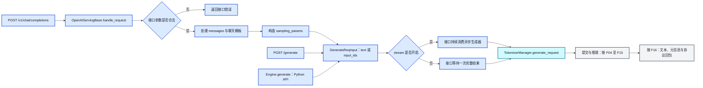

- **聊天模板**：将角色、消息和特殊标记组织成模型输入。普通文本 Chat 路径可能在模板阶段就得到 `input_ids`；TokenizerManager 不一定还要分词一次。
- **GenerateReqInput**：三种入口汇合后的内部请求格式，包含输入、采样参数、流式选项和请求标识等。它还不是 Scheduler 维护的 `Req`。
- **异步生成器**：调用 `generate_request()` 得到生成器，实际消费时推进工作。流式入口持续取结果；非流式入口取到的是请求结束后的结果。
- **协议适配与推理**：API 层负责 Chat 请求/响应格式；Scheduler、Worker 与 GPU 执行共享的推理链路。SSE 是输出协议，不是另一套模型推理算法。

源码：[Chat 路由](../python/sglang/srt/entrypoints/http_server.py#L1732)、[统一接口处理](../python/sglang/srt/entrypoints/openai/serving_base.py#L73)、[Chat 转换](../python/sglang/srt/entrypoints/openai/serving_chat.py#L968)、[消息与模板](../python/sglang/srt/entrypoints/openai/serving_chat.py#L1102)、[原生生成接口](../python/sglang/srt/entrypoints/http_server.py#L899)、[Python Engine 入口](../python/sglang/srt/entrypoints/engine.py#L382)。

学习证据：Chat 路由、`handle_request`、Chat 非流式消费及原生 `/generate` 方法内有新增注释。消息/模板转换、流式启动细节、`Engine.generate` 本体属于串联补充。图中校验错误是代表性出口；模板、分词等后续阶段也可能拒绝无效请求。

<a id="f04"></a>

## F04 登记请求、分词与三进程消息传递

下面区分发送路径和共享接收路径。图中的等待节点只挂起当前请求协程，事件循环继续处理其他请求。并行组广播以普通 TP 场景为代表。

<!-- mermaid:id=f04 -->
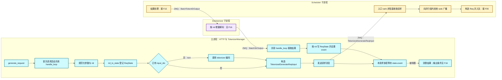

- **rid**：贯穿三个组件的请求标识。TokenizerManager 的 `ReqState`、Scheduler 的 `Req`、Detokenizer 的 `DecodeStatus` 是各进程内的不同对象，通过 rid 对应。
- **ZMQ 三条消息路径**：请求发给 Scheduler；生成 token 结果发给 Detokenizer；文本结果回到 TokenizerManager。这不是跨进程同步调用栈。
- **请求状态先登记**：先建立 `rid_to_state[rid]`，随后编码和发送，才能让异步返回的结果找到等待方。发送前异常会清理尚未完成的状态。
- **共享接收协程**：`handle_loop` 由首次请求懒启动，所有请求共用；每条请求分别等待自己的 `asyncio.Event`。
- **并行组广播**：普通 TP 的多个 rank 收到相同工作请求，再计算各自负责的模型分片。DP attention 会按其分组规则广播，不是向所有 GPU 全局复制。

源码：[登记、编码与发送总入口](../python/sglang/srt/managers/tokenizer_manager.py#L845)、[请求状态登记](../python/sglang/srt/managers/tokenizer_manager.py#L3568)、[text 与 input_ids 分支](../python/sglang/srt/managers/tokenizer_manager.py#L1064)、[请求发送](../python/sglang/srt/managers/tokenizer_manager.py#L1692)、[ZMQ 地址与 socket](../python/sglang/srt/managers/tokenizer_manager.py#L598)、[Scheduler 接收与广播](../python/sglang/srt/managers/scheduler_components/request_receiver.py#L88)、[共享接收协程](../python/sglang/srt/managers/tokenizer_manager.py#L2326)。

学习证据：图中 TokenizerManager 登记、编码、发送、等待、接收方法及 Scheduler 接收入口有新增注释；完整广播分组条件、错误清理和消息类型定义是结合代码补充的约束。控制回复可以直接回 TokenizerManager；`skip_tokenizer_init` 时生成结果也绕过 Detokenizer，此处画普通文本解码路径。

<a id="f05"></a>

## F05 Scheduler 如何选择本轮批次

这里展开普通文本生成的调度主干：非投机、无 PD 分离、不启用混合批、HiSparse 和特殊延迟策略。`running_batch`、`last_batch` 都是 `ScheduleBatch` 的不同用途，`chunked_req` 则是一个尚未完成 prefill 的 `Req` 引用。

```mermaid
flowchart LR
    ENTRY["进入本轮 get_next_batch_to_run"] --> CHUNK{"有尚未完成的 chunked_req？"}
    CHUNK -->|"有新算出的 KV"| STASH["暂存上一块：cache_unfinished_req"]
    CHUNK -->|"没有，或没有新 KV"| LAST{"last_batch 是上一轮 prefill 批？"}
    STASH --> LAST
    LAST -->|"是"| FILTER["过滤已结束请求；排除未完成 chunk"]
    FILTER --> MERGE["剩余请求接管或合并进 running_batch"]
    LAST -->|"否"| PICK["尝试 get_new_batch_prefill"]
    MERGE --> PICK
    PICK --> PREFILL["优先续算旧 chunk；再从 waiting_queue 挑选"]
    PREFILL --> NEW{"本轮选出了 prefill 请求？"}
    NEW -->|"是"| EXTEND["建 ScheduleBatch；prepare_for_extend"]
    EXTEND --> RUNP["执行本轮 prefill 前向"]
    NEW -->|"否"| RUNNING{"running_batch 非空？"}
    RUNNING -->|"是"| UPDATE["update_running_batch：过滤、容量检查、必要时回退"]
    UPDATE --> REMAIN{"还有可运行请求？"}
    REMAIN -->|"是"| DECODE["prepare_for_decode；执行本轮 decode 前向"]
    REMAIN -->|"否"| IDLE["本轮无批可执行"]
    RUNNING -->|"否"| IDLE
    RUNP --> RESULT["结果处理：追加输出、结束判定、缓存与回包"]
    DECODE --> RESULT
    RESULT --> NEXT["继续主循环；再次接收请求和选择批次"]
    IDLE --> NEXT
    NEXT --> ENTRY

    classDef scheduler fill:#FEF3C7,stroke:#A16207,color:#111827,stroke-width:2px
    classDef batch fill:#EDE9FE,stroke:#7C3AED,color:#111827,stroke-width:2px
    classDef cache fill:#DCFCE7,stroke:#15803D,color:#111827,stroke-width:2px
    classDef runner fill:#E0E7FF,stroke:#4338CA,color:#111827,stroke-width:2px
    class ENTRY,CHUNK,LAST,PICK,PREFILL,NEW,RUNNING,UPDATE,REMAIN,IDLE,RESULT,NEXT scheduler
    class FILTER,MERGE,EXTEND batch
    class STASH cache
    class RUNP,DECODE runner
```

**核心概念。** `waiting_queue` 保存待 prefill 或需重算的请求；`running_batch` 保存可以继续 decode 的请求；`last_batch` 用来衔接上一轮执行状态。新 prefill 批有优先机会，选不出才尝试 decode；开启特殊延迟或混合策略时有额外分支。prefill 后可能已经满足停止条件，因此必须过滤后再合并，不能把全部新请求无条件放入 decode。

本图表达请求的逻辑生命周期。普通循环中“执行→处理结果”按序发生；overlap 循环会交错“本轮前向”和“上一轮结果处理”，不能将这张图当作 CPU/GPU 的逐时刻时序图。

源码：[Scheduler.get_next_batch_to_run](../python/sglang/srt/managers/scheduler.py#L3275)、[上一块暂存和上一批合并](../python/sglang/srt/managers/scheduler.py#L3309)、[选择 prefill 或 decode](../python/sglang/srt/managers/scheduler.py#L3373)、[prefill 结果处理](../python/sglang/srt/managers/scheduler_components/batch_result_processor.py#L316)。

学习依据：当前分支 diff 中新增的调度主循环、三个批次状态和 prefill 优先选择注释；图中的 chunk 排除、过滤和结果分支由对应可执行代码补齐。

<a id="f06"></a>

## F06 PrefillAdder 如何准入请求并切分长输入

本图使用基础 RadixCache 路径，不画 Mamba/SWA/HiCache 的额外预算、加载和状态分配。Qwen 3.5 的混合注意力配置不应据此推断成只使用基础 RadixCache。

```mermaid
flowchart LR
    BEGIN["创建 PrefillAdder：预留运行请求的 decode 预算"] --> OLD{"已有 chunked_req？"}
    OLD -->|"有"| RESUME["add_chunked_req：先续算；裁切本轮区间并扣预算"]
    OLD -->|"无"| QUEUE{"排序后还有等待请求？"}
    RESUME --> QUEUE
    QUEUE -->|"无"| BUILD
    QUEUE -->|"有"| LIMIT{"取候选；请求数和槽位额度允许继续？"}
    LIMIT -->|"否"| BUILD["can_run_list 非空才建批；移出已选等待请求"]
    LIMIT -->|"是"| MATCH["init_next_round_input：匹配已有前缀"]
    MATCH --> PRECHECK{"初步 KV 和输入预算可接纳？"}
    PRECHECK -->|"否"| STOP["停止继续挑选；未接纳请求留在等待队列"]
    PRECHECK -->|"是"| LOCK["临时 inc_lock_ref：保护命中路径"]
    LOCK --> RECHECK{"加锁后的预算仍可接纳？"}
    RECHECK -->|"否"| UNLOCKFAIL["释放临时锁；本请求未接纳"]
    UNLOCKFAIL --> STOP
    RECHECK -->|"是"| FIT{"剩余输入能在本轮分块额度内算完？"}
    FIT -->|"是"| FULL["设置完整的 extend_range"]
    FIT -->|"否"| CUT{"能切出一个有效的对齐 chunk？"}
    CUT -->|"否"| UNLOCKFAIL
    CUT -->|"是"| PART["设置当前 chunk 区间；记录 new_chunked_req"]
    FULL --> ADMIT["append 到 can_run_list；加请求锁；扣减预算"]
    PART --> ADMIT
    ADMIT --> UNLOCK["退出 with：只释放临时锁"]
    UNLOCK --> STATUS{"budget_state 允许继续挑选？"}
    STATUS -->|"CONTINUE，且还有候选"| QUEUE
    STATUS -->|"NO_TOKEN / OTHER，或已遍历完"| BUILD
    STOP --> BUILD

    classDef scheduler fill:#FEF3C7,stroke:#A16207,color:#111827,stroke-width:2px
    classDef policy fill:#FFEDD5,stroke:#C2410C,color:#111827,stroke-width:2px
    classDef batch fill:#EDE9FE,stroke:#7C3AED,color:#111827,stroke-width:2px
    classDef cache fill:#DCFCE7,stroke:#15803D,color:#111827,stroke-width:2px
    class OLD,QUEUE,LIMIT,BUILD,STOP scheduler
    class BEGIN,RESUME,PRECHECK,RECHECK,FIT,FULL,CUT,PART,ADMIT,STATUS policy
    class MATCH batch
    class LOCK,UNLOCKFAIL,UNLOCK cache
```

**核心概念。** 在这一路径里，预算只决定“能不能放进本批”，真正的请求槽位和新增 KV 编号在 F07 分配。`rem_total_tokens` 大体是“空闲编号 + 可淘汰缓存 − 已预留预算”。命中路径从可淘汰转为受保护后，可用预算会减少，所以临时加锁后要再判断一次。

**`NO_TOKEN` / `OTHER` 表示停止继续挑选，不等于当前请求一定未被接纳。** 早期检查失败时，它还没进 `can_run_list`；也可能已加入列表并扣完预算，再由 `budget_state()` 发出停止信号。Scheduler 最后根据 `can_run_list` 移出等待队列。若列表为空，则本轮没有新 prefill 批。

`extend_range` 是本轮要计算的输入区间。旧 chunk 走 `add_chunked_req()`，已持有的请求槽位在下一阶段复用；它与新请求第一次走 `add_one_req()` 的流程不同。部分输入过长不代表请求被拒绝，可以只计算对齐后的当前 chunk。

图中把输入额度、页对齐等准入条件汇总为判断节点；不逐项展开配置条件。未启用分块时，首个请求对 `max_prefill_tokens` 有特殊放行逻辑，不能把该参数理解成所有场景下的绝对硬上限。

源码：[PrefillAdder.rem_total_tokens](../python/sglang/srt/managers/schedule_policy.py#L691)、[add_chunked_req](../python/sglang/srt/managers/schedule_policy.py#L1037)、[临时锁上下文](../python/sglang/srt/managers/schedule_policy.py#L1089)、[add_one_req 的判断和入批](../python/sglang/srt/managers/schedule_policy.py#L1243)、[入批后 budget_state](../python/sglang/srt/managers/schedule_policy.py#L1503)、[Scheduler 按最终列表移出队列](../python/sglang/srt/managers/scheduler.py#L3729)。

学习依据：diff 中新增的 PrefillAdder 预算、前缀锁、完整/分块入批注释；返回值与入批状态的区别、首请求特例由代码分支补齐。

<a id="f07"></a>

## F07 Prefill 输入、请求槽位和 KV 编号如何落地

这是普通 prefill 的实际调用顺序。前缀命中拿到的编号早已存在；本阶段只为未命中、且本轮确实要计算的输入分配新位置。

```mermaid
flowchart LR
    REQS["ScheduleBatch.reqs：本轮获准运行的请求"] --> SHAPES["prepare_for_extend：提取未命中输入及 prefix / extend / seq 长度"]
    SHAPES --> FLAT["把各请求输入拼成扁平 input_ids；设置 EXTEND 模式"]
    FLAT --> ALLOC["调用 alloc_for_extend"]
    ALLOC --> SLOT["第一步：alloc_req_slots"]
    SLOT --> REUSE{"Req 已有 req_pool_idx？"}
    REUSE -->|"是，例如续算 chunk"| EXIST["复用原请求槽位"]
    REUSE -->|"否"| NEWROW["从 ReqToTokenPool 获取空闲行号"]
    EXIST --> SPACE["第二步：检查空闲 KV 编号；必要时淘汰未锁缓存"]
    NEWROW --> SPACE
    SPACE --> PAGE{"page_size 等于 1？"}
    PAGE -->|"是"| TOKEN["alloc_token_slots：为新输入分配位置"]
    PAGE -->|"否"| PAGED["alloc_paged_token_slots_extend：按页规则分配位置"]
    TOKEN --> LOC["得到 out_cache_loc：本轮新 KV 写入位置"]
    PAGED --> LOC
    LOC --> MAP["第三步：write_cache_indices 写入 req_to_token"]
    PREFIX["prefix_indices：命中前缀的已有 KV 编号"] --> MAP
    MAP --> ROW["映射：请求槽位 + token 位置 → KV 编号"]
    ROW --> FORWARD["前向计算 K/V；按 out_cache_loc 写入对应 KV buffer"]
    SLOT -.->|"槽位不足"| ERROR["抛出分配异常；不是自动退回等待队列"]
    TOKEN -.->|"分配失败"| ERROR
    PAGED -.->|"分配失败"| ERROR

    classDef batch fill:#EDE9FE,stroke:#7C3AED,color:#111827,stroke-width:2px
    classDef memory fill:#CCFBF1,stroke:#0F766E,color:#111827,stroke-width:2px
    classDef runner fill:#E0E7FF,stroke:#4338CA,color:#111827,stroke-width:2px
    class REQS,SHAPES,FLAT,PREFIX batch
    class ALLOC,SLOT,REUSE,EXIST,NEWROW,SPACE,PAGE,TOKEN,PAGED,LOC,MAP,ROW,ERROR memory
    class FORWARD runner
```

**核心概念。** 请求槽位是 `req_to_token` 的行号；KV 编号是池内 token 存储位置的索引。两者不是同一种编号。完整关联为：`Req.req_pool_idx → req_to_token[行号, token位置] → KV编号 → 每层的K/V存储位置`。

**顺序明确是“先分配或复用请求槽位，再分配新增 KV 编号，再写映射表”。** `prefix_indices` 复用已有 KV，`out_cache_loc` 表示本轮产生 K/V 时的写入位置；编号分配不等于 K/V 已算出来。页式分配会考虑已有末页和对齐余量，不能将逻辑 token 数直接等同于每轮新拿到的页数。

基础池通常在模型启动阶段就已分配显存。本阶段是在池里安排位置。分配函数的 fail-loud 异常与正常预算不够时“留在等待队列”、decode 内存紧张时“retract”是三种不同情况。

源码：[ScheduleBatch.prepare_for_extend](../python/sglang/srt/managers/schedule_batch.py#L2438)、[alloc_for_extend 的三步顺序](../python/sglang/srt/mem_cache/allocation.py#L315)、[ReqToTokenPool.alloc 的槽位复用](../python/sglang/srt/mem_cache/memory_pool.py#L299)、[普通和分页 token 分配](../python/sglang/srt/mem_cache/allocation.py#L150)、[请求槽位不足时抛异常](../python/sglang/srt/mem_cache/allocation.py#L263)。

学习依据：diff 中已有 `ScheduleBatch`、`ReqToTokenPool`、KV 编号及 allocator 的解释；这里把 `prepare_for_extend` 内部调用顺序和失败行为作为源码补充，并不把补充内容算作已学习。

<a id="f08"></a>

## F08 RadixCache 如何连接前缀复用与 KV 生命周期

下面专指基础 RadixCache。树负责保存 token 前缀到 KV 编号的关系；真正的 K/V 仍在 KV 池中。实际配置可能选择混合缓存实现，不能用这张图代替所有缓存后端。

```mermaid
flowchart LR
    KEY["请求的 token 前缀及缓存命名空间"] --> MATCH["match_prefix：逐段匹配；必要时分裂树节点"]
    MATCH --> HIT["返回 prefix_indices 与 last_node"]
    HIT --> LOCK["入批成功后：请求锁保护命中路径"]
    LOCK --> FORWARD["分配新位置并前向计算；K/V 留在 KV 池"]
    FORWARD --> WHEN{"到了哪个缓存处理时点？"}
    WHEN -->|"prefill 完成但生成未结束，或暂存 chunk"| UNFIN["cache_unfinished_req：插入或复用已算前缀"]
    UNFIN --> DUP["释放重复的新 KV；重新匹配树内的规范编号"]
    DUP --> REMAP["更新 req_to_token 与 cache_protected_len"]
    REMAP --> MOVE["释放旧锁并锁新路径；更新 prefix_indices 和 last_node"]
    MOVE --> LIVE["请求继续运行；受保护前缀不可淘汰"]
    LIVE --> FORWARD
    WHEN -->|"普通 decode 尚未结束"| LIVE
    WHEN -->|"正常结束"| FIN["release_kv_cache → cache_finished_req"]
    FIN --> INSERT["可缓存且页对齐的前缀插入或复用树节点"]
    INSERT --> TAIL["释放重复部分和不保留的尾部"]
    TAIL --> UNLOCK["dec_lock_ref：释放这个请求的路径引用"]
    UNLOCK --> FREE["释放额外预分配；ReqToTokenPool.free 归还请求槽位"]
    FREE --> CACHED["可复用 KV 仍留池中；树保存它的编号"]
    CACHED --> PRESSURE{"后续分配出现空间压力？"}
    PRESSURE -->|"无需淘汰"| MATCH
    PRESSURE -->|"需要腾空间"| EVICT["evict：选择未锁叶子，必要时继续向上淘汰"]
    EVICT --> RETURN["移除树节点；KV 编号还给 allocator"]

    classDef scheduler fill:#FEF3C7,stroke:#A16207,color:#111827,stroke-width:2px
    classDef batch fill:#EDE9FE,stroke:#7C3AED,color:#111827,stroke-width:2px
    classDef memory fill:#CCFBF1,stroke:#0F766E,color:#111827,stroke-width:2px
    classDef cache fill:#DCFCE7,stroke:#15803D,color:#111827,stroke-width:2px
    classDef runner fill:#E0E7FF,stroke:#4338CA,color:#111827,stroke-width:2px
    class WHEN scheduler
    class KEY,LIVE batch
    class FIN,TAIL,FREE,PRESSURE memory
    class MATCH,HIT,LOCK,UNFIN,DUP,REMAP,MOVE,INSERT,UNLOCK,CACHED,EVICT,RETURN cache
    class FORWARD runner
```

**核心概念。** `lock_ref` 是路径上的引用计数。节点从 0 变为 1 时，对应缓存从“可淘汰”转为“受保护”；从 1 变为 0 时才重新可淘汰。另一个请求还持有引用时，当前请求结束不会让共享缓存失去保护。

`cache_unfinished_req()` 会移动锁和映射，因为插入时可能发现别人已缓存了同一段前缀，要释放重复分配并改为共享已有编号。不是每次都在原 `last_node` 下新增一个子节点，也不是每个 decode token 都立刻插入树。

**结束请求不等于清空它曾用过的全部 K/V。** 请求槽位可以马上复用，已入树的缓存仍占着 KV 池空间；将来淘汰才归还其编号。`cache_finished_req` 只按实际已计算的 KV 长度处理，最后新采样出的输出 token 通常尚未经过下一次前向，不能把它也画成已有 KV。

图中的结束插入采用启用缓存且允许 finished insert 的常规配置；禁用缓存或禁止结束插入时会走释放分支。decode 回退则显式使用 `is_insert=False`，见 F09。

源码：[RadixCache.match_prefix](../python/sglang/srt/mem_cache/radix_cache.py#L391)、[cache_unfinished_req](../python/sglang/srt/mem_cache/radix_cache.py#L530)、[cache_finished_req](../python/sglang/srt/mem_cache/radix_cache.py#L473)、[引用计数与可淘汰统计](../python/sglang/srt/mem_cache/radix_cache.py#L637)、[evict](../python/sglang/srt/mem_cache/radix_cache.py#L607)、[release_kv_cache 释放请求槽位](../python/sglang/srt/mem_cache/common.py#L202)。

学习依据：diff 中已有 TreeNode、前缀编号和锁引用统计解释；插入去重、重新匹配、锁迁移和结束释放由源码补齐，属于帮助闭合链路的延伸内容。

<a id="f09"></a>

## F09 Decode 如何扩展 KV，以及空间不足时如何回退

本图是普通非投机 decode，不含 beam、PD 分离时的 CPU 备份等路径。每个活跃请求本轮处理一个输入 token、采样下一个 token；请求槽位沿用，KV 位置逐步增长。

```mermaid
flowchart LR
    RUNNING["running_batch 进入 update_running_batch"] --> FILTER["filter_batch：移除已结束请求"]
    FILTER --> NONEMPTY{"批次还非空？"}
    NONEMPTY -->|"否"| BACK["返回 Scheduler，下一轮重新选择批次"]
    NONEMPTY -->|"是"| NEED["估算下一步所需 KV 空间"]
    NEED --> EVICT["check_decode_mem：先淘汰可淘汰缓存"]
    EVICT --> FIT{"空闲空间足够？"}
    FIT -->|"否"| MORE{"剩余批次还有多个请求？"}
    MORE -->|"是"| VICTIM["retract_decode：选择需要退回的请求"]
    MORE -->|"否"| ABORT["最后一个也放不下：释放资源并报告 OOM"]
    VICTIM --> RELEASE["release_kv_cache，is_insert=False；释放私有 KV 和槽位"]
    RELEASE --> RESET["解锁后按需淘汰；重置请求并记入回退列表"]
    RESET --> NEED
    FIT -->|"是"| REQUEUE["回退列表重新进入 waiting_queue；没有回退则直接继续"]
    ABORT --> REQUEUE
    REQUEUE --> LEFT{"仍有可运行请求？"}
    LEFT -->|"无"| BACK
    LEFT -->|"有"| PREP["prepare_for_decode：复用请求槽位；分配新增 KV 位置"]
    PREP --> MAP["写入 req_to_token；更新序列长度"]
    MAP --> FORWARD["处理上一步输出 token；写 K/V；采样下一个 token"]
    FORWARD --> RESULT["追加 output_ids；更新结束状态"]
    RESULT --> FIN{"请求结束？"}
    FIN -->|"是"| CACHE["正常缓存和释放资源；输出结果"]
    FIN -->|"否"| KEEP["保留在运行批；按发送条件输出"]
    CACHE --> BACK
    KEEP --> BACK

    classDef scheduler fill:#FEF3C7,stroke:#A16207,color:#111827,stroke-width:2px
    classDef batch fill:#EDE9FE,stroke:#7C3AED,color:#111827,stroke-width:2px
    classDef memory fill:#CCFBF1,stroke:#0F766E,color:#111827,stroke-width:2px
    classDef runner fill:#E0E7FF,stroke:#4338CA,color:#111827,stroke-width:2px
    class RUNNING,NONEMPTY,BACK,REQUEUE,LEFT,RESULT,FIN,CACHE,KEEP scheduler
    class FILTER,NEED,EVICT,FIT,MORE,VICTIM,ABORT,RESET,PREP batch
    class RELEASE,MAP memory
    class FORWARD runner
```

**核心概念。** “KV 不够”先触发 cache eviction，仍不够才触发 request retraction。前者只是丢弃可重用但无人引用的缓存；后者让活跃请求退出本轮运行，释放其资源，以后重新组 prefill。回退保留已生成的 `output_ids`，重算使用“原输入 + 已输出 token”，不是把用户已经收到的输出撤销。

退回路径的 `is_insert=False` 避免把待释放的私有 KV 再作为新缓存保留下来；旧共享前缀的引用解除后，会在需要时被淘汰。正常结束则允许保留可复用前缀，两者不能画成同一个“写入缓存”动作。

每次普通 decode 为每个请求新增一个逻辑 token 的 KV 位置；页式池可能继续使用已有末页，不能理解为每步必定新分配一个完整页。回退后只剩一个请求也未必能运行：代码有终止并报告 OOM 的分支。本轮结束后仍回到 Scheduler，因此新到达的 prefill 请求可以在下一轮获得调度机会。

源码：[Scheduler.update_running_batch](../python/sglang/srt/managers/scheduler.py#L3848)、[check_decode_mem 先淘汰](../python/sglang/srt/managers/schedule_batch.py#L2914)、[retract_decode 及最后请求 OOM](../python/sglang/srt/managers/schedule_batch.py#L2921)、[release_req 的不插入释放](../python/sglang/srt/managers/schedule_batch.py#L1967)、[reset_for_retract](../python/sglang/srt/managers/schedule_batch.py#L1705)、[alloc_for_decode](../python/sglang/srt/mem_cache/allocation.py#L528)、[decode 结果与结束判断](../python/sglang/srt/managers/scheduler_components/batch_result_processor.py#L949)。

学习依据：diff 中已有 `running_batch`、decode 新增编号和回退入口说明；淘汰先后、`is_insert=False`、映射更新和最终 OOM 分支由当前实现补齐。

<a id="f10"></a>

## F10 ScheduleBatch 到模型执行：Eager 或 CUDA Graph

这里聚焦普通生成请求，不展开投机验证、分层 Prefill 和流水线中间 rank。普通 CUDA Decode 可能命中预先捕获的图；Prefill 也存在单独的图执行路径，不能笼统说“Prefill 一定 Eager”。

```mermaid
flowchart LR
    A["Scheduler.run_batch"] --> B["resolve_forward_inputs 补齐本轮 input_ids"]
    B --> C["TpModelWorker.forward_batch_generation"]
    C --> D["ForwardBatch.init_new 组织本轮模型输入"]
    D --> E["ModelRunner.forward → _forward_raw"]
    E --> F{"模式与批次满足 Decode Graph 条件？"}
    F -->|是| G["DecodeCudaGraphRunner.execute"]
    G --> H["load_batch 更新静态缓冲区与元数据"]
    H --> I["replay 执行已捕获的模型计算"]
    F -->|否| J["准备当前批次及必要的状态更新"]
    J --> K{"本轮为 Extend 且 Prefill Graph 可运行？"}
    K -->|是| L["Prefill Graph 执行器执行模型"]
    K -->|否| M["EagerRunner.execute 按 ForwardMode 分派"]
    M --> N["Decode 或 Extend：按需初始化 Attention 元数据"]
    N --> O["model.forward 执行模型"]
    I --> P["返回 ModelRunnerOutput 与 logits"]
    L --> P
    O --> P
    P --> Q["Worker 进入采样并返回 GenerationBatchResult"]

    classDef scheduler fill:#FEF3C7,stroke:#A16207,color:#111827,stroke-width:2px
    classDef batch fill:#EDE9FE,stroke:#7C3AED,color:#111827,stroke-width:2px
    classDef runner fill:#E0E7FF,stroke:#4338CA,color:#111827,stroke-width:2px
    classDef model fill:#FCE7F3,stroke:#BE185D,color:#111827,stroke-width:2px
    classDef attention fill:#ECFCCB,stroke:#4D7C0F,color:#111827,stroke-width:2px
    class A scheduler
    class B,D batch
    class C,E,F,G,H,I,J,K,L,M,P,Q runner
    class O model
    class N attention
```

**核心概念。** `ScheduleBatch` 面向调度，持有请求集合及本轮准备结果；`ForwardBatch` 面向模型，组织 `input_ids`、`positions`、`seq_lens`、`req_pool_indices`、`out_cache_loc` 和采样参数。它会引用已经准备好的张量，并不是在 `init_new` 才首次分配所有 GPU 数据。`ForwardMode` 说明本次计算属于 Extend、Decode 等哪种模式；Attention 元数据描述这一批的序列长度、缓存位置和计算布局。

CUDA Graph 保存可重复执行的操作和依赖。回放前更新稳定地址上的数据，GPU 仍计算本轮结果；这不是复用上轮 logits。图中的各执行路径在模型输出处汇合，常规采样在外层继续进行。延迟采样见 F14。

**学习证据。** `run_batch`、Worker、Runner 和 Eager 的分派已有学习注释；`ForwardBatch.init_new` 的字段传递、Graph 的可运行条件及静态缓冲区加载为连贯补充。

源码：[Worker 前向入口](../python/sglang/srt/managers/tp_worker.py#L600)、[ForwardBatch.init_new](../python/sglang/srt/model_executor/forward_batch_info.py#L728)、[Runner 三类执行路径](../python/sglang/srt/model_executor/model_runner.py#L1745)、[Eager 分派](../python/sglang/srt/model_executor/runner/eager_runner.py#L214)、[Decode Graph 可用条件](../python/sglang/srt/model_executor/runner/decode_cuda_graph_runner.py#L676)、[load_batch 后回放](../python/sglang/srt/model_executor/runner/decode_cuda_graph_runner.py#L1449)。

<a id="f11"></a>

## F11 Qwen 3.5：逐层选择全 Attention 或 GatedDeltaNet

以 `Qwen3_5ForConditionalGeneration` 的 dense 文本生成路径为例，省略视觉、MoE 和 PP 分段。层类型由模型配置决定，两种层出现在同一条层序列中；下面的分叉表示当前层的类型选择，不表示同时跑两份模型。

```mermaid
flowchart LR
    A["Qwen3_5ForConditionalGeneration"] --> B["继承的 Qwen3VLForConditionalGeneration.forward"]
    B --> C["Qwen3_5ForCausalLM.forward 文本主干"]
    C --> D["Embedding：token ID 变成 hidden_states"]
    D --> E{"还有下一层？"}
    E -->|是| F["取出按配置预建的层；准备归一化与残差"]
    F --> G{"当前层类型？"}
    G -->|attention| H["Qwen3_5AttentionDecoderLayer"]
    H --> I["QKV 投影；Q/K 归一化与位置编码"]
    I --> J["RadixAttention 调用全 Attention 后端"]
    J --> K["按配置进行输出门控，再投影"]
    G -->|linear_attention| L["Qwen3_5LinearDecoderLayer"]
    L --> M["GatedDeltaNet 输入投影"]
    M --> N["RadixLinearAttention 调用线性后端"]
    N --> O["更新循环状态后归一化与输出投影"]
    K --> P["prepare_mlp：处理残差与归一化"]
    O --> P
    P --> Q["dense MLP：复用 Qwen2MoeMLP"]
    Q --> R["完成本层的输出与必要通信"]
    R --> E
    E -->|否| S["最终归一化得到 hidden_states"]
    S --> T["外层 LogitsProcessor 投影为词表分数"]

    classDef model fill:#FCE7F3,stroke:#BE185D,color:#111827,stroke-width:2px
    classDef attention fill:#ECFCCB,stroke:#4D7C0F,color:#111827,stroke-width:2px
    classDef sampling fill:#FEE2E2,stroke:#B91C1C,color:#111827,stroke-width:2px
    class A,B,C,D,E,F,G,H,I,K,L,M,O,P,Q,R,S model
    class J,N attention
    class T sampling
```

**核心概念。** `hidden_states` 是当前 token 的向量表示；`residual` 把层间信息接续起来。全 Attention 显式访问历史 K/V；GatedDeltaNet 的线性路径通过专门后端维护循环状态，不能把它画成每层都读写同一个普通 MHA KV 池。两种层都有后续前馈计算。

`Qwen2MoeMLP` 是复用的 dense MLP 类名，名字含 `Moe` 不代表本图经过专家路由。模型层序列应从实际配置读取，不能凭模型系列名固定画成某个层数或固定的“线性层数：全 Attention 层数”。归一化、残差和通信在实现中会融合或延后，图中按语义归并。

**学习证据。** 继承入口及 `hidden_states → logits` 处已有新增中文解释；Qwen 3.5 两种 decoder layer 的内部流程是为连贯补充的源码展开，不能据此标为已经精读。

源码：[Qwen 3.5 服务入口](../python/sglang/srt/models/qwen3_5.py#L1866)、[继承的 forward](../python/sglang/srt/models/qwen3_vl.py#L1442)、[按配置构造层](../python/sglang/srt/models/qwen3_5.py#L1453)、[文本主干逐层执行](../python/sglang/srt/models/qwen3_5.py#L1503)、[全 Attention 层](../python/sglang/srt/models/qwen3_5.py#L1280)、[线性层](../python/sglang/srt/models/qwen3_5.py#L875)、[GatedDeltaNet](../python/sglang/srt/models/qwen3_5.py#L708)。

<a id="f12"></a>

## F12 普通 MHA Attention：新 KV 写哪里，历史 KV 从哪里读

这是生成任务中启用 KV 写入、普通非 MLA、非 SWA、非 CP 的 FlashAttention 后端代表路径，关注显式 KV 缓存的全 Attention 层。它不是所有 Attention 后端的固定执行步骤，也不能套到 Qwen 3.5 的 GatedDeltaNet 层。

```mermaid
flowchart LR
    A["ScheduleBatch 已分配位置并写好请求映射"] --> B["ForwardBatch 携带序列长度与位置索引"]
    B --> C["Attention 后端准备批次元数据"]
    R["ReqToTokenPool：请求行号和序列位置 → KV 编号"] -.-> C
    C --> D["模型本层算出 Q、K、V"]
    D --> E["RadixAttention.forward"]
    E --> F{"ForwardMode？"}
    F -->|Extend| G["FlashAttentionBackend.forward_extend"]
    F -->|Decode| H["FlashAttentionBackend.forward_decode"]
    G --> I["按 out_cache_loc 写入本层新 K/V"]
    H --> I
    I --> J["MHATokenToKVPool.set_kv_buffer"]
    J --> K["本层 GPU KV 缓冲区已含新数据"]
    K --> L["Attention 内核读取所需 K/V 并计算输出"]
    C -.->|页表与长度| L
    D -.->|当前 Q| L
    OLD["此前缓存的历史 K/V"] -.-> L
    L --> M["返回 Attention 输出给模型后续计算"]

    classDef batch fill:#EDE9FE,stroke:#7C3AED,color:#111827,stroke-width:2px
    classDef memory fill:#CCFBF1,stroke:#0F766E,color:#111827,stroke-width:2px
    classDef model fill:#FCE7F3,stroke:#BE185D,color:#111827,stroke-width:2px
    classDef attention fill:#ECFCCB,stroke:#4D7C0F,color:#111827,stroke-width:2px
    class A,B batch
    class R,J,K,OLD memory
    class D model
    class C,E,F,G,H,I,L,M attention
```

**核心概念。** 请求行号 `req_pool_idx`、token ID、KV 编号是三种不同的整数：前者定位请求映射表的一行，token ID 表示词表中的符号，KV 编号定位缓存池中的位置。`out_cache_loc` 是本轮新 K/V 的写入位置；Attention 元数据从请求映射与长度组织历史读取位置。分配器给出编号时，那里还没有本轮新算出的 K/V。

Prefill 对本轮未复用的后缀做计算，并结合命中前缀的缓存；普通 Decode 每个请求处理一个当前输入 token，再写入其 K/V。各层有自己的 K/V 数据；一个位置编号不是一个 token 的“全部模型输出”。`RadixCache` 在调度侧查找可复用前缀并保留相关缓存，图中 GPU Attention 内核并不遍历 Python 前缀树。

**学习证据。** 槽位、KV 编号、请求映射和组批已有学习注释与文档；后端 `forward_extend/decode`、`set_kv_buffer` 与内核读取边界是为连贯补充的代表实现。

源码：[FlashAttention 元数据准备](../python/sglang/srt/layers/attention/flashattention_backend.py#L683)、[RadixAttention 转交后端](../python/sglang/srt/layers/radix_attention.py#L157)、[按模式分派](../python/sglang/srt/layers/attention/base_attn_backend.py#L243)、[Extend 写入 KV](../python/sglang/srt/layers/attention/flashattention_backend.py#L1310)、[Decode 写入 KV](../python/sglang/srt/layers/attention/flashattention_backend.py#L1837)、[MHA 池写入实现](../python/sglang/srt/mem_cache/memory_pool.py#L2383)。

<a id="f13"></a>

## F13 从 hidden_states 到 logits，再采样下一个 token

本图限定普通生成、不请求输入 logprob 的直观路径。额外 logprob、量化 LM head 和分布式词表会增加处理步骤，但不会改变“向量表示 → 词表分数 → 选择 token”的语义。

```mermaid
flowchart LR
    A["模型输出 hidden_states"] --> B["LogitsProcessor 选取各请求的预测位置"]
    B --> C["LM head 投影到词表维度"]
    C --> D["next_token_logits：每个请求一行分数"]
    D --> E["ModelRunner.sample"]
    E --> F["应用语法 mask、惩罚与 logits bias"]
    F --> G["Sampler.forward 执行自定义处理与异常值处理"]
    G --> H{"当前批全是贪心采样？"}
    H -->|是| I["argmax 选择最高分 token"]
    H -->|否| J["温度缩放并形成概率"]
    J --> K["按请求应用 top-k、top-p、min-p 等约束"]
    K --> L["按分布选取 token"]
    I --> M["next_token_ids"]
    L --> M
    M --> N["Worker 返回 GenerationBatchResult"]
    N --> O["下一轮输入接力与 CPU 结果处理"]

    classDef runner fill:#E0E7FF,stroke:#4338CA,color:#111827,stroke-width:2px
    classDef model fill:#FCE7F3,stroke:#BE185D,color:#111827,stroke-width:2px
    classDef sampling fill:#FEE2E2,stroke:#B91C1C,color:#111827,stroke-width:2px
    classDef external fill:#F3F4F6,stroke:#4B5563,color:#111827,stroke-width:2px
    class E,N runner
    class A model
    class B,C,D,F,G,H,I,J,K,L,M sampling
    class O external
```

**核心概念。** `hidden_states` 的列是隐藏维度；`logits` 的列是词表维度。普通下一 token 预测通常每个请求得到一行 `next_token_logits`，形状为 `[请求数, vocab_size]`。未量化 LM head 的直观计算是 `hidden_states × lm_head.weight.T`；分数经过采样规则处理后才选出 token ID。

贪心路径选择最大值；概率路径会按参数缩小候选集合并抽样，具体筛选可能由后端融合完成。`GenerationBatchResult` 不只是 token ID，还可带 logits/logprob、拷贝事件等信息。普通生成会采样；`prefill_only`、投机验证和 PP 中间 rank 不按这张图采出下一 token。结构化输出等场景可能把采样推迟到上一批结果处理之后。

**学习证据。** Qwen 外层的 logits 解释、Worker 的采样调用和 Sampler 入口已有新增中文注释；裁剪预测位置、完整 logits 预处理和筛选实现属于连贯补充。

源码：[LogitsProcessor.forward](../python/sglang/srt/layers/logits_processor.py#L343)、[预测位置选择](../python/sglang/srt/layers/logits_processor.py#L438)、[LM head 计算](../python/sglang/srt/layers/logits_processor.py#L711)、[Runner logits 预处理](../python/sglang/srt/model_executor/model_runner.py#L1855)、[Runner.sample](../python/sglang/srt/model_executor/model_runner.py#L1883)、[Sampler 贪心与概率分支](../python/sglang/srt/layers/sampler.py#L98)、[Worker 延迟采样条件](../python/sglang/srt/managers/tp_worker.py#L665)。

<a id="f14"></a>

## F14 overlap：三条设备流、FutureMap 和上一批结果

本图为 CUDA、普通生成、无需延迟采样且本轮允许 overlap 的稳态迭代；`n` 表示本轮，`n−1` 表示上一轮。设备流中的节点表示排队执行的工作，不是三个 Python 调度线程。实线是本条链路的顺序，虚线是跨链路数据或等待依赖。

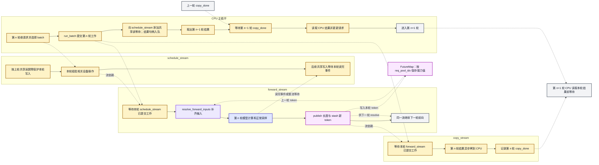

**核心概念。** `schedule_stream` 承载调度准备产生的设备操作；`forward_stream` 承载输入补齐、模型计算和采样；CUDA 路径的 `copy_stream` 搬运 CPU 结果处理所需的数据。`wait_stream`、`wait_event` 建立设备端依赖；CPU 在真正读取结果前调用 `copy_done.synchronize()`。提交本轮 GPU 工作后，CPU 可以处理上一轮结果，不必等待本轮模型计算完成。

`FutureMap.output_tokens_buf[req_pool_idx]` 接力该请求最新采样出的 token；下一轮 Decode 可在设备端据此构造 `input_ids`，不需要先把 token 拷回 CPU 再搬回 GPU。`publish` 写新长度，`stash` 写 token；普通生成的 token 接力主要读后者，投机分支另有长度与附加状态解析。首次纯 Prefill 输入来自 CPU 暂存的 prompt token，并不从 FutureMap 读取一个不存在的上一轮结果。这里的槽位是分配期间稳定的请求行号，不是批次中的第几个请求。

共享读屏障保护的是“前向还在读取的共享缓冲区不要被后续调度提前改写”；有精细读完事件时只等该事件，否则退化为等待前向流。它与“CPU 等结果拷贝完成”的 `copy_done` 作用不同。

需要语法状态或开启延迟采样时，Worker 先返回待采样函数，Scheduler 处理上一批结果后再调用 `launch_batch_sample_if_needed`，然后完成本轮 token 接力与拷贝；不能把这种分支强行套成图中立即采样的顺序。部分连续 Prefill 等条件也会先处理上一批再提交本批。

**学习证据。** overlap 主循环、`run_batch`、FutureMap 两个缓冲区和 token 读取已有新增中文注释；WAR 共享读屏障、独立拷贝流和事件边界是为保证时序正确而补充的源码细节。

源码：[overlap 主循环](../python/sglang/srt/managers/scheduler.py#L1871)、[共享读屏障](../python/sglang/srt/managers/scheduler.py#L1815)、[run_batch 的流依赖与拷贝](../python/sglang/srt/managers/scheduler.py#L3995)、[输入补齐](../python/sglang/srt/managers/overlap_utils.py#L87)、[FutureMap.publish 与 stash](../python/sglang/srt/managers/overlap_utils.py#L535)、[写入下一轮 token](../python/sglang/srt/managers/scheduler.py#L4263)、[拷贝后记录事件](../python/sglang/srt/managers/utils.py#L180)、[CPU 读 Decode 结果前等待](../python/sglang/srt/managers/scheduler_components/batch_result_processor.py#L876)、[延迟采样](../python/sglang/srt/managers/scheduler.py#L4316)。

<a id="f15"></a>

## F15 结果处理、结束判定与输出时机

范围：普通生成，不展开投机解码、beam search、PD offload。处理的是已执行批次的结果；Overlap 下提交和结果处理分开，进入本图时须等对应的 CPU 拷贝完成。

<!-- mermaid:id=f15 -->
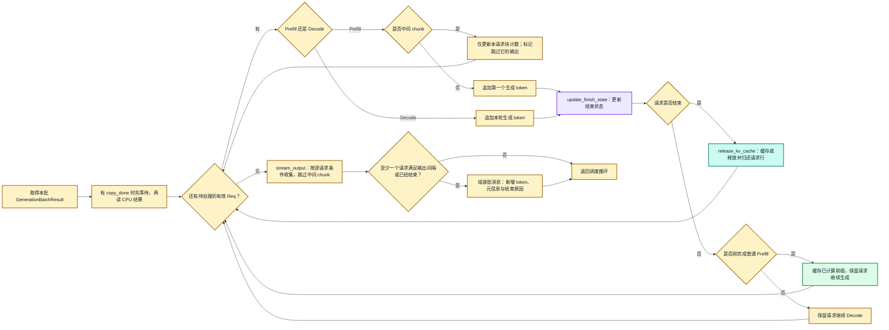

- **Prefill 的输出边界**：中间 chunk 只推进输入处理，不追加可返回的生成 token；最后 chunk 才追加首个输出 token，并检查结束条件。
- **结束条件**：`update_finish_state` 依据生成长度、停止 token、停止字符串等更新请求状态。已取消、已结束或被退回请求还有防止重复提交结果的保护。
- **释放与保留**：`release_kv_cache` 会按前缀缓存策略处理 KV，并归还请求行；可复用的 KV 可能留在 RadixCache 中，不能理解为所有 KV 编号立刻全部空闲。
- **内部输出与客户端流式不同**：请求完成一定输出；流式请求按间隔输出；非流式请求也可能周期性内部回传，TokenizerManager 仍等完成后才向非流式调用方 yield。
- **一批多请求**：图中结束与输出判断是逐请求进行，最后合并为批消息。`skip_stream_req` 只跳过未完成 Prefill 的那个请求，不会阻止批内其他请求输出。

源码：[Prefill 结果处理](../python/sglang/srt/managers/scheduler_components/batch_result_processor.py#L240)、[Decode 结果处理](../python/sglang/srt/managers/scheduler_components/batch_result_processor.py#L870)、[结束请求资源处理](../python/sglang/srt/managers/scheduler_components/batch_result_processor.py#L1105)、[批量输出入口](../python/sglang/srt/managers/scheduler_components/output_streamer.py#L118)、[逐请求发送条件](../python/sglang/srt/managers/scheduler_components/output_streamer.py#L420)。

学习证据：Prefill、Decode 结果入口和 `stream_output` 方法新增了职责注释；中间 chunk、防重复处理、资源处理分支及具体发送条件属于为流程完整性核对的串联补充。不要因入口有一句注释，就把所有内部算法视为已有阅读证据。

<a id="f16"></a>

## F16 增量解码、唤醒等待方与 API 回包

范围：普通 Python 文本生成回包。Detokenizer 产生文本增量；TokenizerManager 根据配置累积或保留增量；接口层再包装成外部协议。

<!-- mermaid:id=f16 -->
```mermaid
flowchart LR
    INPUT["Detokenizer 收到 BatchTokenIDOutput"] --> STATUS["按 rid 取建 DecodeStatus 并追加 token"]
    STATUS --> DECODE["解码上下文窗口 surr_ids 与 read_ids"]
    DECODE --> DELTA["去掉共有前缀得到新文本"]
    DELTA --> FINISH{"该请求是否结束"}
    FINISH -->|"否"| CLEAN{"新文本是否完整"}
    CLEAN -->|"是"| COMMIT["提交文本并推进 token 偏移"]
    CLEAN -->|"否"| PARTIAL["仅发可打印部分，保留偏移等待后续 token"]
    FINISH -->|"是"| TAIL["裁剪停止串、输出尾部并删除解码状态"]
    COMMIT --> STR["组装 BatchStrOutput"]
    PARTIAL --> STR
    TAIL --> STR
    STR -->|"ZMQ"| HANDLE["TokenizerManager.handle_loop 收到结果"]
    HANDLE --> STATE["按 rid 更新 ReqState 与 out_list"]
    STATE --> EVENT["event.set 唤醒请求等待协程"]
    EVENT --> WAIT["_wait_one_response 取出并合并待处理结果"]
    WAIT --> CLIENT{"请求完成或开启 stream"}
    CLIENT -->|"否"| MORE["继续等待后续结果"]
    MORE -->|"下一次通知"| WAIT
    CLIENT -->|"是"| YIELD["yield 结果给接口层"]
    YIELD --> FORMAT["Chat JSON、SSE 或 Python 返回值"]

    classDef api fill:#DBEAFE,stroke:#1D4ED8,color:#111827,stroke-width:2px
    classDef tokenizer fill:#CFFAFE,stroke:#0E7490,color:#111827,stroke-width:2px
    classDef detokenizer fill:#F3E8FF,stroke:#6B21A8,color:#111827,stroke-width:2px
    class FORMAT api
    class HANDLE,STATE,EVENT,WAIT,CLIENT,MORE,YIELD tokenizer
    class INPUT,STATUS,DECODE,DELTA,FINISH,CLEAN,COMMIT,PARTIAL,TAIL,STR detokenizer
```

- **上下文增量解码**：单个 token 不一定能独立解码为完整字符。分别解码 `surr_ids` 与 `read_ids`，再取差值，避免切坏 Unicode 字符或重复输出。
- **两份状态**：Detokenizer 的 `decode_status` 保存解码窗口；TokenizerManager 的 `rid_to_state` 保存等待方、累计输出和事件。完成时两边各自清理，等待协程仍持有其 `ReqState` 引用。
- **Event 只负责通知**：结果存在 `out_list`，不存放在 Event 中；等待方取走积压结果、清空事件，再决定是否 yield。
- **流式与完整结果**：流式可以多次 yield；非流式仅在完成时 yield。增量流式积压多块时需要合并，累计模式可以取最新快照。
- **停止与清理**：Scheduler 判定结束并携带原因，Detokenizer 负责文本裁剪与尾部输出；它不执行 GPU forward，也不重新决定采样 token。

源码：[Detokenizer 消息循环](../python/sglang/srt/managers/detokenizer_manager.py#L207)、[增量解码](../python/sglang/srt/managers/detokenizer_manager.py#L360)、[文本批结果组装](../python/sglang/srt/managers/detokenizer_manager.py#L506)、[Tokenizer 后台接收](../python/sglang/srt/managers/tokenizer_manager.py#L2326)、[状态更新与唤醒](../python/sglang/srt/managers/tokenizer_manager.py#L2347)、[等待方输出判断](../python/sglang/srt/managers/tokenizer_manager.py#L1827)、[Chat 非流式包装](../python/sglang/srt/entrypoints/openai/serving_chat.py#L1811)、[Chat 流式包装](../python/sglang/srt/entrypoints/openai/serving_chat.py#L1517)。

学习证据：Detokenizer 接收、增量解码、BatchStrOutput 组装，以及 Tokenizer 接收、等待、唤醒都有方法内新增注释；Chat 流式包装细节属于串联补充。图中省略断连检查与错误响应；等待超时用于检查客户端是否断开，不表示 GPU 推理自动超时失败。

## 从现有注释与文章回到这些图

下表记录本轮重点比对的已有图和方法旁说明。它们用于定位概念与阅读习惯；有出入时，以本次图中的源码依据为准。

| 已有材料 | 本图谱对应位置 |
|---|---|
| [一次推理全过程](<基础知识二：一次推理的全过程（启动、组批、前向与采样）.md>) | F00—F16：重新核对组件、默认路径和条件分支 |
| [Engine](<核心组件一：Engine.md>)、[启动子进程方法说明](../python/sglang/srt/entrypoints/engine.py._launch_subprocesses.md)、[配置发布](../python/sglang/srt/runtime_context.py.publish.md)、[PortArgs](../python/sglang/srt/server_args.py.PortArgs.md) | F01—F02 |
| [TokenizerManager](<核心组件二：TokenizerManager.md>)、[HTTP 到 TokenizerManager](../docs/learn/01-http-tokenizer-manager.md)、[Chat 说明](../python/sglang/srt/entrypoints/openai/serving_chat_说明.md) | F03—F04 |
| [Scheduler](<核心组件四：Scheduler.md>)、[批次选择](../python/sglang/srt/managers/scheduler.py.get_next_batch_to_run.md)、[输入请求处理](../python/sglang/srt/managers/scheduler.py.process_input_requests.md)、[ScheduleBatch](<核心组件六：ScheduleBatch.md>) | F05—F09 |
| [组批数据模型](<思考一：关于组批请求的数据模型.md>)、[TreeNode](../python/sglang/srt/mem_cache/radix_cache.py.TreeNode.md)、[分配器](../python/sglang/srt/mem_cache/allocator/base.py.BaseTokenToKVPoolAllocator.md) | F06—F09 |
| [Worker 与 Runner](<核心组件五：TpModelWorker与ModelRunner.md>)、[前向执行](../docs/learn/04-model-forward-execution.md) | F10—F13；用 Qwen 3.5 补足两种层的区别 |
| [显存与 FutureMap](<核心概念三：显存管理（槽位、KV Cache 与 FutureMap）.md>)、[CPU/GPU Stream 与 Event](<核心概念二：CPU 调度与 GPU 执行（CUDA Stream 与 Event）.md>)、[run_batch](../python/sglang/srt/managers/scheduler.py.run_batch.md) | F07、F12、F14 |
| [DetokenizerManager](<核心组件三：DetokenizerManager.md>)、[增量解码方法说明](../python/sglang/srt/managers/detokenizer_manager.py._decode_batch_token_id_output.md) | F15—F16 |

扩展主题接入核心链路的位置：并行策略影响 F01/F02 的进程和模型划分、F04 广播与 F10/F13 通信；PD 分离改变 F05/F09 的请求与 KV 交接；投机解码改变 F09/F13/F14 的 token 数、验收和跨轮状态；LoRA、MoE 与量化影响 F02/F11/F13 的模型加载和计算；多模态输入影响 F03/F04/F11。它们在本分支已有专题材料，入口见[原目录](README.md)。这些是**插入点说明**，不表示本图谱已经展开所有扩展实现。

## 逐图复核与验证记录

初版内容由三位 subagent 对照源码交叉审阅，作者没有审核自己的流程图。复核覆盖每张图的节点、方向、分支、对象含义和主要源码链接。针对空批次、空等待队列、锁迁移、输出间隔等问题修正后再复查；辅助图片逐张查看，记录见[科普图册](<学习图谱二：SGLang核心概念科普图册.md>)。

| 图 | 独立审阅 subagent | 最终结论 | 重点核对 |
|---|---|---|---|
| [F00](#f00) | `audit_compute_images` | 通过 | 空批判断、回退身份、结束清理与最后输出 |
| [F01](#f01) | `audit_compute_images` | 通过 | 配置发布、进程启动、就绪与预热 |
| [F02](#f02) | `audit_batching_source` | 通过 | 权重重叠、池、后端、计算图初始化次序 |
| [F03](#f03) | `audit_compute_images` | 通过 | 三类入口与统一请求转换 |
| [F04](#f04) | `audit_compute_images` | 通过 | 请求状态、分词分支、ZMQ 与广播 |
| [F05](#f05) | `audit_entry_scope` | 通过 | chunk 排除、批次过滤与合并 |
| [F06](#f06) | `audit_entry_scope` | 通过 | 空候选出口、停止挑选与入批状态区分 |
| [F07](#f07) | `audit_entry_scope` | 通过 | 请求槽位先于新 KV 编号与映射写入 |
| [F08](#f08) | `audit_entry_scope` | 通过 | 去重、字段更新、锁迁移与释放次序 |
| [F09](#f09) | `audit_entry_scope` | 通过 | 先淘汰后回退、OOM、输出条件 |
| [F10](#f10) | `audit_batching_source` | 通过 | Decode/Extend 图条件与 Eager 分派 |
| [F11](#f11) | `audit_batching_source` | 通过 | 构造期选层、Q/K 操作、门控和线性状态 |
| [F12](#f12) | `audit_batching_source` | 通过 | 写入新 KV 与历史读取的代表实现 |
| [F13](#f13) | `audit_batching_source` | 通过 | 预测位置、logits、预处理和采样 |
| [F14](#f14) | `audit_batching_source` | 通过 | 共享读等待、FutureMap、copy_done 依赖 |
| [F15](#f15) | `audit_compute_images` | 通过 | 逐请求循环、中间 chunk、最后批量输出 |
| [F16](#f16) | `audit_compute_images` | 通过 | 增量文本、偏移、事件唤醒与流式条件 |
| 数据模型文档总图 | `audit_entry_scope` | 通过 | ①—⑫唯一编号、分配先后、完整 Prefill 缓存与 chunk 复用 |
| 数据模型文档缓存交互图（初版为时序图） | `audit_entry_scope` | 通过 | 再次匹配、临时/请求引用、槽位与编号先后 |

统一 LR 与模块配色后，`audit_compute_images` 再次逐图交叉复核 F00—F16 及数据模型文档两图，19 图全部通过。380 个节点均恰好归属一个模块，各图使用相同配色；F00—F16 的标签、连线和分支保持不变。缓存时序图改成 LR 流程图后，另行核对了预算初判、临时引用释放、已接纳状态、分配先后与缓存收尾。

Mermaid 全部采用 `flowchart LR`，无远程资源、初始化脚本或 HTML 节点标签。19 张 Mermaid 图均通过 canonical schema、静态检查，以及本机现有 Cursor 扩展所附 Mermaid 解析器的纯解析校验。源码语义复核与解析通过不等同于布局渲染；本机未安装 `mmdc`，本轮没有做原生布局渲染或截图验收。
