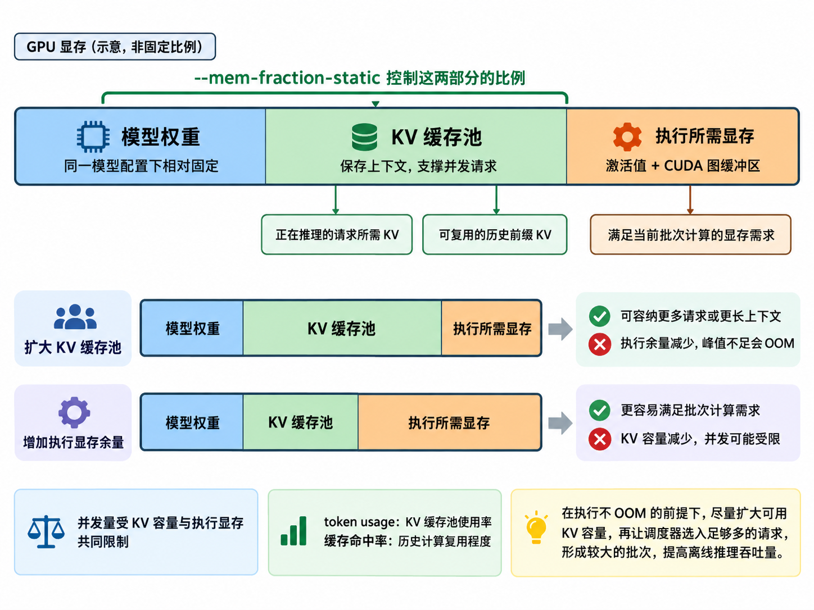
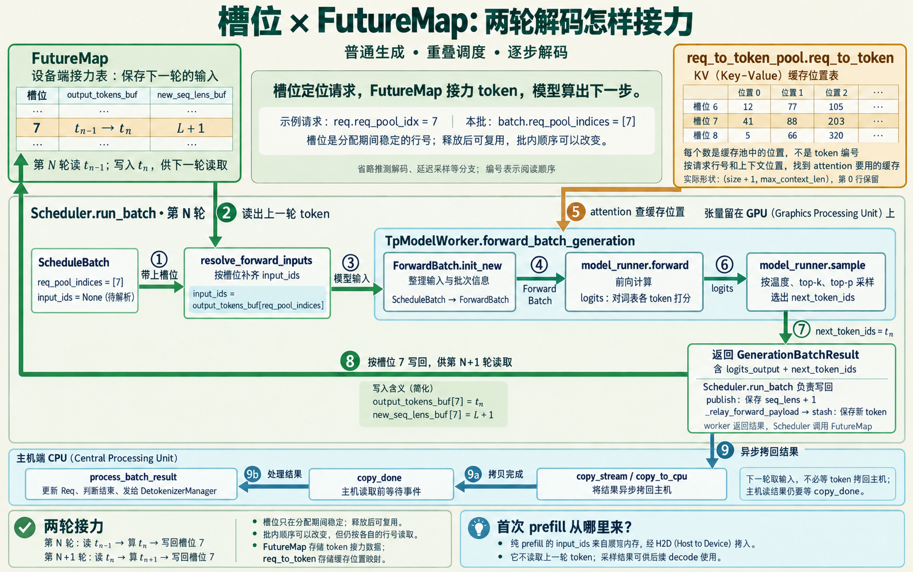
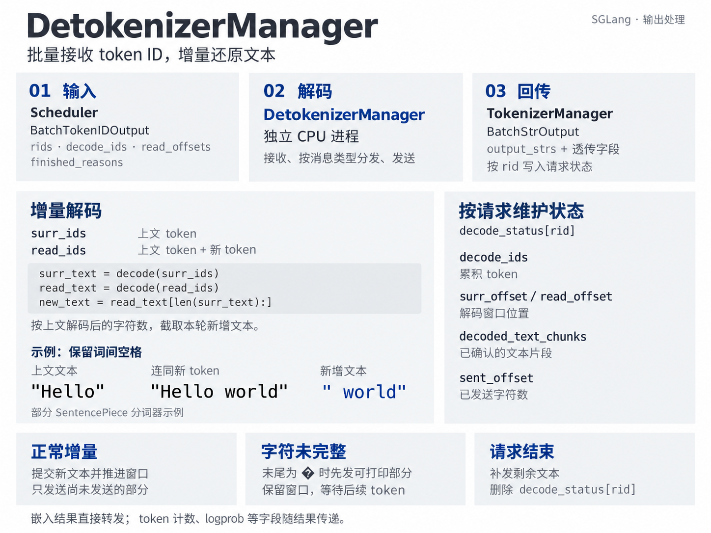

# 学习图谱二：SGLang 核心概念科普图册

这里集中展示[核心链路流程图](<学习图谱一：SGLang核心链路流程图.md>)使用的全部 **6 张辅助科普图**。它们用于看清容器、内存、索引、硬件和并发关系；方法调用、条件分支与执行顺序以该文档的 F00—F16 为准。G01 重新突出实体之间的管理、包含、引用与映射，其余五图复用仓库已有版本；图片不作为已学习代码的证据。

| 图 | 看清什么 | 配合阅读 |
|---|---|---|
| [G01 组批实体](#g01) | 调度器、请求容器、槽位池、KV 池和前缀树的关系 | F05—F09 |
| [G02 显存构成](#g02) | 权重、KV 池和执行空间的区别 | F02、F07、F12 |
| [G03 CPU/GPU 与 KV 生命周期](#g03) | CPU 管编号、GPU 算向量；释放与保留缓存的区别 | F07—F09、F12 |
| [G04 FutureMap](#g04) | 按请求槽位接力下一轮输入 token | F14 |
| [G05 CUDA Graph](#g05) | 捕获操作、更新输入、回放与硬件执行的关系 | F02、F10、F14 |
| [G06 增量解码](#g06) | token ID 如何逐步组成完整可读文本 | F16 |

## G01 组批实体：包含、引用与映射

图中容器持有 `Req`，`RadixCache` 包含 `TreeNode`；请求引用命中节点并占用请求槽位。`ReqToTokenPool` 和前缀树通过编号关联 KV 池。**这些是关系箭头，不是时间顺序**；实际顺序是先请求槽位、后新 KV 编号、最后写映射，见 F07。

[图片原文](<思考一：关于组批请求的数据模型.md>) · [生成提示词](assets/batching-entity-relationships-wide-v3.prompt.txt)

## G02 显存：装模型、装历史、留出计算空间

权重在不同请求间共享；KV 按请求历史增长并可经前缀缓存共享；工作区服务本轮计算。图中的大小是示意，不能用来推导某个模型的固定显存比例。日志里 `token usage` 的精确分母随日志位置和池实现而异，应对照实际字段；它不等于 GPU 总显存利用率。

[原生成提示词](assets/gpu-memory-usage.prompt.txt) · 源码：[KV 池配置](../python/sglang/srt/mem_cache/kv_cache_configurator.py)、[ModelRunner](../python/sglang/srt/model_executor/model_runner.py)。

## G03 编号分配和 K/V 计算是两件事

CPU 侧调度决定哪些请求运行、用哪些编号；GPU 在前向中计算并写入向量。请求结束释放请求槽位，可复用的 KV 仍能留池，之后淘汰才归还对应编号。这张图限定普通非投机、非 PD 路径；局部编号用于解释概念，不是 F00 的全局步骤编号。Decode 沿用请求槽位，分页分配也不等于每步必定取得新物理页。

源码：[Decode 分配](../python/sglang/srt/mem_cache/allocation.py#L528)、[KV 结束处理](../python/sglang/srt/mem_cache/common.py#L202)、[RadixCache 淘汰](../python/sglang/srt/mem_cache/radix_cache.py#L607)。

## G04 FutureMap：接力一个结果，不复制整段上下文

当前实现按请求槽位 `req_pool_idx` 索引。`output_tokens_buf` 接力上一轮采样结果，普通 Decode 在 forward stream 中用它补齐输入；KV Cache 保存历史向量，二者不是同一个缓存。`publish` 还更新长度缓冲区，但普通生成的长度维护不能全部解释成从 FutureMap 取长度；CPU 长度的延迟解析主要在需要它的投机等分支使用。

[原生成提示词](assets/futuremap-slot-token-relay-wide.prompt.txt) · 源码：[resolve_forward_inputs](../python/sglang/srt/managers/overlap_utils.py#L87)、[publish 与 stash](../python/sglang/srt/managers/overlap_utils.py#L535)。

## G05 CUDA Graph：重用提交方式，每轮仍计算新数据

捕获的是操作、依赖和稳定的缓冲区地址，**不是缓存模型输出**。执行时更新输入/元数据，再回放设备上的计算。图画的是模型前向，普通采样由外层 `ModelRunner.sample` 执行；没命中可用图或后端不支持时走 Eager。它与 Overlap 是不同层面的优化。

[原布局提示词](assets/cuda-graph-cpu-gpu-overview-wide-v4.layout.prompt.txt) · [原修订提示词](assets/cuda-graph-cpu-gpu-overview-wide-v4.edit.prompt.txt) · 源码：[图执行](../python/sglang/srt/model_executor/runner/decode_cuda_graph_runner.py#L1449)、[采样](../python/sglang/srt/model_executor/model_runner.py#L1883)。

## G06 Detokenizer：把 token 序列稳定地增量解码

`DecodeStatus` 按 `rid` 保存解码上下文与偏移。实现会比较带上下文的解码结果，提交可打印的新文本；不完整字符要等后续 token，不能假设一个 token 就对应一个汉字。请求完成时提交尾部并清理状态。此状态与 TokenizerManager 的 `ReqState`、Scheduler 的 `Req` 分属不同进程，通过 `rid` 对应。

源码：[DecodeStatus](../python/sglang/srt/managers/detokenizer_manager.py#L75)、[增量解码](../python/sglang/srt/managers/detokenizer_manager.py#L360)、[发送文本结果](../python/sglang/srt/managers/detokenizer_manager.py#L506)。

## 图的取舍与复核

G01—G06 均已由独立 subagent 实际查看图片，并与当前源码核对；每张图上方给出了适用范围。未复用旧 Scheduler 总览中“每轮都发送”和“全部 KV 立即释放”的简化，也未把 Session-Aware RadixCache 的会话软引用当作基础 RadixCache 的硬引用锁。旧 Attention 科普图包含未核准的特定模型参数，因此用 F11/F12 的源码流程说明。

G01 使用内置 imagegen 重绘，RadixCache 内部仅保留三个节点的小树；其余五张图片沿用已有版本。图片辅助理解实体和概念，方法调用与条件分支保留为可编辑 Mermaid。
