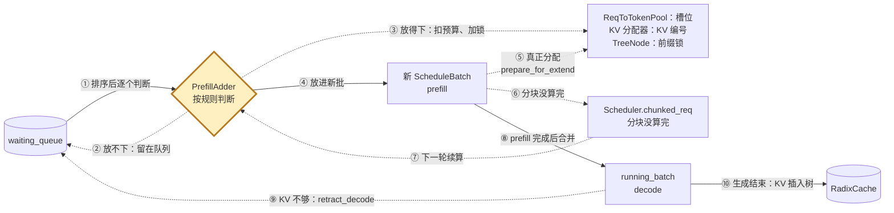

# 思考一：关于组批请求的数据模型

组批的代码分支很多，但换个角度看，它只是几类实体之间的交互：**调度器按规则把 `Req` 从 `waiting_queue` 搬进 `ScheduleBatch`；规则读的是各实体的状态，搬运又会改这些状态。**

## 1. 参与组批的实体

- **调度器**：负责搬运，自身也带状态和规则。
  - `Scheduler`：主循环，决定本轮跑 prefill 还是 decode，并创建 `PrefillAdder`。
  - `SchedulePolicy`：给 `waiting_queue` 排序；默认 FCFS（First Come First Serve），LPM（Longest Prefix Match）等策略会参考前缀命中长度。
  - `PrefillAdder`：本轮的预算管家，逐个判断请求能否入批，放得下就扣预算。
- **数据容器**：装请求或资源，本身也有状态。
  - `waiting_queue`：等待 prefill 的请求。
  - `ScheduleBatch`：本轮要跑的一批；其中 `running_batch` 是 prefill 已完成、正在 decode 的请求集合。
  - `ReqToTokenPool`：槽位，`req_to_token[槽位]` 记录这个请求每个 token 的 KV（Key-Value）编号。
  - KV 分配器与 KV 池：分配器管空闲的 KV 编号，KV 池按编号存 K/V。
  - `RadixCache`：前缀缓存树，统计可淘汰、受保护的 token 数。
- **有状态的元素**
  - `Req`：被搬运的对象。
  - `TreeNode`：不会被搬运，只会被锁住、分裂或淘汰。

## 2. 搬运的全貌

实线是请求的主流程，虚线是分支或资源操作。

- **①② 排序与判断**：`SchedulePolicy` 排好序后，`PrefillAdder` 逐个判断（①）；放不下的请求留在队列里等下一轮（②）。
- **③④⑤ 入批：先预占，再分配**：
  - `PrefillAdder` 先扣预算、给命中的前缀节点加锁（③），再把请求放进新批（④），这两步都不分配资源；`ScheduleBatch.prepare_for_extend()` 才真正分配槽位和 KV 编号，并写入 `req_to_token`（⑤）。
  - 组批只动 KV 编号，不动 K/V 数据；K/V 在前向时才按编号写进 KV 池。
- **⑥⑦⑧ 合并进 decode**：分块没算完的请求暂存在 `Scheduler.chunked_req`（⑥），下一轮接着算（⑦）；prefill 全部完成后，请求合并进 `running_batch`（⑧）。
- **⑨⑩ 离开**：KV 不够时，`retract_decode` 把请求退回 `waiting_queue`（⑨）；生成结束时把 KV 插入 `RadixCache` 并释放槽位（⑩）。所以搬运是循环，不是单向。

## 3. 规则读的状态，搬运改的状态

| 实体 | 规则读什么 | 搬运改什么 |
|---|---|---|
| `Req` | 输入长度、命中前缀长度、`max_new_tokens` | 写入 `prefix_indices`、`last_node`、`extend_range`、`req_pool_idx` |
| `TreeNode` | `lock_ref`：大于 0 不可淘汰 | `lock_ref += 1`；匹配停在一段中间时会分裂 |
| `RadixCache` | `evictable_size()`：可淘汰的 token 数 | 可淘汰的变少、受保护的变多；空间不够时淘汰叶子 |
| KV 分配器 | `available_size()`：空闲 KV 编号数 | 空闲编号变少 |
| `ReqToTokenPool` | `available_size()`：空闲槽位数 | 占用槽位，`req_to_token` 写入 KV 编号 |
| `running_batch` | 请求数、将来 decode 要预留的 KV | prefill 完成的请求合并进来 |
| `PrefillAdder` | `rem_total_tokens`、`rem_input_tokens`、`rem_chunk_tokens` | 每放进一个请求就扣减 |

- 规则的另一部分来源是启动配置：`max_running_requests`、`max_prefill_tokens`、`chunked_prefill_size`、`schedule_policy`。

## 4. 读组批代码时的抓手

看到一行组批代码，先判断它属于哪一类：

- **读状态**：在检查哪个实体的哪个状态？例如 `total_tokens >= self.rem_total_tokens` 读的是 `PrefillAdder` 的预算。
- **改状态**：在改哪个实体的状态？例如 `inc_lock_ref()` 改的是 `TreeNode.lock_ref` 和 `RadixCache` 的两个计数。
- **搬运**：把 `Req` 从哪个容器移到哪个容器？例如 `adder.can_run_list.append(req)`，之后这些请求从 `waiting_queue` 中移除。

## 术语与生词

| 术语或单词 | 中文释义 | 简明英文释义 |
|---|---|---|
| FCFS — First Come First Serve | 先来先服务：按到达顺序调度 | Serve requests in arrival order. |
| LPM — Longest Prefix Match | 最长前缀匹配：优先调度命中前缀最长的请求 | Prefer requests with the longest cached prefix. |
| KV — Key-Value | 注意力里每个 token 的键和值 | Attention keys and values of each token. |
| budget /ˈbʌdʒɪt/ | 预算：本轮还能用的资源额度 | The amount of resources still available. |
| retract /rɪˈtrækt/ | 撤回：把请求退回等待队列，释放它占的 KV | Send a request back to the waiting queue and free its KV. |
| evict /ɪˈvɪkt/ | 淘汰：移除缓存项以腾出空间 | To remove a cached item to make space. |

点击图片查看大图。[生成提示词](assets/batching-entity-relationships-wide-v2.prompt.txt)
