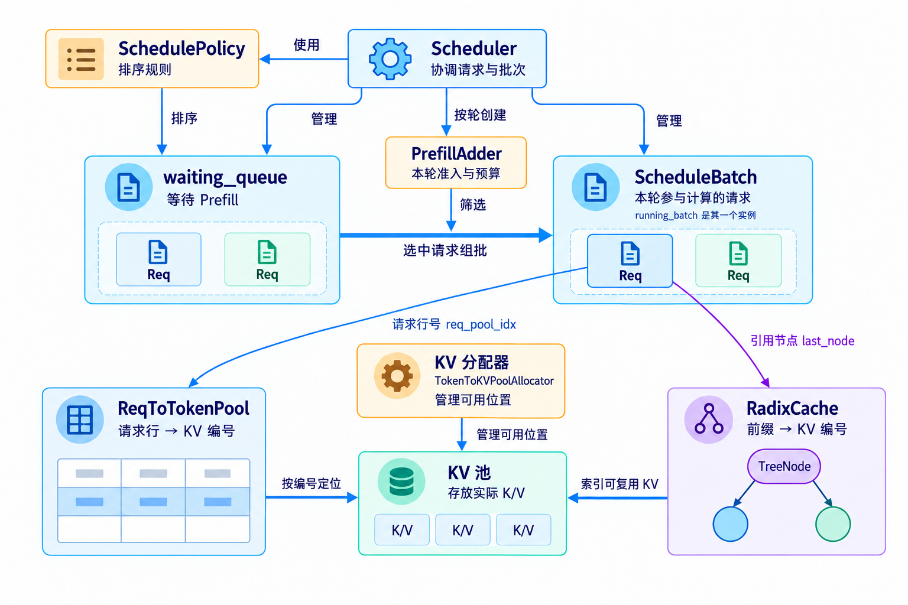

# 思考一：关于组批请求的数据模型

组批的代码分支很多，但换个角度看，它只是几类实体之间的交互：**调度器按规则把 `Req` 从 `waiting_queue` 搬进 `ScheduleBatch`；规则读的是各实体的状态，搬运又会改这些状态。**

## 1. 参与组批的实体

- **调度器**：负责搬运，自身也带状态和规则。
  - `Scheduler`：主循环，决定本轮跑 prefill 还是 decode，并创建 `PrefillAdder`。
  - `SchedulePolicy`：给 `waiting_queue` 排序；默认 FCFS（First Come First Serve），LPM（Longest Prefix Match）等策略会参考前缀命中长度。
  - `PrefillAdder`：本轮的预算管家，逐个判断请求能否入批，放得下就扣预算。
- **数据容器**：装请求或资源，本身也有状态。
  - `waiting_queue`：等待 prefill 的请求。
  - `ScheduleBatch`：本轮要跑的一批；其中 `running_batch` 是 prefill 已完成、正在 decode 的请求集合。
  - `ReqToTokenPool`：槽位，`req_to_token[槽位]` 记录这个请求每个 token 的 KV（Key-Value）编号。
  - `TokenToKVPoolAllocator` 与 KV 池：`TokenToKVPoolAllocator` 管空闲的 KV 编号，KV 池按编号存 K/V。
  - `RadixCache`：前缀缓存树，由 `TreeNode` 组成；统计可淘汰、受保护的 token 数。
- **有状态的元素**：`Req` 是被搬运的对象；`TreeNode` 是 `RadixCache` 的节点，存一段 token 和对应的 KV 编号，不会被搬运，只会被锁住、分裂或淘汰。

完整链路和各环节的可编辑流程图见[核心链路流程图](<学习图谱一：SGLang核心链路流程图.md>)；辅助图片集中在[核心概念科普图册](<学习图谱二：SGLang核心概念科普图册.md>)。

## 2. 搬运的全貌

下面是**普通文本生成、基础 RadixCache、非投机、无 PD 分离**的逻辑生命周期。①—⑫只在动作节点出现一次，分支不另复用编号。Overlap 会让 CPU 处理结果和 GPU 下一轮执行交错，图中连线不是严格的 CPU 时间线。

两图都从左向右阅读，并沿用[核心链路图谱](<学习图谱一：SGLang核心链路流程图.md>)的模块配色：**琥珀色为 Scheduler，橙色为 Policy/PrefillAdder，紫色为 Req/批次描述，蓝绿色为池与分配器，绿色为 Radix 缓存，靛蓝色为 Worker/Runner**。颜色标明主要责任模块，复合动作按主要责任方着色；同色节点不表示同一进程或设备流。

```mermaid
flowchart LR
    Q["waiting_queue：等待 Prefill 的 Req"]
    P["① 排序、匹配已有前缀"]
    A{"② PrefillAdder：当前请求能入批吗？"}
    L["③ 选入 can_run_list、保护前缀、扣预算"]
    B["④ 用选中请求建批；仅新请求移出等待队列"]
    S["⑤ 先取得或复用请求槽位"]
    K["⑥ 再分配新增 KV 编号；必要时淘汰缓存"]
    M["⑦ 写 req_to_token：已有编号加新编号"]
    F["⑧ 前向与采样：写入 K/V，得到本轮计算结果"]
    R{"按请求处理结果：结束、分块未完、继续生成"}
    C["⑨ 暂存已算前缀；保留 chunked_req 与请求槽位"]
    U["下一轮优先 add_chunked_req 续算"]
    RB["⑩ 未结束且 Prefill 已算完：并入或留在 running_batch"]
    CHECK{"下一步 KV 容量足够？先尝试淘汰无锁缓存"}
    D["⑪ prepare_for_decode：沿用请求槽位，增加 KV 位置"]
    RET["回退部分请求：释放私有资源、重置，再排队"]
    END["⑫ 结束：登记可复用前缀、解锁、释放请求槽位"]
    Q --> P --> A
    A -->|"未选入，留队"| Q
    A -->|"选入"| L --> B --> S --> K --> M --> F --> R
    R -->|"中间 chunk，不返回生成 token"| C --> U --> B
    R -->|"完整 Prefill；未结束"| CACHE["缓存已算前缀并移动请求引用"] --> RB
    R -->|"Decode；未结束"| RB
    RB --> CHECK
    CHECK -->|"足够"| D --> F
    CHECK -->|"不足"| RET --> Q
    RET --> LEFT{"仍有保留在运行批的请求？"}
    LEFT -->|"有"| CHECK
    LEFT -->|"无"| IDLE["返回调度，等待下一轮选择"]
    R -->|"已结束"| END
    S -.->|"请求行"| POOL["ReqToTokenPool"]
    K -.->|"空闲编号"| AL["KV 分配器"]
    L -.->|"前缀保护"| TREE["RadixCache：TreeNode 组成的索引树"]
    C -.->|"插入或复用前缀结构"| TREE
    END -.->|"缓存仍可留在 KV 池"| TREE
    F -.->|"实际向量"| KV["KV 池：存放 K/V"]

    classDef scheduler fill:#FEF3C7,stroke:#A16207,color:#111827,stroke-width:2px
    classDef policy fill:#FFEDD5,stroke:#C2410C,color:#111827,stroke-width:2px
    classDef batch fill:#EDE9FE,stroke:#7C3AED,color:#111827,stroke-width:2px
    classDef memory fill:#CCFBF1,stroke:#0F766E,color:#111827,stroke-width:2px
    classDef cache fill:#DCFCE7,stroke:#15803D,color:#111827,stroke-width:2px
    classDef runner fill:#E0E7FF,stroke:#4338CA,color:#111827,stroke-width:2px
    class Q,R,LEFT,IDLE scheduler
    class P,A,L,U policy
    class B,RB,CHECK,D,RET batch
    class S,K,M,END,POOL,AL,KV memory
    class C,CACHE,TREE cache
    class F runner
```

**分配顺序是请求槽位在先、新 KV 编号在后。** [`alloc_for_extend`](../python/sglang/srt/mem_cache/allocation.py#L282) 先调用 `alloc_req_slots`（315 行），再分配新增 KV 编号（324 行起），最后 `write_cache_indices`（356 行）。前缀匹配更早返回的是**已有编号**，并不是新分配。分块续算通过 [`ReqToTokenPool.alloc`](../python/sglang/srt/mem_cache/memory_pool.py#L299) 复用已有请求槽位。

- **①—④是挑选和记账**：是否已入批看 `can_run_list`；`NO_TOKEN / OTHER` 也可能在接纳当前请求后返回，只表示本轮停止继续挑选。资源不足而未选中的请求才留在队列。
- **⑤—⑧才把批变成可执行输入并计算**：槽位是请求索引表的一行；KV 编号定位显存池；前向才写 K/V。普通路径中，如果已经进入实际分配却失败，会报错，不能理解成自动留队重试。
- **⑨和⑩是两条不同路径**：中间 chunk 暂存后，下一轮优先 `add_chunked_req`，保留槽位；完整 Prefill 且未结束的请求，在后续调度中经过滤后合并进 `running_batch`。中间 chunk 不返回普通生成 token。
- **⑪与回退**：先尝试淘汰无锁缓存；仍不足才回退请求。被回退请求用 `release_kv_cache(is_insert=False)`，新算的私有部分不会为这次回退写入树，之后携带已生成 token 重新 Prefill；极端情况下连一个请求也无法容纳，会终止该请求。
- **⑫释放请求槽位，不代表清空全部 KV**：树登记前缀到编号的映射；可复用 K/V 仍留在池里。释放重复、尾部和无需保留的编号，或日后淘汰缓存，才使对应容量回到分配器。

源码依据：[建批与调度](../python/sglang/srt/managers/scheduler.py#L3275)、[Prefill 结果分支](../python/sglang/srt/managers/scheduler_components/batch_result_processor.py#L240)、[Decode 容量与回退](../python/sglang/srt/managers/schedule_batch.py#L2914)、[结束后的资源处理](../python/sglang/srt/mem_cache/common.py#L202)。

## 3. 和 RadixCache 的交互

下面从左向右展开新请求的普通准入、批次分配和缓存收尾。排序阶段按策略选择是否参考前缀；`Req.init_next_round_input` 再取得本轮实际命中。批次准备经 `allocation.py` 辅助函数操作池与缓存，缓存收尾由 Scheduler 的结果处理或分块暂存路径触发。已有 chunk 的优先续算见上一图。

```mermaid
flowchart LR
    SORT["SchedulePolicy.calc_priority"] --> AWARE{"采用缓存相关排序策略？"}
    AWARE -->|"是，例如 LPM"| PCACHE["RadixCache.match_prefix：取得排序参考"]
    AWARE -->|"否"| ORDER["确定 waiting_queue 的先后"]
    PCACHE --> ORDER
    ORDER --> NEXT{"还有候选请求？"}
    NEXT -->|"有"| REQ["Req.init_next_round_input"]
    REQ --> MATCH["再次匹配：已有 KV 编号与 last_node"]
    MATCH --> FIRST{"PrefillAdder 预算初判通过？"}
    FIRST -->|"否"| NOLOCK["未接纳；不加临时锁，仍留队"]
    FIRST -->|"是"| TEMP["inc_lock_ref：临时保护命中路径"]
    TEMP --> SECOND{"重判容量、输入与分块额度，可接纳？"}
    SECOND -->|"是"| ADMIT["设置 extend_range；加入 can_run_list"]
    ADMIT --> REFL["增加请求长期引用"]
    REFL --> BUDGET["扣预算；并未分配槽位或新 KV 编号"]
    SECOND -->|"否"| DENY["未加入 can_run_list，仍留队"]
    BUDGET --> UNLOCK["finally：只释放临时引用"]
    DENY --> UNLOCK
    UNLOCK --> CONT{"返回码允许继续挑选？"}
    NOLOCK --> CONT
    CONT -->|"CONTINUE"| NEXT
    CONT -->|"NO_TOKEN / OTHER"| ANY{"最终 can_run_list 非空？"}
    NEXT -->|"无"| ANY
    ANY -->|"否"| IDLE["没有新 Prefill 批；返回 Scheduler"]
    ANY -->|"是"| BATCH["ScheduleBatch.init_new → prepare_for_extend"]
    BATCH --> SLOT["先取得或复用请求槽位"]
    SLOT --> SPACE{"空闲 KV 编号足够？"}
    SPACE -->|"不足，尝试腾空间"| EVICT["淘汰无锁叶子；编号还给分配器"]
    SPACE -->|"足够"| ALLOC["后分配新增 KV 编号"]
    EVICT --> ALLOC
    ALLOC --> MAP["write_cache_indices：已有与新编号写入请求行"]
    MAP --> FWD["模型前向才向 KV 池写入实际 K/V"]
    FWD --> STATUS{"处理请求结果或暂存 chunk"}
    STATUS -->|"未结束，需缓存已算前缀"| UNFIN["cache_unfinished_req：插入或复用、更新映射、移动引用"]
    STATUS -->|"正常结束"| FIN["cache_finished_req：缓存、去重、解锁"]
    FIN --> RELEASE["release_kv_cache 归还请求槽位；可复用 KV 仍留池"]

    classDef policy fill:#FFEDD5,stroke:#C2410C,color:#111827,stroke-width:2px
    classDef cache fill:#DCFCE7,stroke:#15803D,color:#111827,stroke-width:2px
    classDef scheduler fill:#FEF3C7,stroke:#A16207,color:#111827,stroke-width:2px
    classDef batch fill:#EDE9FE,stroke:#7C3AED,color:#111827,stroke-width:2px
    classDef memory fill:#CCFBF1,stroke:#0F766E,color:#111827,stroke-width:2px
    classDef runner fill:#E0E7FF,stroke:#4338CA,color:#111827,stroke-width:2px
    class SORT,AWARE,ORDER,FIRST,SECOND,NOLOCK,ADMIT,BUDGET,DENY policy
    class PCACHE,MATCH,TEMP,REFL,UNLOCK,EVICT,UNFIN,FIN cache
    class NEXT,CONT,ANY,IDLE,STATUS scheduler
    class REQ,BATCH batch
    class SLOT,SPACE,ALLOC,MAP,RELEASE memory
    class FWD runner
```

前缀缓存从以下方面影响组批：

- **命中减少新计算与新分配**：普通初判使用“未命中输入长度 + 经裁剪的剩余输出预算 + 一页余量”；输出预算会减去已生成长度并限制到估算上限。Mamba、SWA 等路径另有预算，不能把这个简式当成所有模型的通用公式。
- **可淘汰缓存可用于腾空间**：普通 `rem_total_tokens` 综合空闲、可淘汰容量和运行请求/本批预留；它是预算，未取得具体编号。
- **锁后必须重判**：路径上引用从 0 变 1 的节点会从可淘汰转成受保护；本来已被其他请求保护的节点，只增加引用计数，不重复扣同一份可淘汰容量。
- **临时引用与请求引用不同**：临时引用在 `finally` 释放；接纳后请求持有的引用跨轮次保留。`cache_unfinished_req` 可以先插入/复用前缀、去重、改映射，再把引用从旧路径移到新路径；正常结束或回退再解除相应引用。
- **LPM 只影响先后，不保证“同前缀只放一个”**：共享未缓存前缀的请求可能被暂时排到后面，预算允许时仍能进入同一批。FCFS 不按命中长度排序，即使某些配置下也会为统计做匹配。

源码依据：[准入及预算](../python/sglang/srt/managers/schedule_policy.py#L1243)、[临时锁](../python/sglang/srt/managers/schedule_policy.py#L1089)、[LPM 延后规则](../python/sglang/srt/managers/schedule_policy.py#L331)、[未结束请求缓存](../python/sglang/srt/mem_cache/radix_cache.py#L530)、[引用计数](../python/sglang/srt/mem_cache/radix_cache.py#L637)。

## 4. 规则读的状态，搬运改的状态

| 实体 | 规则读什么 | 搬运改什么 |
|---|---|---|
| `Req` | 输入长度、命中前缀长度、`max_new_tokens` | 写入 `prefix_indices`、`last_node`、`extend_range`、`req_pool_idx` |
| `TreeNode` | `lock_ref`：大于 0 不可淘汰 | `lock_ref` 加减；匹配停在一段中间时分裂；插入时新建 |
| `RadixCache` | `match_prefix()` 的命中长度、`evictable_size()` | 引用从 0 变 1 时可淘汰量减少、受保护量增加；空间不够时淘汰无锁叶子 |
| `TokenToKVPoolAllocator` | `available_size()`：空闲 KV 编号数 | 分配时空闲编号变少，淘汰时变多 |
| `ReqToTokenPool` | `available_size()`：空闲槽位数 | 占用槽位，`req_to_token` 写入 KV 编号 |
| `running_batch` | 请求数、将来 decode 要预留的 KV | prefill 完成的请求合并进来 |
| `PrefillAdder` | `rem_total_tokens`、`rem_input_tokens`、`rem_chunk_tokens` | 每放进一个请求就扣减 |

- 规则的另一部分来源是启动配置：`max_running_requests`、`max_prefill_tokens`、`chunked_prefill_size`、`schedule_policy`。
- 读组批代码时，先判断一行代码是在读状态（如 `total_tokens >= self.rem_total_tokens`）、改状态（如 `inc_lock_ref()`），还是在搬运（如 `adder.can_run_list.append(req)`）。

## 术语与生词

| 术语或单词 | 中文释义 | 简明英文释义 |
|---|---|---|
| FCFS — First Come First Serve | 先来先服务：按到达顺序调度 | Serve requests in arrival order. |
| LPM — Longest Prefix Match | 最长前缀匹配：优先调度命中前缀最长的请求 | Prefer requests with the longest cached prefix. |
| LRU — Least Recently Used | 最近最少使用：先淘汰最久没访问的节点 | Evict the item that was used least recently. |
| KV — Key-Value | 注意力里每个 token 的键和值 | Attention keys and values of each token. |
| retract /rɪˈtrækt/ | 撤回：释放私有资源，把请求退回等待队列以重算 | Send a request back to the waiting queue and free its KV. |
| evict /ɪˈvɪkt/ | 淘汰：移除缓存项以腾出空间 | To remove a cached item to make space. |

点击图片查看大图。[生成提示词](assets/batching-entity-relationships-wide-v3.prompt.txt)
