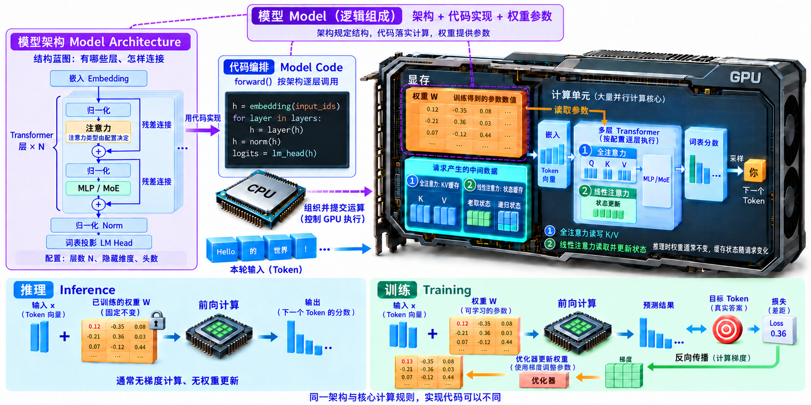
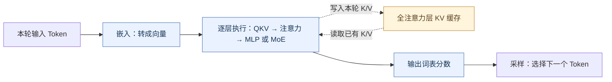

# 思考二：关于推理过程的思考

> 模型不只是一份权重：架构规定怎样计算，权重提供学到的参数，推理框架负责组织和高效执行。下文以常见的自回归 Transformer 语言模型为例。

[](assets/inference-model-reflection-wide-v3.webp)

## 1. 模型到底是什么

- **模型架构(Model Architecture)**：规定有哪些层、怎样连接、采用什么计算规则；配置描述层数、维度、注意力头数等。
- **模型权重(Model Weights)**：训练得到的参数数值，通常以张量(Tensor)保存；数值本身不会规定完整的执行流程。
- **模型实现(Model Implementation)**：用代码或计算图落实架构，加载权重并执行运算；通用基类不会仅凭权重自动推导出完整计算逻辑。

把模型比作程序：计算规则对应算法，张量形状与组织方式属于数据结构，**权重是其中存放的参数数据**。例如 `y = activation(x @ W + b)` 中，`W、b` 是参数，乘法、加法和激活函数及其顺序是计算逻辑。

以 Qwen3.5 文本路径为例，下面将[模型主体](../python/sglang/srt/models/qwen3_5.py#L1503)和[输出头](../python/sglang/srt/models/qwen3_5_text.py#L135)合并为六行示意：`h` 是隐藏状态、`r` 是残差，省略多卡、空批等分支，并非逐行摘录。
```python
h = self.model.embed_tokens(input_ids)  # Token 转向量
r = None  # 初始化残差
for layer in self.model.layers:  # 按模型配置逐层计算
    h, r = layer(hidden_states=h, residual=r, positions=positions, forward_batch=forward_batch)
h, _ = self.model.norm(h, r)  # 最终归一化
return self.logits_processor(input_ids, h, self.lm_head, forward_batch)  # 词表分数
```
其中 `layer` 按[配置](../python/sglang/srt/models/qwen3_5.py#L1454)组合全注意力(Full Attention)与门控 Delta 网络(Gated DeltaNet)线性注意力层，随后执行 MLP 或 MoE；权重已挂在这些层上，调用层时才参与实际计算。

## 2. 一次模型计算，内部到底做什么？

模型类的前向方法(Forward)组织词元(Token)嵌入(Embedding)、多层计算和输出；它调用的层、后端与算子共同完成细节，不需要每个模型类重新实现所有底层操作。

<!-- mermaid:id=model_forward -->


- **注意力(Attention)**：全注意力路径从隐藏状态(Hidden States)计算查询(Query，Q)、键(Key，K)、值(Value，V)，结合位置编码等完成计算；Qwen3.5 的线性注意力层采用另一套状态更新逻辑，不能把所有层都理解成相同的注意力实现。
- **键值缓存(Key-Value Cache，KV Cache)**：图中缓存读写针对全注意力层；后端写本轮 K/V、读已有 K/V。KV 编号定位存储槽位，分配编号不等于写入数据；Qwen3.5 的线性注意力层则维护卷积状态与递归状态，不是保存完整历史 K/V 列表。
- **多层感知机(Multilayer Perceptron，MLP)**：通常进行投影升维、激活或门控、投影降维；混合专家(Mixture of Experts，MoE)模型常在此处改为选专家、计算并合并结果。
- **输出与生成**：前向得到词表分数(Logits)，采样(Sampling)选择下一个 Token；常规解码中，新选出的 Token 在下一轮作为输入，其 K/V 也通常到那时才计算并写入。

## 3. 训练和推理是不是同一套模型？

对于同一个模型，两者通常遵循同一套架构和核心前向计算规则，但实现代码可以不同：训练实现支持求导与更新，推理实现优化组批、缓存、算子与并行；同一份权重可由不同框架中的兼容实现执行。

- **训练(Training)**：前向预测 → 计算损失(Loss) → 反向传播(Backpropagation)，计算梯度(Gradient) → 优化器(Optimizer)更新可训练参数。
- **推理(Inference)**：用已经训练好的权重前向计算并输出结果，通常不计算梯度、不更新权重；KV 缓存随请求变化，不代表权重发生变化。

## 4. 为什么新模型能获得首日支持？

模型团队可以提前提供架构、参考实现和测试材料，共同适配或直接贡献代码；沿用已支持的架构也可能只需少量改动，所以“首日支持(Day-0 Support)”不一定意味着提前合作。全新架构通常还要适配计算、权重加载与缓存并验证正确性；能运行与功能、性能都已优化是不同层次。

## 术语与生词

| 术语 / 单词 | 中文释义 | 简明英文释义 |
|---|---|---|
| architecture /ˈɑːkɪtektʃə/ | 架构：模型组件及其连接和计算规则 | The structure of a model and how its parts work together. |
| tensor /ˈtensə/ | 张量：按一个或多个维度组织的数值数组 | An array of numbers organized along one or more dimensions. |
| inference /ˈɪnfərəns/ | 推理：使用训练好的模型计算输出 | Using a trained model to produce outputs. |
| gradient /ˈɡreɪdiənt/ | 梯度：函数相对各变量的变化率组成的向量 | A vector of partial derivatives of a function. |
| KV Cache — Key-Value Cache | 键值缓存：复用历史 Token 的注意力键和值 | Stored attention keys and values reused in later steps. |
| MLP — Multilayer Perceptron | 多层感知机：通过线性变换与非线性激活处理向量 | A network that combines linear transformations with nonlinear activations. |
| MoE — Mixture of Experts | 混合专家：为 Token 选择部分专家参与计算 | A model design that selects a subset of experts for each token. |
