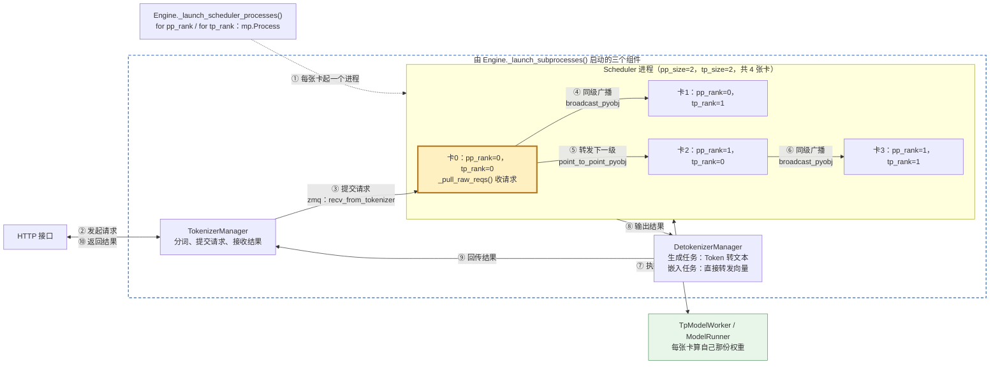

# 核心概念一：SGLang中的并行策略

> **把权重、层、请求、专家或 token 分到多张卡上；每张卡一个 Scheduler 进程，用 rank 坐标区分各自的分工。**

## 1. 并行策略一览

### 五种基础策略

| 策略 | 切什么 | 参数 | 例子（4 张卡） | 文档 |
|---|---|---|---|---|
| 张量并行(Tensor Parallelism，TP) | 每层的权重矩阵，层内横切 | `--tp-size` | 32 个注意力头，每张卡算 8 个 | [1.3](<1.3 并行策略与模型网关(Parallelism and Model Gateway).md>) |
| 流水线并行(Pipeline Parallelism，PP) | 按层纵切 | `--pp-size` | 80 层，每张卡放 20 层 | [1.7](<1.7 长上下文流水线并行(Pipeline Parallelism for Long Context).md>) |
| 数据并行(Data Parallelism，DP) | 按请求分，每份是完整模型副本 | `--dp-size` | 4 个副本各自处理不同请求 | [1.3](<1.3 并行策略与模型网关(Parallelism and Model Gateway).md>) |
| 专家并行(Expert Parallelism，EP) | 混合专家(Mixture of Experts，MoE)层的专家 | `--ep-size` | 256 个专家，每张卡放 64 个 | [1.4](<1.4 专家并行(Expert Parallelism).md>) |
| 上下文并行(Context Parallelism，CP) | 同一条请求的 token | `--attn-cp-size` | 4 万 token 的请求，每张卡负责 1 万 | [2.5](<2.5 预填充上下文并行(Prefill Context Parallelism).md>) |

```text
TP=4（层内横切）            PP=4（按层纵切）
层1: [卡0|卡1|卡2|卡3]      层1-20  → 卡0
层2: [卡0|卡1|卡2|卡3]      层21-40 → 卡1
...                          层41-60 → 卡2
层N: [卡0|卡1|卡2|卡3]      层61-80 → 卡3
```

- TP 每层算完都要 all-reduce 合并各卡的部分结果，通信频繁，一般用在同一台机器内。
- PP 只在相邻两级之间传中间结果，通信少，适合跨机器。
- CP 的每个 token 要看到前面所有 token，各卡之间要交换键值(Key-Value，KV)。

### SGLang 的细分变体

- 注意力数据并行(Data Parallelism Attention，DPA)：只在注意力层做 DP，KV Cache 不再每张卡重复存，主要用于多头潜在注意力(Multi-head Latent Attention，MLA)模型；用 `--enable-dp-attention` 开启，详见 [1.3](<1.3 并行策略与模型网关(Parallelism and Model Gateway).md>)。
- 解码上下文并行(Decode Context Parallelism，DCP)：decode 阶段把 MLA 的 KV Cache 分片到多张卡，各自算局部注意力再合并；用 `--dcp-size`，详见 [2.4](<2.4 解码上下文并行(Decode Context Parallelism).md>)。
- MoE DP：MoE 层内部再做 DP，用 `--moe-dp-size`。
- MoE dense TP：给 MoE 模型里的稠密多层感知机(Multi-Layer Perceptron，MLP)层单独设 TP 大小，用 `--moe-dense-tp-size`。
- 分布式权重数据并行(Distributed Weight Data Parallelism，DWDP)：MoE prefill 时预取权重，代替 token 的 all-to-all；用 `--dwdp-size`。

### 容易混淆、但不算模型并行的

- SGLang 模型网关(SGLang Model Gateway，SMG)：在多个实例之间路由请求，相当于实例外层的 DP。
- 预填充与解码分离(Prefill-Decode Disaggregation，PD 分离)：把 prefill 和 decode 放到不同实例，属于部署拆分，详见 [1.5](<1.5 预填充与解码分离(PD Disaggregation).md>)。

## 2. 卡怎么分：TP 组是基本单位

- **总卡数**：一般是 `pp_size × tp_size`；原生 DP 每个副本单独一组卡，再乘 `dp_size`（[`launch_dp_schedulers`](../python/sglang/srt/managers/data_parallel_controller.py#L369) 按 `tp_size × pp_size` 偏移 GPU 编号）。
- **DPA、CP、EP 不额外加卡**，都在 TP 组的卡里重新划分（[data_parallel_controller.py](../python/sglang/srt/managers/data_parallel_controller.py#L680) 的注释）：
  - 注意力层：TP 组 → DP → ATTN_CP → ATTN_TP，`attn_tp_size = tp_size / dp_size / attn_cp_size`。
  - MoE 层：TP 组 → MOE_DP → EP → MOE_TP。
- **例子**：`--tp-size 8 --dp-size 4 --enable-dp-attention` 一共 8 张卡；注意力层分 4 组，每组 2 张卡做 TP；MoE 层 8 张卡一起算。

## 3. 在核心链路中的位置：rank 坐标与请求分发



虚线是启动阶段（①），实线是请求处理链路（②–⑩）。

- **① rank 坐标**：[`_launch_scheduler_processes`](../python/sglang/srt/entrypoints/engine.py#L838) 两层循环 `for pp_rank`、`for tp_rank`，每张卡起一个 Scheduler 进程。
  - 不开 DP 时，`(pp_rank, tp_rank)` 唯一确定一张卡，全局编号 = `pp_rank × tp_size + tp_rank`。
  - 开 DP 时多一维 `dp_rank`，改由 DataParallelController 启动。
- **③ 只有 (0, 0) 这张卡收请求**：[`_pull_raw_reqs`](../python/sglang/srt/managers/scheduler_components/request_receiver.py#L113) 非阻塞读 zmq，其他卡返回 `None`。
- **④⑥ 同级广播**：[`_broadcast_reqs_across_ranks`](../python/sglang/srt/managers/scheduler_components/request_receiver.py#L173) 用 `broadcast_pyobj` 走 CPU 通信组（gloo）。
  - 广播的是完整请求列表，每张卡拿到的一样；分工体现在权重上，不体现在请求上。
- **⑤ 转发下一级**：pp_rank 大于 0 的 tp_rank=0 卡从上一级接收（[L162](../python/sglang/srt/managers/scheduler_components/request_receiver.py#L162)），发送端是 [`_pp_send_pyobj_to_next_stage`](../python/sglang/srt/managers/scheduler_pp_mixin.py#L972)。
- **⑦ 计算时的通信**：TP 每层 all-reduce；PP 把中间结果传给下一级。
- 代码里判断用的是 `attn_tp_rank`、`attn_cp_rank`：不开 DPA、CP 时分别等于 `tp_rank` 和 0。
- 单卡（`tp_size=pp_size=1`）时 ④⑤⑥ 都不发生。

## 术语与生词

| 术语或单词 | 中文释义 | 简明英文释义 |
|---|---|---|
| TP — Tensor Parallelism | 张量并行：每层的权重矩阵切到多张卡。 | Splitting each layer's weight matrices across devices. |
| PP — Pipeline Parallelism | 流水线并行：按层切到多张卡，数据逐级传递。 | Splitting a model by layers and passing data stage by stage. |
| DP — Data Parallelism | 数据并行：完整模型副本处理不同请求。 | Processing different requests with separate copies of a model. |
| EP — Expert Parallelism | 专家并行：不同专家放到不同卡上。 | Distributing experts across devices. |
| CP — Context Parallelism | 上下文并行：同一条请求的 token 切到多张卡。 | Splitting the tokens of one request across devices. |
| DPA — Data Parallelism Attention | 注意力数据并行：只在注意力层按请求分卡。 | Applying data parallelism only to attention layers. |
| DCP — Decode Context Parallelism | 解码上下文并行：decode 时分片 KV Cache。 | Sharding the KV cache across devices during decoding. |
| DWDP — Distributed Weight Data Parallelism | 分布式权重数据并行：预取权重代替 token 交换。 | Prefetching weights instead of exchanging tokens in MoE prefill. |
| MoE — Mixture of Experts | 混合专家：每个 token 只用部分专家计算。 | A model design that uses a subset of experts for each token. |
| MLA — Multi-head Latent Attention | 多头潜在注意力：用压缩的潜在向量存 KV。 | Attention that stores keys and values as a compact latent vector. |
| MLP — Multi-Layer Perceptron | 多层感知机：模型里的前馈网络层。 | The feed-forward layers of a model. |
| KV — Key-Value | 键值：注意力里的键和值，缓存后供后续 token 复用。 | Attention keys and values, cached for later tokens. |
| SMG — SGLang Model Gateway | 模型网关：在实例之间路由请求。 | A gateway that routes requests across instances. |
| PD — Prefill-Decode | 预填充与解码：PD 分离把两个阶段放到不同实例。 | The two inference phases; PD disaggregation runs them on separate instances. |
| rank /ræŋk/ | 编号：并行组里每个进程（每张卡）的序号。 | The index of a process within a parallel group. |
| all-reduce | 全归约：各卡结果求和后每张卡都拿到总和。 | Combining values from all devices and sharing the result with each. |
| all-gather | 全收集：每张卡拿到所有卡的数据。 | Collecting data from all devices onto every device. |
| all-to-all | 全互换：每张卡把不同的数据分别发给其他每张卡。 | Each device sends a different piece of data to every other device. |
| gloo /ɡluː/ | PyTorch 的 CPU 通信后端，这里用于广播请求。 | A PyTorch communication backend that runs on the CPU. |
