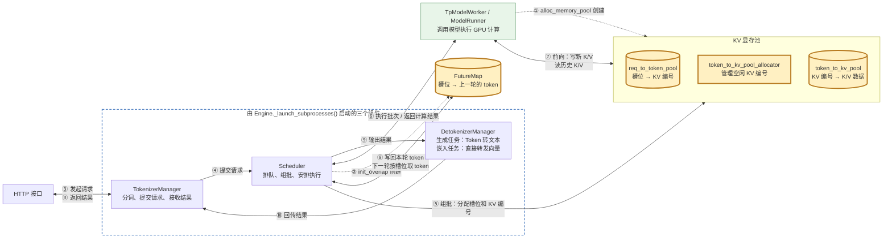
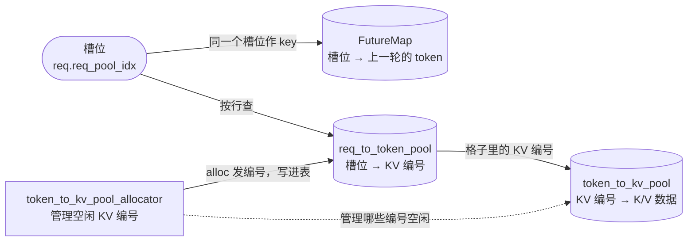
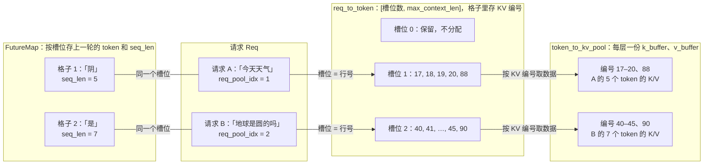
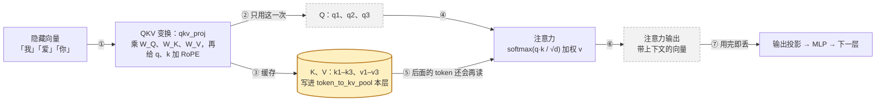
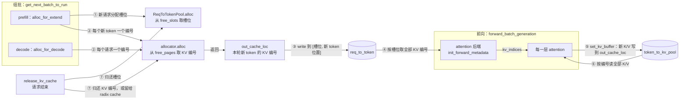
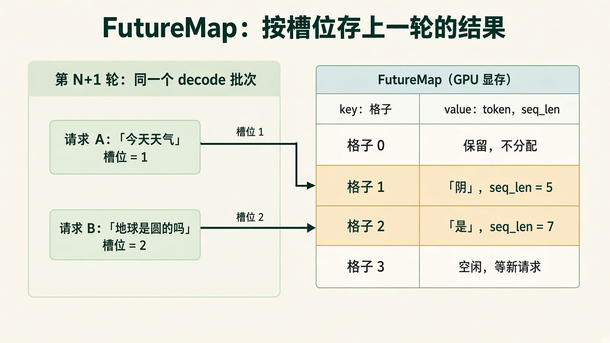
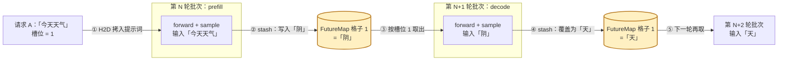
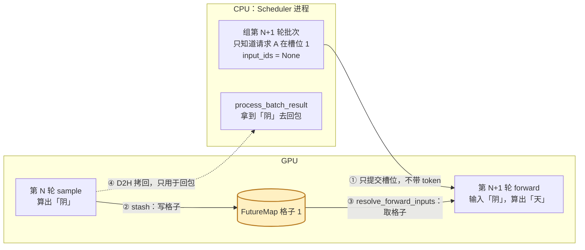

# 核心概念三：显存管理（槽位、KV Cache 与 FutureMap）

> 请求的 token 在显存里怎么存、怎么找、怎么接力到下一轮，代码在 `python/sglang/srt/` 下的 managers 与 mem_cache 中，下文路径都相对这个目录

## 1. 在核心链路中的位置




- ① 启动时 `model_runner.py#ModelRunner.alloc_memory_pool()` 建好三个池，关键代码：
  - `self.req_to_token_pool = result.req_to_token_pool`
  - `self.token_to_kv_pool = result.token_to_kv_pool`
  - `self.token_to_kv_pool_allocator = result.token_to_kv_pool_allocator`

> Scheduler 在 `scheduler.py#Scheduler.init_memory_pools()` 拿到这几个池的引用

- ② overlap 模式下 `managers/scheduler.py` 的 `Scheduler.init_overlap()` 创建 FutureMap，长度等于槽位数。
  - 关键代码：`self.future_map = self.spec_algorithm.create_future_map(self.device, self.req_to_token_pool, ...)`。
- ⑤ ⑦ 的细节见第 4 节，⑧ 的细节见第 5 节
- 槽位（`req.req_pool_idx`）是请求运行期间独占的行号，用来在 `req_to_token` 和 FutureMap 里都用`req.req_pool_idx作为请求的 唯一key/存储下标 获取这个请求的数据`


#### 1）req_to_token_pool

- 作用：保存每个请求的每个 token 在 KV 池里的位置（KV 编号）
- `req_to_token[槽位]` 是一个长度为 `max_context_len` 的 int32 数组，按 token 位置依次记着这个请求每个 token 的 KV（Key-Value）编号，前 `seq_len` 个有效
- 数据结构：`req_to_token`，int32 二维表 `[槽位数, max_context_len]`；key 是（槽位，token 位置），value 是 KV 编号
  - 槽位对应请求，不是 token：一个请求占一行，这一行第 i 列是它第 i 个 token 的 KV 编号
  - 槽位数就是最多能同时在跑的请求数，即 `max_running_requests + 1`，槽位 0 保留不用；槽位满了，新请求只能在 `waiting_queue` 里等
- 数据示例

```text
// [1] 是槽位
// [17, 18, 19, 20...：这些是 kv 编号（kv编号实际也是一个数字，通过 token_to_kv_pool 获取到 k 向量和 v向量的值）
req_to_token[1] = [17, 18, 19, 20, 88,  0,  0,  0]
token 位置          0   1   2   3   4   5   6   7
对应 token          今  天  天  气  阴  -   -   -
                   └────── 有效：前 seq_len=5 个 ──────┘└─ 空位 ─┘
```


#### 2）token_to_kv_pool

- 作用：保存每个 token 在每一层的 K/V 向量，不存 token 本身（token id）；是显存大头
- 数据结构：`k_buffer`、`v_buffer` 各是一个长度为层数的列表，每层一个 `[KV 编号数, head_num, head_dim]` 的 tensor；key 是（层号，KV 编号），value 是 K/V 向量
  - 层数就是 Transformer 层(Transformer Layer)的数量：每一层都会给同一个 token 算出一份自己的 K、V，所以只给 KV 编号还不够，还要说明是哪一层的
  - 例：32 层的模型里「阴」的 KV 编号是 88，`k_buffer[0][88]` 是第 0 层的 K，`k_buffer[31][88]` 是第 31 层的 K；编号只分配一次，各层共用


#### 3）FutureMap.output_tokens_buf

- 作用：保存每个请求上一轮推理采样出的那 1 个 token，每轮覆盖
- 数据结构：int64 一维数组 `[槽位数]`；key 是槽位，value 是 token id
- 为什么有了 `req_to_token_pool` 还需要 `FutureMap.output_tokens_buf`:

比如推理 今天天气 -> 阴天 的时候，当前轮次根据 今天天气 推理出 阴(天)

之前的 今天天气 的 KV  向量都有 Cache了，都计算过

保存 阴(天) 的tokenID 是为了在下次推理过程中要经过：向量化 -> 计算 qkv -> cache kv // 阴(天) 之前没有 cache kv 


#### 4）token_to_kv_pool_allocator

- 作用：保存哪些 KV 编号空着
- 数据结构：`free_pages`，空闲 KV 编号组成的一维 tensor，不是 map；`alloc` 从头部切走编号，`free` 再拼回去


## 2. 实体与映射


### 关系总图




- 两种 key 把 4 个实体串起来：槽位是请求级的，一个请求占一个；KV 编号是 token 级的，一个 token 占一个。
- 主链路：槽位 → `req_to_token_pool` 查出 KV 编号 → `token_to_kv_pool` 取出 K/V 数据。
- allocator 只管编号、不存数据：组批时 `alloc` 发出编号（即 `out_cache_loc`），写进 `req_to_token_pool`；请求结束时 `free` 收回。
- FutureMap 和 `req_to_token_pool` 共用槽位作 key，但存的是 token，不存 KV 编号；和 KV 池、allocator 没有直接关系。
  - `managers/overlap_utils.py` 的 `FutureMap.__init__()` 里 `self.req_pool_size = req_to_token_pool.req_to_token.shape[0]`，所以长度等于槽位数。


### 示例：第 N+1 轮的请求 A、B




- 图中时刻：第 N+1 轮 decode 组批之后，假设一个字是一个 token。
  - A 的「阴」、B 的「是」是第 N 轮采样出的，已经存在 FutureMap 里。
  - 本轮组批给「阴」「是」各分了一个新 KV 编号（88、90），K/V 内容要等本轮 forward 才写入。
- 槽位(Slot)：就是 `req.req_pool_idx`，也是 `req_to_token` 的行号；批次里所有请求的槽位是 `batch.req_pool_indices`。请求进 prefill 时分配、结束时释放。
  - 槽位 0 保留：`mem_cache/memory_pool.py` 的 `ReqToTokenPool.__init__()` 里 `self.free_slots = list(range(1, self._alloc_size))`，从 1 开始。
- `req_to_token`：GPU 上的 int32 二维表，第 i 列存该请求第 i 个 token 的 KV 编号；只存编号，占显存小。
  - 同一个 `__init__()` 里：`self.req_to_token = torch.zeros((self._alloc_size, max_context_len), dtype=torch.int32, device=device)`。
- `token_to_kv_pool`：存真实的键值缓存(Key-Value Cache，KV Cache)，占显存大。
  - `mem_cache/memory_pool.py` 的 `class MHATokenToKVPool`：`self.k_buffer`、`self.v_buffer` 是长度为 `layer_num` 的列表，每层一个 tensor，形状 `[KV 编号数, head_num, head_dim]`，第一维下标就是 KV 编号。
- 一行的编号个数等于 seq_len：A 是 4 个提示词 token 加「阴」共 5 个，B 是 6 个加「是」共 7 个。
- KV 编号不必连续：「阴」是 decode 时新分配的，拿到 88；前缀缓存命中时，两个请求的行可以指向同一批编号。


| 类                        | 职责                        | 核心方法                             | 说明                               |
| ------------------------ | ------------------------- | -------------------------------- | -------------------------------- |
| `ReqToTokenPool`         | 管理槽位，存槽位 → KV 编号          | `alloc`、`free`、`write`           | 只存编号，占显存小                        |
| `TokenToKVPoolAllocator` | 管理空闲 KV 编号                | `alloc`、`free`                   | `alloc` 返回的编号就是 `out_cache_loc`  |
| `MHATokenToKVPool`       | 存每层的 K、V 数据               | `set_kv_buffer`、`get_key_buffer` | 第一维下标是 KV 编号，占显存大                |
| `FutureMap`              | 按槽位暂存上一轮的 token 和 seq_len | `stash`、`publish`                | 下一轮由 `resolve_forward_inputs` 读取 |


## 3. Transformer 层里的 KV Cache

> 以请求 A 输入「我」「爱」「你」为例，只看其中一层




- ① QKV 变换(QKV Projection)：每一层把每个 token 的隐藏向量分别乘 W_Q、W_K、W_V，得到这个 token 在这一层的 q、k、v；q、k 再加上位置信息，即旋转位置编码(Rotary Position Embedding，RoPE)。
  - SGLang 把三次乘法合成一个 `qkv_proj`，算完再 `split` 成三份。
- ④⑤⑥ 注意力计算：以「你」为例，q3 和 k1、k2、k3 相乘，除以 √d 后做 softmax 得到注意力权重，再用权重给 v1、v2、v3 加权求和，得到带上下文的注意力输出。
  - 每个 token 只看自己和前面的 token，即因果注意力(Causal Attention)：

```text
          k1(我)  k2(爱)  k3(你)
q1(我)     ✓       ×       ×
q2(爱)     ✓       ✓       ×
q3(你)     ✓       ✓       ✓
```

- ③ KV Cache 保存的是注意力计算之前的 K、V（k 已经加过 RoPE），因为后面的 token 计算注意力时需要这些 K、V。
  - 下一轮生成第 4 个 token 时，只算新 token 的 q4、k4、v4；k1–k3、v1–v3 直接从 KV Cache 读，不用重算。
  - 每个 token 每层存 K、V 各一份，每份形状 `[head_num, head_dim]`；一个 token 共占"层数 × 2 × head_num × head_dim"个数。
- ⑦ 不保存注意力输出（带上下文的向量），因为它只在当前这一步往下传给输出投影、多层感知机(Multi-Layer Perceptron，MLP)和下一层，后面的 token 计算时用不到。
- ② 也不保存 Q：Q 只在当前 token 算注意力时用一次。
- 这些 K、V 在显存里怎么分编号、怎么写、怎么读，见第 4 节。


## 4. KV Cache 读写链路




- ① `mem_cache/allocation.py` 的 `alloc_req_slots()` 分配槽位；decode 沿用已有槽位。
  - 关键代码：`req_pool_indices = req_to_token_pool.alloc(reqs)`。
  - `mem_cache/memory_pool.py` 的 `ReqToTokenPool.alloc()` 里 `r.req_pool_idx = select_index[offset]`，把槽位写到请求上。
- ② `mem_cache/allocation.py` 的 `alloc_token_slots()` 分配 KV 编号，返回值就是 `out_cache_loc`。
  - 关键代码：`out_cache_loc = allocator.alloc(num_tokens)`。
  - `mem_cache/allocator/token.py` 的 `TokenToKVPoolAllocator.alloc()`：`select_index = self.free_pages[:need_size]`，从空闲列表头部切出编号。
  - 入口：`managers/schedule_batch.py` 的 `ScheduleBatch.prepare_for_extend()` 调 `alloc_for_extend(...)`；`ScheduleBatch.prepare_for_decode()` 里 `self.out_cache_loc = alloc_for_decode(self, token_per_req=1)`。
- ③ 把 KV 编号写进 `req_to_token`。到这一步只分了编号、写了映射，K/V 内容还没有。
  - prefill：`mem_cache/allocation.py` 的 `write_cache_indices()` 写两段，命中的前缀 `req_to_token_pool.write((req_idx, slice(0, prefix_len)), prefix_tensors[i])`，新 token `req_to_token_pool.write((req_idx, slice(prefix_len, seq_len)), out_cache_loc[pt : pt + extend_len])`。
  - decode：同文件的 `alloc_for_decode()` 里 `batch.req_to_token_pool.write((batch.req_pool_indices, locs), out_cache_loc.to(torch.int32))`，`locs` 就是当前 `seq_lens`，即新 token 的位置。
- ④ 以 triton 后端为例：`layers/attention/triton_backend.py` 的 `TritonAttnBackend.init_forward_metadata()` 调 `_fill_kv_indptr_and_indices()`，按槽位和 `seq_lens` 把 `req_to_token` 里的编号拼成 `kv_indices`。
  - 关键代码：`create_flashinfer_kv_indices_triton[(bs,)](self.req_to_token, req_pool_indices, seq_lens, ...)`。
- ⑤ 每层在 `TritonAttnBackend.forward_extend()` / `forward_decode()` 里先调 `_set_kv_buffer()`，把本层新算的 K、V 写到 `out_cache_loc`。
  - 关键代码：`self.token_to_kv_pool.set_kv_buffer(layer, loc, k, v, **kwargs)`。
  - `mem_cache/memory_pool.py` 的 `MHATokenToKVPool.set_kv_buffer()` 写入 `self.k_buffer[layer_id - self.start_layer]`、`self.v_buffer[...]` 的 `loc` 位置。
- ⑥ 再用 `self.forward_metadata.kv_indices` 读出该请求全部 K/V（含刚写入的）算 attention。
- ⑦ `mem_cache/common.py` 的 `release_kv_cache()` 在请求结束时释放：
  - 先 `tree_cache.cache_finished_req(req, ...)` 处理 KV 编号：开基数缓存(Radix Cache)时挂到前缀树供复用，否则归还 allocator。
  - 再 `tree_cache.req_to_token_pool.free(req)` 归还槽位。


## 5. FutureMap：按槽位接力 token


### 作用与数据结构

- 作用：overlap( cpu调度任务和gpu执行任务并行执行) 模式下，CPU 组第 N+1 轮时还拿不到第 N 轮采样出的 token；FutureMap 把 token 留在 GPU 上、按槽位存进格子，第 N+1 轮直接按槽位取出来当输入，CPU 只需交出槽位
- 第 N 轮、第 N+1 轮是 Scheduler 主循环相邻的两轮，每轮组一个批次(Batch)；同一个请求每轮生成 1 个 token，同一批次里还可能有其他请求。
- 请求A的输入是：今天天气；预期输出是：阴天。例子里假设一个字是一个 token

> 请求 B 的输入是：地球是圆的吗；预期输出是：是的



> 注意，某个格子在某次请求推理过程中总是保存这次推理的 token，比如之前保存 阴 位置的格子后边也保存 天

- 图中时刻：A 刚做完 prefill，算出「阴」；B 已经输出了「是」。第 N+1 轮 A 并入 B 所在的 decode 批次，两个请求一起算。
- `managers/overlap_utils.py` 的 `class FutureMap` 名字叫 Map，实际是两个按槽位下标访问的 GPU 数组，长度等于槽位数；逻辑上是「槽位 → 值」的映射，key 就是格子编号。
  - `output_tokens_buf`：图中 value 列的 token，存每个请求上一轮采样出的 token id，图中画成文字；创建代码 `self.output_tokens_buf = torch.empty((self.req_pool_size,), dtype=torch.int64, device=self.device)`。
  - `new_seq_lens_buf`：图中 value 列的 seq_len，存每个请求加上新 token 后的序列长度，例如 A 是 4 个提示词 token 加「阴」共 5。不开投机解码(Speculative Decoding)时只写不读，下一轮 CPU 自己加 1；开了才由 `FutureMap.resolve_seq_lens_cpu()` 读出。
- 写格子：同文件的 `FutureMap.stash()` 里 `self.output_tokens_buf[indices] = payload.bonus_tokens...` 写 token；`FutureMap.publish()` 里 `self.new_seq_lens_buf[indices] = new_seq_lens...` 写序列长度。
- 读格子：同文件的 `resolve_forward_inputs()`。
- 格子里只放输出 token；提示词在 prefill 时从 CPU 内存拷到显存(Host to Device，H2D)，不经过格子。


### 例子：「今天天气」→「阴天」

请求 A 的提示词是「今天天气」，占槽位 1。第 N 轮的批次做 prefill，算出「阴」；第 N+1 轮的批次做 decode，算出「天」。




- 两个黄色节点都是 FutureMap 的格子 1，只是不同时刻的值，每轮被新 token 覆盖。
- ①③ 都在 `managers/overlap_utils.py` 的 `resolve_forward_inputs()` 里：
  - prefill 走 H2D：`batch.prefill_input_ids_cpu.to(batch.device, non_blocking=True)`。
  - decode 按槽位取格子：`batch.input_ids = future_map.output_tokens_buf[batch.req_pool_indices]`。
- 每个「forward + sample」就是 `managers/tp_worker.py` 的 `TpModelWorker.forward_batch_generation()` 三步，其中 attention 读写 KV 见第 4 节：
  - 组装前向输入：`forward_batch = ForwardBatch.init_new(batch, self.model_runner, ...)`。
  - 算 logits：`out = self.model_runner.forward(forward_batch, ...)`。
  - 采样：`batch_result.next_token_ids = self.model_runner.sample(logits_output, forward_batch)`。

下图放大 ②③：CPU 组第 N+1 轮批次时，CPU 和 GPU 各在做什么。




- ① CPU 组第 N+1 轮时，第 N 轮可能还在 GPU 上算，CPU 还不知道是「阴」，所以 `input_ids` 先置 `None`，只交出槽位 `req_pool_indices`。
  - `managers/scheduler.py` 的 `Scheduler.run_batch()` overlap 分支末尾：注释 `# Next-iter input_ids relayed via future_map.` 下面的 `batch.input_ids = None`。
- ② 写格子在 `managers/scheduler.py` 里：
  - `Scheduler._relay_forward_payload()` 里 `self.future_map.stash(future_indices, payload)` 写 token。
  - `Scheduler.run_batch()` overlap 分支里 `self.future_map.publish(future_indices, batch.seq_lens + 1)` 写序列长度。
- ③ 第 N 轮写、第 N+1 轮读都排在同一条 forward_stream 上，GPU 保证先写后读。
- ④ 拷回内存(Device to Host，D2H)走 copy_stream，见「核心概念二：CPU 调度与 GPU 执行（CUDA Stream 与 Event）」；CPU 拿到「阴」后做停止判断、回包。


### 好处：为什么不经过 CPU

- CPU 不用等：组第 N+1 轮时不必等第 N 轮算完、拷回，CPU 组批和 GPU 计算重叠(Overlap)，GPU 不空转。
- 批次变了也不错位：每轮批次会加入新请求、移除已结束的请求，按槽位取 token 不受位置变化影响。
- 不用额外同步：写格子、读格子在同一条流上，顺序天然正确。
- D2H 还在，但只服务回包，不挡下一轮计算。


## 术语与生词


| 术语或单词                               | 中文释义                                     | 简明英文释义                                                          |
| ----------------------------------- | ---------------------------------------- | --------------------------------------------------------------- |
| KV Cache（Key-Value Cache）           | 键值缓存：attention 已算出的 K、V，供后续 token 复用     | Saved attention keys and values reused by later tokens.         |
| H2D（Host to Device）                 | 主机到设备拷贝：CPU 内存拷到 GPU 显存                  | Copy data from host memory to GPU memory.                       |
| D2H（Device to Host）                 | 设备到主机拷贝：GPU 显存拷回 CPU 内存                  | Copy data from GPU memory to host memory.                       |
| QKV Projection /prəˈdʒekʃn/         | QKV 变换：隐藏向量乘三组权重，得到 q、k、v                | Multiply hidden states by three weight matrices to get q, k, v. |
| RoPE（Rotary Position Embedding）     | 旋转位置编码：把 token 的位置信息加到 q、k 上             | Encodes token position by rotating q and k.                     |
| Causal /ˈkɔːzl/ Attention           | 因果注意力：每个 token 只看自己和前面的 token            | Each token attends only to itself and earlier tokens.           |
| Softmax /ˈsɒftmæks/                 | 把一组分数归一化成和为 1 的权重                        | Normalizes scores into weights that sum to 1.                   |
| MLP（Multi-Layer Perceptron）         | 多层感知机：注意力之后的前馈网络                         | The feed-forward network after attention.                       |
| Slot /slɑːt/                        | 槽位：`req_to_token` 的一行，一个请求占一个            | A row in req_to_token owned by one request.                     |
| Pool /puːl/                         | 池：预先分配、反复复用的一块显存                         | Pre-allocated memory that is reused.                            |
| Allocator /ˈæləkeɪtər/              | 分配器：管理空闲编号的分配和归还                         | Hands out and takes back free indices.                          |
| Index /ˈɪndeks/                     | 下标、编号                                    | A position number used to look up data.                         |
| Prefill /ˈpriːfɪl/                  | 预填充：一次算完提示词的所有 token                     | Process all prompt tokens at once.                              |
| Decode /diːˈkoʊd/                   | 解码：每轮生成一个新 token                         | Generate one new token per step.                                |
| Extend /ɪkˈstend/                   | 扩展：SGLang 对 prefill 批次的叫法，在已有前缀后追加 token | SGLang's name for a prefill batch that appends tokens.          |
| Radix /ˈreɪdɪks/ Cache              | 基数缓存：用前缀树复用相同前缀的 KV                      | Reuse KV of shared prefixes with a prefix tree.                 |
| Logits /ˈloʊdʒɪts/                  | 模型对词表每个 token 打的原始分数                     | Raw scores over the vocabulary.                                 |
| Sample /ˈsæmpl/                     | 采样：根据 logits 选出下一个 token                 | Pick the next token from logits.                                |
| Batch /bætʃ/                        | 批次：一轮里一起计算的多个请求                          | A group of requests computed together in one step.              |
| Overlap /ˌoʊvərˈlæp/                | 重叠：CPU 组批和 GPU 计算同时进行                    | CPU scheduling and GPU compute run at the same time.            |
| Speculative /ˈspekjələtɪv/ Decoding | 投机解码：先猜多个 token，再一次校验                    | Draft several tokens, then verify them at once.                 |
| Stash /stæʃ/                        | 暂存                                       | Put something away for later.                                   |
| Publish /ˈpʌblɪʃ/                   | 发布：写出数据供读取方使用                            | Make data available to readers.                                 |
| Resolve /rɪˈzɑːlv/                  | 兑现：把占位换成真实值                              | Replace a placeholder with the real value.                      |


