# 核心概念二：CPU 调度与 GPU 执行（CUDA Stream 与 Event）

> CPU 调度提交任务 和 GPU 执行任务的相关概念，代码在 Scheduler.run_batch 中

## 1. 全景图：一个批次在三条流上的流转

```mermaid
flowchart LR
    CPU1["CPU：组批 N<br/>get_next_batch_to_run"]
    CPU2["CPU：组批 N+1"]
    CPU3["CPU：处理批 N 的结果<br/>process_batch_result"]
    subgraph S["schedule_stream：调度准备"]
        S1["批 N：H2D<br/>拷 seq_lens 等批次张量"]
        E1{{"event e1"}}
        S2["批 N+1：H2D"]
        E3{{"event e3"}}
    end
    subgraph F["forward_stream：模型计算"]
        F1["批 N：前向 + 采样"]
        E2{{"event e2"}}
        F2["批 N+1：前向 + 采样"]
    end
    subgraph C["copy_stream：结果拷回"]
        C1["批 N：D2H<br/>拷 next_token_ids"]
        E4{{"event copy_done"}}
    end
    CPU1 -->|"① 提交"| S1
    S1 -->|"② 执行完，记录 e1"| E1
    E1 -.->|"③ e1 完成后开始"| F1
    F1 -->|"④ 算完，记录 e2"| E2
    E2 -.->|"⑤ e2 完成后开始"| C1
    C1 -->|"⑥ 拷完，记录 copy_done"| E4
    CPU2 -->|"⑦ 提交（和 ③ 同时）"| S2
    S2 -->|"⑧ 执行完，记录 e3"| E3
    E3 -.->|"⑨ e3 完成后开始（和 ⑤ 同时）"| F2
    F1 -.->|"同一条流：F2 排在 F1 之后"| F2
    E4 -.->|"⑩ copy_done.synchronize() 后读取结果"| CPU3
    classDef ev fill:#fff0c2,stroke:#b7791f,stroke-width:2px
    class E1,E2,E3,E4 ev
```

- ①–⑥ 由 CPU 在一次 `run_batch` 里连续提交完，序号表示 GPU 上的执行顺序
- 三个 stream 都是在 gpu 上执行的
- D2H 和 H2D 是指 显存 与 CPU 内存的数据交换，D 是 Device、GPU显存，H 是 host、CPU内存
- CPU 提交完批 N 不等 GPU，直接进入下一轮组批 N+1，形成两处重叠：⑦ 和 ③ 同时，⑨ 和 ⑤ 同时

#### 事件(Event)

- **解释**：插在某条流里的一个标记。GPU 执行到这个位置时，标记变为"已完成"；有未完成、已完成两种状态
  - 状态由 CUDA 驱动维护，只能通过方法读取：`query()` 返回 `True` 表示已完成，`False` 表示未完成。
  - `record(stream)` 把标记插到这条流当前的末尾，状态变成未完成；GPU 执行到这里后变成已完成
  - 再次 `record()` 会把标记挪到新位置，重新跟踪。从没 `record()` 过的 event，查询结果也是已完成

- **状态的作用：给等待方放行**。等待方一直等到 event 变成已完成，才执行后面的操作：

| 方法                                             | 谁在等  | 会不会卡住 CPU    | 图中对应  |
| ---------------------------------------------- | ---- | ------------ | ----- |
| `stream.wait_event(e)`、`stream.wait_stream(s)` | 另一条流 | 不会，只在 GPU 侧等 | ③ ⑤ ⑨ |
| `e.synchronize()`                              | CPU  | 会，等到完成为止     | ⑩     |
|                                                |      |              |       |

## 术语与生词

| 术语或单词                                     | 中文释义                            | 简明英文释义                                                              |
| ----------------------------------------- | ------------------------------- | ------------------------------------------------------------------- |
| CUDA（Compute Unified Device Architecture） | NVIDIA 的 GPU 编程平台               | NVIDIA's platform for GPU computing.                                |
| H2D（Host to Device）                       | 主机到设备拷贝：CPU 内存拷到 GPU 显存         | Copy data from host memory to GPU memory.                           |
| D2H（Device to Host）                       | 设备到主机拷贝：GPU 显存拷回 CPU 内存         | Copy data from GPU memory to host memory.                           |
| Stream /striːm/                           | 流：GPU 上按顺序执行的任务队列               | An ordered queue of GPU work.                                       |
| Event /ɪˈvent/                            | 事件：插在流里的完成标志                    | A marker recorded in a stream to track completion.                  |
| Kernel /ˈkɜːrnl/                          | 核函数：在 GPU 上执行的一个计算函数            | A function that runs on the GPU.                                    |
| Synchronize /ˈsɪŋkrənaɪz/                 | 同步：等待任务完成                       | Wait until the work has finished.                                   |
| Query /ˈkwɪri/                            | 查询：只看状态，不等待                     | Check the status without waiting.                                   |
| Handle /ˈhændl/                           | 句柄：指向底层资源的编号                    | An opaque reference to an underlying resource.                      |
| Pinned /pɪnd/ Memory                      | 锁页内存：不会被换出的 CPU 内存，GPU 可以直接异步读写 | Host memory that stays resident so the GPU can copy asynchronously. |
| Overlap /ˌoʊvərˈlæp/                      | 重叠：两件事同时进行                      | Doing two things at the same time.                                  |

