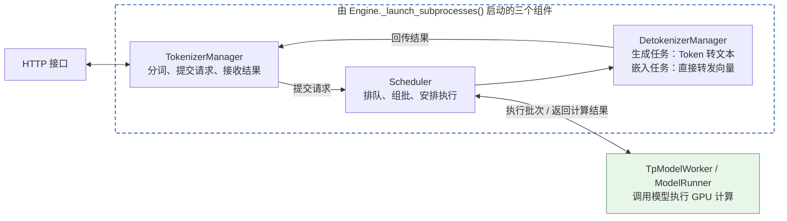
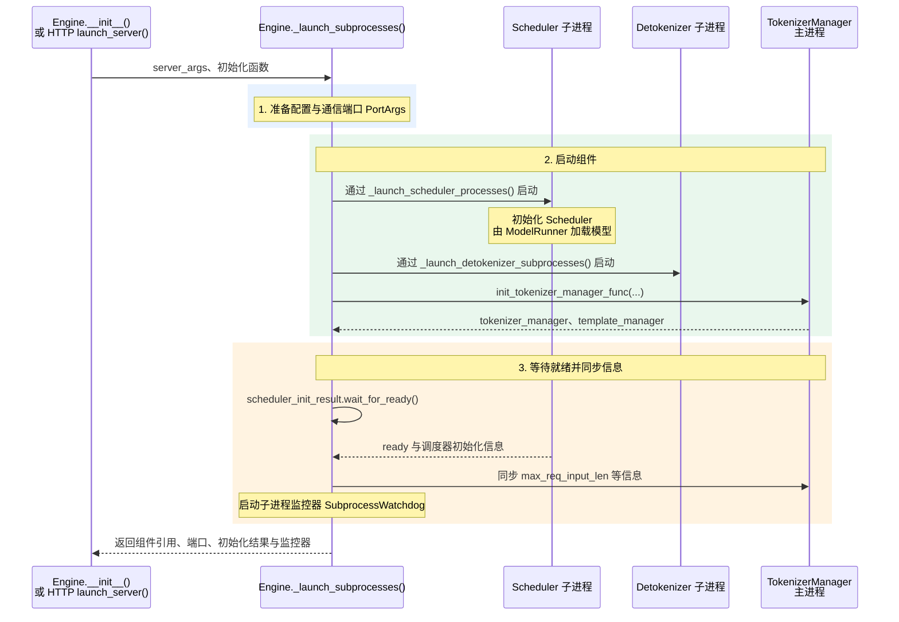

# 核心组件一：Engine



虚线框表示组件的启动关系，实线箭头表示请求与结果流。`TpModelWorker / ModelRunner` 在 Scheduler 子进程内工作。

> **提供推理接口：通过 `generate()`、`encode()` 等方法提交请求，交给底层组件处理。**

## 1. 提供推理接口(Inference API)

[`Engine`](../python/sglang/srt/entrypoints/engine.py#L208) 是 SGLang 的 Python 推理入口与组件管理类。上图展示普通 Python 后端的 HTTP 请求流：分词管理器(TokenizerManager)处理输入，调度器(Scheduler)安排批次，模型执行器(ModelRunner)执行计算，反分词管理器(DetokenizerManager)处理并回传结果。

| 接口 | 提交的请求 | 作用与输出 |
|---|---|---|
| [`generate()`](../python/sglang/srt/entrypoints/engine.py#L363) | `GenerateReqInput` | 文本生成(Text Generation)：输入问题，返回生成的回答等结果 |
| [`encode()`](../python/sglang/srt/entrypoints/engine.py#L576) | `EmbeddingReqInput` | 嵌入计算(Embedding)：将文本等输入转换为向量，用于语义检索、相似度比较等 |

## 2. 初始化：启动各个组件(Initialization)
> HTTP 路径通过 `launch_server()` 复用 `Engine._launch_subprocesses()` 启动组件，然后由 HTTP 接口直接对接 `TokenizerManager`，处理请求时无需经过 `Engine.generate()`。

`Engine(...)` 构造对象时会调用 [`_launch_subprocesses()`](../python/sglang/srt/entrypoints/engine.py#L1025)。下面展示单节点、单分词工作进程、Python 后端的简化启动顺序；箭头标明启动入口，省略各组件内部细节。



`proc.start()` 发起子进程启动后，模型可能仍在加载；`wait_for_ready()` 等待相关 Scheduler 完成初始化并报告就绪。`Engine` 保存返回的组件引用，后续推理接口便可使用它们。

模板管理器(TemplateManager)与 `TokenizerManager` 一同初始化，负责加载聊天模板(Chat Template)等配置。更详细的调用关系见[启动流程与时序图](../python/sglang/srt/entrypoints/engine.py._launch_subprocesses.md)。

## 3. 关闭：回收进程与资源(Shutdown)

[`Engine.shutdown()`](../python/sglang/srt/entrypoints/engine.py#L1270) 负责结束引擎的运行并清理资源：

1. 停止 `SubprocessWatchdog`，关闭远程过程调用(Remote Procedure Call，RPC)通信连接。
2. 按配置终止本引擎启动的权重缓存守护进程，再终止相关子进程并等待退出，使它们释放 GPU 上下文及资源。
3. 在 `finally` 中清理多模态处理器与 CUDA 虚拟内存管理(Virtual Memory Management，VMM)特征传输组件。

Python 调用方可以用 `try/finally` 明确管理生命周期(Lifecycle)：

```python
import sglang as sgl

engine = sgl.Engine(model_path="模型路径")
try:
    result = engine.generate("你好")
finally:
    engine.shutdown()
```

## 术语与生词

| 术语或单词 | 中文释义 | 简明英文释义 |
|---|---|---|
| Inference /ˈɪnfərəns/ | 推理：使用模型对输入进行计算并得到输出 | Using a model to produce an output from an input. |
| Embedding /ɪmˈbedɪŋ/ | 嵌入：用数值向量表示输入的特征 | A numerical vector that represents features of an input. |
| Scheduler /ˈskedʒuːlər/ | 调度器：安排请求何时、以什么批次执行 | A component that decides when and in which batch work runs. |
| Lifecycle /ˈlaɪfˌsaɪkəl/ | 生命周期：从初始化、使用到关闭的过程 | The stages from initialization through use to shutdown. |
