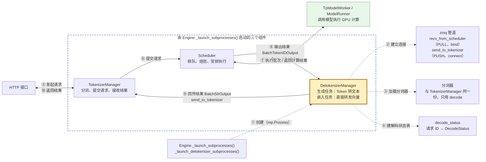
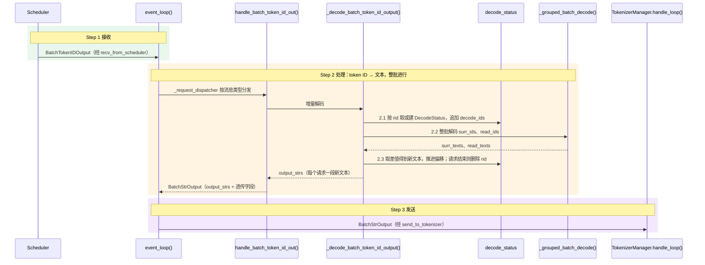
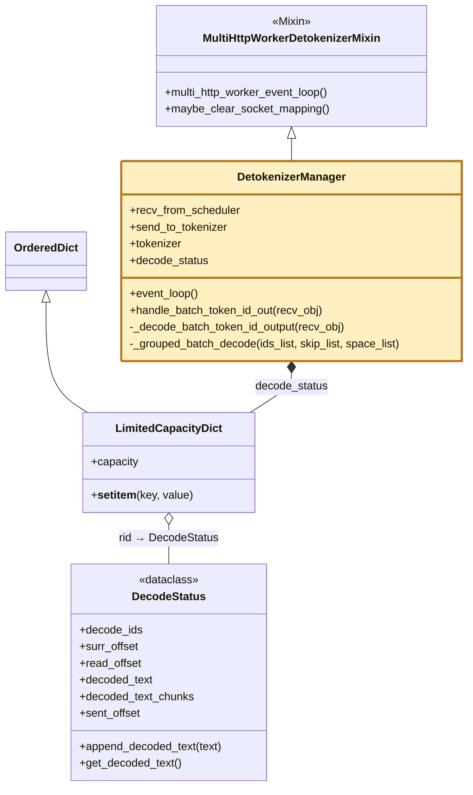
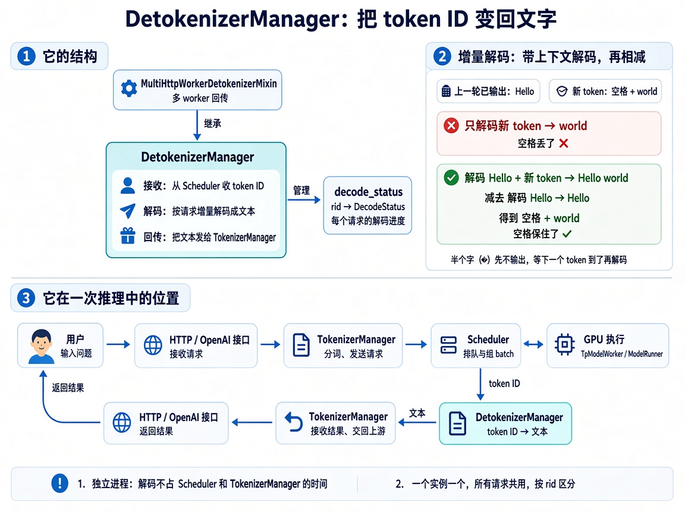

# 核心组件三：DetokenizerManager

> **独立进程：把 Scheduler 发来的 token ID 增量解码(Incremental Decoding)成文本，发回 TokenizerManager；嵌入结果直接转发。**

## 1. 在核心链路中的位置

虚线是启动阶段（①–④），在 `DetokenizerManager.__init__` 里完成：

- ② [`init_ipc_channels`](../python/sglang/srt/managers/detokenizer_manager.py#L143)：`recv_from_scheduler` 收 Scheduler 的输出，`send_to_tokenizer` 把文本发给 TokenizerManager。
- ③ [`init_tokenizer`](../python/sglang/srt/managers/detokenizer_manager.py#L160)：加载和 TokenizerManager 同一份分词器，只用它的 decode。
- ④ [`init_running_status`](../python/sglang/srt/managers/detokenizer_manager.py#L179)：建 `decode_status`，容量默认 65536，满了淘汰最早插入的请求。

实线是请求处理链路（⑤–⑩），第 2 节展开 ⑧ 到 ⑨ 之间发生的事。几个要点：

- 解码是 CPU 活，单独成进程，不占 Scheduler 调度 GPU 的循环，也不占 TokenizerManager 的异步事件循环。
- 只有需要解码的生成结果才绕道这里；Scheduler 的控制回复直接发给 TokenizerManager，开 `--skip-tokenizer-init` 时生成结果也直连。
- 默认一个服务实例只有一个 DetokenizerManager（多节点时只在 0 号节点），所有请求共用，靠请求 ID(Request ID，rid)区分。

## 2. 浅层时序图(Sequence Diagram)

- **Step 1 接收**：[`event_loop`](../python/sglang/srt/managers/detokenizer_manager.py#L207) 阻塞等在 `recv_from_scheduler` 上，收到的 `BatchTokenIDOutput` 是一批请求的输出。
  - `rids` 列出这批请求的 ID；其余字段都是列表，按下标 `i` 与 `rids` 一一对应。
  - 重点字段：`decode_ids`（本次新增的 token ID）、`read_offsets`、`finished_reasons`（未结束为 `None`）。
- **Step 2 处理**：分发器(Dispatcher) `_request_dispatcher` 按消息类型分发，生成任务交给 [`handle_batch_token_id_out`](../python/sglang/srt/managers/detokenizer_manager.py#L506)，它调用 [`_decode_batch_token_id_output`](../python/sglang/srt/managers/detokenizer_manager.py#L360) 把整批 token ID 转成文本。
  - **2.1 维护 `decode_status[rid]`**：首次见到 rid 时新建 `DecodeStatus`，`decode_ids` 开头带最多 5 个输入 token 当上下文；之后只把新 token 追加到末尾。
  - **2.2 整批解码**：[`_grouped_batch_decode`](../python/sglang/srt/managers/detokenizer_manager.py#L282) 解码 `surr_ids`、`read_ids`，结果按下标与请求对齐。默认一次 `tokenizer.batch_decode` 解完整批；各请求解码选项不同时按选项分组，空列表直接得到 `""`。
  - **2.3 取差值**：新文本 = `read_texts[i]` 去掉开头的 `surr_texts[i]`，原因见附录。新文本完整就提交并推进偏移；以 `"�"` 结尾就只发可打印部分、偏移不动；请求结束时删除 `decode_status[rid]`，把剩余文本一次发完。
  - 省略：嵌入任务 `BatchEmbeddingOutput` 原样转发；控制消息处理后不回复；beam search 的额外解码；`_clamp_decode_ids` 把越界 token ID 置 0。
- **Step 3 发送**：`handle_batch_token_id_out` 把 `output_strs` 和其余字段组装成 `BatchStrOutput`，`event_loop` 经 `send_to_tokenizer` 发出，TokenizerManager 的 `handle_loop` 按 rid 写入 `ReqState`。
  - 只有 `output_strs` 是这里算出来的；token 计数、logprob 等原样透传，`routed_experts` 等张量在这里转成 base64。
  - 多 tokenizer worker 模式下改由 `multi_http_worker_event_loop` 按 `http_worker_ipcs` 分别发回。

## 3. 继承关系与职责

`class DetokenizerManager(MultiHttpWorkerDetokenizerMixin)`

| 类 | 职责 | 核心方法 | 说明 |
|---|---|---|---|
| [`DetokenizerManager`](../python/sglang/srt/managers/detokenizer_manager.py#L113) | 独立进程：把 token ID 增量解码成文本，发回 TokenizerManager | `event_loop` | 从 Scheduler 收消息、按类型分发，有结果就发回 TokenizerManager |
| - | - | `handle_batch_token_id_out` | 生成任务入口：调用增量解码，组装 `BatchStrOutput` |
| - | - | `_decode_batch_token_id_output` / `_grouped_batch_decode` | 维护 `decode_status[rid]`，整批解码后取差值得到新文本 |
| [`MultiHttpWorkerDetokenizerMixin`](../python/sglang/srt/managers/multi_tokenizer_mixin.py#L403) | 多 tokenizer worker 模式下，把结果发回各自的 worker | `multi_http_worker_event_loop` | 替代 `event_loop`：把批次按请求拆开，按 `http_worker_ipcs` 分别发送 |
| - | - | `maybe_clear_socket_mapping` | 进程异常退出时关闭这些 socket |
| [`LimitedCapacityDict`](../python/sglang/srt/managers/detokenizer_manager.py#L594) | 有容量上限的有序字典，用来存 `decode_status` | `__setitem__` | 满了先淘汰最早插入的项；读取不刷新顺序，所以是先进先出 |
| [`DecodeStatus`](../python/sglang/srt/managers/detokenizer_manager.py#L75) | 单个请求的增量解码状态 | `append_decoded_text` / `get_decoded_text` | 新文本先存成片段，请求结束时再合并，避免反复拼接长字符串 |

- **DetokenizerManager**：持有两个管道、一份分词器、`decode_status` 和分发表；主循环 `event_loop` 只做三件事：收、分发、发。
- **DecodeStatus**：存在 `decode_status[rid]` 里，请求结束即删除。数据流是：GPU 输出 token ID → 追加到 `decode_ids` → 解码成新文本放进 `decoded_text_chunks` → 请求结束时合并进 `decoded_text`。字段按数据流分三组：
  - token 侧：`decode_ids`（开头最多 5 个输入 token，加上已生成的全部 token）；`surr_offset` / `read_offset` 把它切成上下文和新 token 两段。
  - 文本侧：`decoded_text`（初始为空串，请求结束时才合并）、`decoded_text_chunks`（生成中确认的新文本片段）、`decoded_text_len`（已确认文本的总长度）。
  - 发送侧：`sent_offset`，已发给 TokenizerManager 的字符数，防止重复发送。
- **Mixin 为什么单独放**：它和 TokenizerManager 侧的多 worker 代码（`MultiTokenizerRouter` 等）同在 `multi_tokenizer_mixin.py`，多 worker 逻辑集中在一处，`detokenizer_manager.py` 只保留单 worker 的主路径。

## 附录：surr_ids 与 read_ids

- `surr_ids`（surr 即 surrounding）：上一轮已输出的那段 token，只当上下文；首次是输入末尾最多 5 个 token。
- `read_ids`：`surr_ids` 加本次新 token；请求因结束符停止时去掉末尾的 `<eos>`。
- 新文本 = `decode(read_ids)` 去掉开头的 `decode(surr_ids)`；输出后窗口后移：`surr_offset ← read_offset`，`read_offset ← len(decode_ids)`。
- 为什么要相减：单独解码新 token 可能出错。例（Llama 等 SentencePiece 分词器）：上一轮已输出 `"Hello"`，新 token 是 `▁world`（`▁` 表示前面有空格）
  - 只解码新 token：`decode([▁world])` 得到 `"world"`，开头空格被去掉，拼起来成了 `"Helloworld"` ✗
  - 带上下文再相减：`decode([▁Hello, ▁world])` 得到 `"Hello world"`，减去 `decode([▁Hello])` 的 `"Hello"`，得到 `" world"` ✓；两次解码开头的副作用相同，相减正好抵消
- 一个字可能拆成两个 token，只解码前一个会得到 `"�"`：此时偏移不推进，等下一个 token 到了一起解码。

示例（窗口怎么移动）：输入切成 `[数, 三个, 数字]`，依次生成 `1`、`2`、`3`、`<eos>`：

| 轮次 | surr_ids → 文本 | read_ids → 文本 | 新文本 |
|---|---|---|---|
| 1 | `[数, 三个, 数字]` → `数三个数字` | `[数, 三个, 数字, 1]` → `数三个数字1` | `1` |
| 2 | `[1]` → `1` | `[1, 2]` → `12` | `2` |
| 3 | `[2]` → `2` | `[2, 3]` → `23` | `3` |
| 4 | `[3]` → `3` | `[3]`（去掉 `<eos>`）→ `3` | 空，请求结束 |

## 术语与生词

| 术语或单词 | 中文释义 | 简明英文释义 |
|---|---|---|
| Detokenize /diːˈtoʊkənaɪz/ | 反分词：把 token ID 还原成文本 | Convert token IDs back into text. |
| Incremental /ˌɪŋkrəˈmentl/ Decoding | 增量解码：每次只算出新增的那段文本 | Producing only the newly added text at each step. |
| rid（Request ID） | 请求 ID：每个请求的唯一标识 | The unique identifier of a request. |
| Dispatcher /dɪˈspætʃər/ | 分发器：按消息类型交给对应的处理方法 | A component that routes each message to its handler by type. |
| Surrounding /səˈraʊndɪŋ/ Offset（surr） | 上下文窗口起点：解码时带上的已输出 token 从这里开始 | Start of the already-emitted tokens kept as decoding context. |
| Replacement Character（U+FFFD，“�”） | 替换字符：字节不完整、无法解码时的占位符 | Placeholder shown when bytes cannot be decoded. |
| Evict /ɪˈvɪkt/ | 淘汰：容量满时移除旧条目 | Remove an old entry when capacity is full. |

## 科普图

