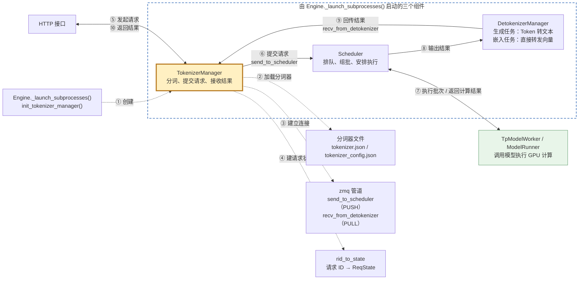
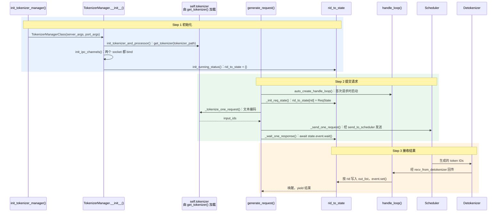
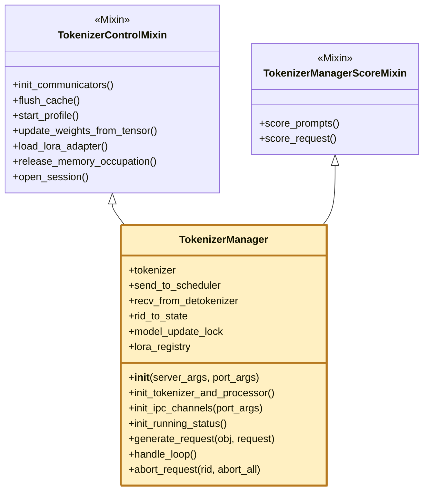

# 核心组件二：TokenizerManager

> **主进程里的请求入口：分词、提交请求、接收结果；控制类操作也经它转发给 Scheduler。**

## 1. 在核心链路中的位置

虚线是启动阶段（①–④），在 `TokenizerManager.__init__` 里完成；实线是请求处理链路（⑤–⑩）。⑥、⑨ 用的就是 ③ 建立的两个 zmq socket。

## 2. 浅层时序图(Sequence Diagram)

- **Step 1 初始化**：[`__init__`](../python/sglang/srt/managers/tokenizer_manager.py#L416) 依次调用一串 `init_*`，图中只画了核心的三个；模型配置、日志转储、权重更新、LoRA、PD 分离、指标、请求分发表等省略。
  - **加载分词器**：[`init_tokenizer_and_processor`](../python/sglang/srt/managers/tokenizer_manager.py#L510) → [`get_tokenizer`](../python/sglang/srt/utils/hf_transformers/tokenizer.py#L476) → `AutoTokenizer.from_pretrained`。`tokenizer_path` 默认等于模型路径，读取 `tokenizer.json`（词表、合并规则）和 `tokenizer_config.json`（`tokenizer_class`、特殊 token、聊天模板），不下载权重。多模态分支（加载 processor）省略。
  - **建立连接**：[`init_ipc_channels`](../python/sglang/srt/managers/tokenizer_manager.py#L591) 创建 `send_to_scheduler`（PUSH，地址 `scheduler_input_ipc_name`）和 `recv_from_detokenizer`（PULL，地址 `tokenizer_ipc_name`），两端都 bind，由 Scheduler、Detokenizer connect。多 tokenizer worker 模式省略。
  - **建状态表**：[`init_running_status`](../python/sglang/srt/managers/tokenizer_manager.py#L651) 创建 `rid_to_state`。[`ReqState`](../python/sglang/srt/managers/tokenizer_manager.py#L223) 的重点字段：`out_list`、`finished`、`event`、`obj`、`text` / `text_chunks`。
- **Step 2 提交请求**：
  - [`generate_request`](../python/sglang/srt/managers/tokenizer_manager.py#L840) 先登记 `ReqState` 再分词、发送，最后在 [`_wait_one_response`](../python/sglang/srt/managers/tokenizer_manager.py#L1835) 等待事件。
  - 参数校验、暂停等待、模型更新读锁、LoRA 解析、批量请求省略。
- **Step 3 接收结果**：
  - [`handle_loop`](../python/sglang/srt/managers/tokenizer_manager.py#L2323) 一直从 `recv_from_detokenizer` 收消息，生成结果交给 [`_handle_batch_output`](../python/sglang/srt/managers/tokenizer_manager.py#L2338)，按 rid 写入后 `event.set()`。
  - abort、会话、权重更新等非生成消息走 `_result_dispatcher`，图中省略。

## 3. 继承关系与职责

`class TokenizerManager(TokenizerControlMixin, TokenizerManagerScoreMixin)`

- **Mixin 是什么**：只提供一组方法、不单独使用的父类，像“功能插件”。继承后三者合成同一个对象，Mixin 的方法直接用 `self` 访问主体的分词器、管道和状态表；拆开是为了按职责分文件，控制主文件体积。

| 类 | 职责 | 核心方法 | 说明 |
|---|---|---|---|
| [`TokenizerManager`](../python/sglang/srt/managers/tokenizer_manager.py#L397) | 数据面：分词，按请求 ID 提交请求、接收结果 | `__init__` | 依次调用 `init_*`，加载分词器、建两个 zmq socket 和 `rid_to_state` |
| - | - | `generate_request` | 登记 `ReqState`、分词、发给 Scheduler，再等待结果 |
| - | - | `handle_loop` | 后台循环接收 Detokenizer 的结果，按 rid 写入 `ReqState` 并唤醒等待方 |
| [`TokenizerControlMixin`](../python/sglang/srt/managers/tokenizer_control_mixin.py#L155) | 控制面：清缓存、性能采集、更新权重、LoRA、显存释放与恢复、会话等 | `init_communicators` | 为每类控制操作建一个 `FanOutCommunicator`，广播给所有 Scheduler 再汇总回复 |
| - | - | `update_weights_from_tensor` / `update_weights_from_distributed` | 持 `model_update_lock` 写锁广播更新权重，与推理请求互斥 |
| - | - | `load_lora_adapter` / `unload_lora_adapter` | 广播加载、卸载 LoRA，并同步维护 `lora_registry`；卸载前等用到它的请求结束 |
| [`TokenizerManagerScoreMixin`](../python/sglang/srt/managers/tokenizer_manager_score_mixin.py#L28) | 打分：计算候选 token 的概率，用于重排序、分类 | `score_request` | 计算 query + item 之后指定 token 的概率；可把多个 item 拼成一条序列一起算 |
| - | - | `score_prompts` | 对完整 prompt 打分，是 `score_request` 的薄封装 |

- **控制操作为什么放在这里**：它是主进程里唯一连着 Scheduler 的对象，而且这些操作要和进行中的请求协调。比如 `model_update_lock` 读写锁：推理请求拿读锁，更新权重拿写锁；`lora_registry` 负责校验请求用的 LoRA。名字是历史遗留，更准确的理解是“主进程的请求与控制入口”。

## 术语与生词

| 术语或单词 | 中文释义 | 简明英文释义 |
|---|---|---|
| Tokenizer /ˈtoʊkənaɪzər/ | 分词器：把文本切成 token 并映射为 ID | A component that splits text into tokens and maps them to IDs. |
| Inter-Process Communication (IPC) | 进程间通信：不同进程之间交换数据 | Exchanging data between separate processes. |
| Mixin /ˈmɪksɪn/ | 混入类：只提供方法、供其他类继承组合 | A class that only supplies methods for others to inherit. |
| Control Plane /kənˈtroʊl pleɪn/ | 控制面：管理和配置系统的操作 | Operations that manage or configure the system. |
| Event /ɪˈvent/ | 事件：一方等待、另一方触发的同步信号 | A signal one side waits on and another side sets. |
