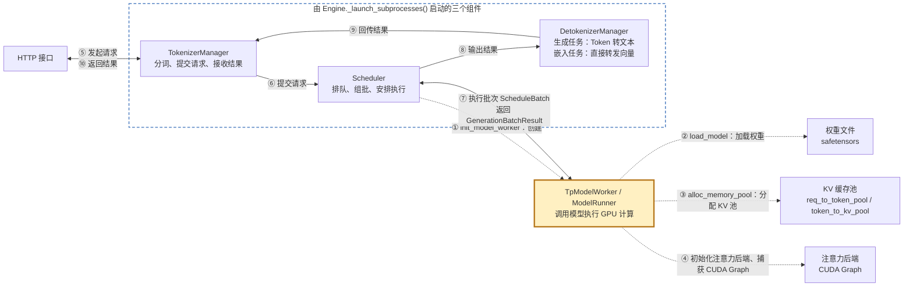
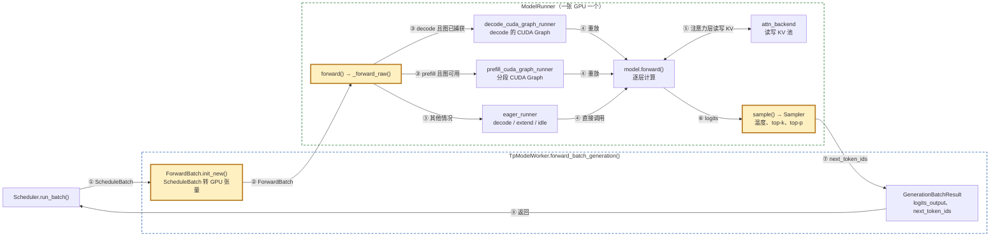
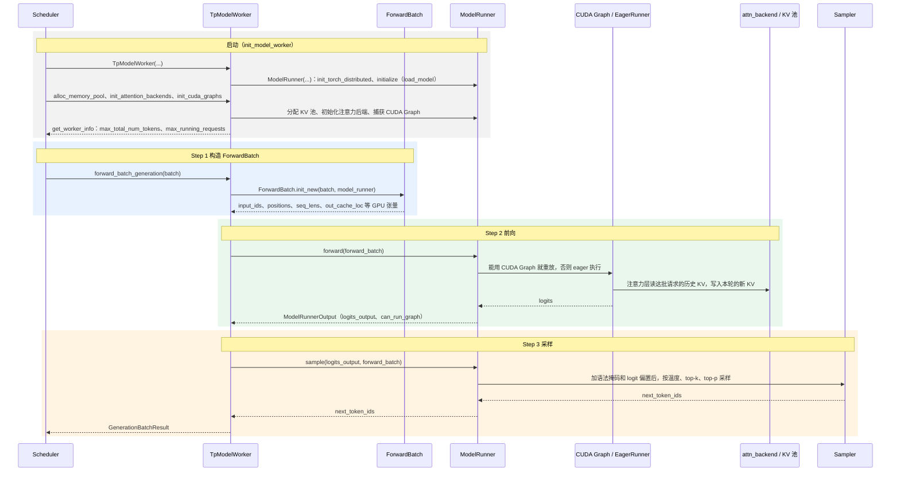
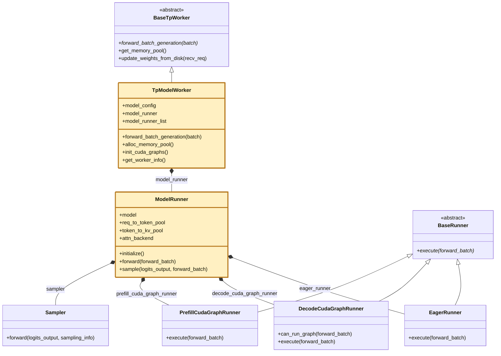

# 核心组件五：TpModelWorker 与 ModelRunner

> **每张 GPU 一对，和 Scheduler 在同一个进程里：启动时加载权重、分配 KV 池、捕获 CUDA Graph；每轮把 ScheduleBatch 转成 GPU 张量，前向得到 logits，再采样出下一个 token。**

## 1. 在核心链路中的位置

虚线是启动阶段（①–④），实线是请求处理链路（⑤–⑩）。

- **启动**：Scheduler 的 [`init_model_worker`](../python/sglang/srt/managers/scheduler.py#L1031) 按下面的顺序调用。
  - ① [`init_tp_model_worker`](../python/sglang/srt/managers/scheduler.py#L939) 创建 [`TpModelWorker`](../python/sglang/srt/managers/tp_worker.py#L312)：先由 [`_init_model_config`](../python/sglang/srt/managers/tp_worker.py#L461) 读模型配置，再由 [`_init_model_runner`](../python/sglang/srt/managers/tp_worker.py#L482) 创建 [`ModelRunner`](../python/sglang/srt/model_executor/model_runner.py#L291)。
  - ② `ModelRunner.__init__` 先 [`init_torch_distributed`](../python/sglang/srt/model_executor/model_runner.py#L1103) 建好多卡通信，再进 [`initialize`](../python/sglang/srt/model_executor/model_runner.py#L647)：创建采样器，[`load_model`](../python/sglang/srt/model_executor/model_runner.py#L1121) 加载权重，确定这张卡负责哪几层（流水线并行时只负责一部分，见 [1.7](<1.7 长上下文流水线并行(Pipeline Parallelism for Long Context).md>)）。
  - ③ [`init_memory_pools`](../python/sglang/srt/managers/scheduler.py#L1004) → [`ModelRunner.alloc_memory_pool`](../python/sglang/srt/model_executor/model_runner.py#L873)：按 `mem_fraction_static` 和加载权重后剩下的显存，算出 KV 池能放多少 token。
  - ④ [`init_attention_backends`](../python/sglang/srt/model_executor/model_runner.py#L993)、[`init_cuda_graphs`](../python/sglang/srt/model_executor/model_runner.py#L1058)：初始化注意力后端，再按一组批大小把 decode 的前向录成 CUDA Graph。
  - 最后 [`get_worker_info`](../python/sglang/srt/managers/tp_worker.py#L547) 把 `max_total_num_tokens`、`max_running_requests` 等交回 Scheduler，组批时的预算就来自这里。
- **要点**：
  - Scheduler 调用它们是普通的函数调用，不走进程间通信。
  - TpModelWorker 是薄的一层：把批次交给 ModelRunner，再把结果装进 `GenerationBatchResult`；模型、KV 池、注意力后端和 CUDA Graph 都挂在 ModelRunner 上。
  - 张量并行时，同一个 TP 组的每张卡各有一对，拿到相同的批次一起计算，每张卡只持有 1/N 的权重。
  - 开了推测解码时，同一进程里还有草稿模型的 worker，它和目标模型共用 KV 池；这时 `run_batch` 调用的是草稿 worker（[L1067](../python/sglang/srt/managers/scheduler.py#L1067)），由它再调用目标模型做验证。
  - 一个 TpModelWorker 通常只有一个 ModelRunner；只有多层 EAGLE 草稿模型会在 `model_runner_list` 里为每一步建一个（[`_init_multi_layer_eagle_model_runners`](../python/sglang/srt/managers/tp_worker.py#L503)）。

### TpModelWorker 与 ModelRunner 内部

- 编号对应三步：①② 构造 ForwardBatch，③–⑤ 前向，⑥⑦ 采样；黄框是三步各自的入口。
- ⑥ 实际是 TpModelWorker 拿到 logits 后再调 `model_runner.sample`；overlap 模式下带语法约束时，这一步推迟到 Scheduler 下一轮。
- CUDA Graph 把整次前向的 GPU kernel 录下来，之后同样形状的批直接重放，省掉 CPU 逐个下发 kernel 的时间；条件不满足时退回 eager。

## 2. 浅层时序图(Sequence Diagram)

- **启动**：见第 1 节。
  - 顺序不能换：KV 池的大小取决于权重加载完还剩多少显存，CUDA Graph 要在模型和注意力后端都就绪后才能录。
  - 投机解码时，草稿 worker 也走一遍同样的流程，但直接复用目标模型的 KV 池（[`init_memory_pools`](../python/sglang/srt/managers/scheduler.py#L1004)）。
- **Step 1 构造 ForwardBatch**：[`ForwardBatch.init_new`](../python/sglang/srt/model_executor/forward_batch_info.py#L723)，对应代码里的 [【Step 1】](../python/sglang/srt/managers/tp_worker.py#L614)。
  - `ScheduleBatch` 是调度视角的批次（请求列表、前缀长度等，大多在 CPU 上）；`ForwardBatch` 是模型视角：`input_ids`、`positions`、`seq_lens`、`req_pool_indices`、`out_cache_loc`（本轮新 KV 写到哪些槽位）、`sampling_info`。
  - `forward_mode` 决定后面怎么跑：[`ForwardMode`](../python/sglang/srt/model_executor/forward_batch_info.py#L104) 里 `EXTEND` 就是 prefill，`DECODE` 每个请求算 1 个 token，`IDLE` 是 DP 模式下没分到请求的卡空跑一轮。
- **Step 2 前向**：[`ModelRunner.forward`](../python/sglang/srt/model_executor/model_runner.py#L1572) → [`_forward_raw`](../python/sglang/srt/model_executor/model_runner.py#L1717)，对应 [【Step 2】](../python/sglang/srt/managers/tp_worker.py#L635)。
  - decode 批满足条件（批大小在捕获范围内等，见 [`can_run_graph`](../python/sglang/srt/model_executor/runner/decode_cuda_graph_runner.py#L676)）时，[重放 decode 的 CUDA Graph](../python/sglang/srt/model_executor/model_runner.py#L1749)。
  - 否则先看 prefill 的[分段 CUDA Graph](../python/sglang/srt/model_executor/model_runner.py#L1800) 能不能用（见 [5.1](<5.1 分段 CUDA 图(Piecewise CUDA Graph).md>)），都不行就交给 [`EagerRunner.execute`](../python/sglang/srt/model_executor/runner/eager_runner.py#L212)：按 decode / idle / extend 分派，注意力后端准备好元数据后调用 `model.forward(input_ids, positions, forward_batch)`。
  - 返回 [`ModelRunnerOutput`](../python/sglang/srt/model_executor/model_runner.py#L266)：`logits_output` 和这次是否用了 CUDA Graph。两种执行路径的对比见 [docs/learn/04](../docs/learn/04-model-forward-execution.md)。
- **Step 3 采样**：[`ModelRunner.sample`](../python/sglang/srt/model_executor/model_runner.py#L1846) 调用 [`Sampler`](../python/sglang/srt/layers/sampler.py#L71)，对应 [【Step 3】](../python/sglang/srt/managers/tp_worker.py#L655)。
  - 先由 [`_preprocess_logits`](../python/sglang/srt/model_executor/model_runner.py#L1818) 加上结构化输出的词表掩码和 logit 偏置。
  - 全部请求都是贪心（temperature 为 0）时[直接取分数最高的 token](../python/sglang/srt/layers/sampler.py#L130)；否则 logits 除以温度、softmax，再按 top-k / top-p / min-p 采样。请求里的 temperature、top_k 等参数就在这里生效。
  - TpModelWorker 把 `next_token_ids` 和 `logits_output` 一起装进 [`GenerationBatchResult`](../python/sglang/srt/managers/utils.py#L45) 交回 Scheduler，接上[核心组件四](核心组件四：Scheduler.md)的「处理结果」。
- **图中省略的分支**：
  - 推迟采样：overlap 模式下带语法约束（或开了 `SGLANG_ENABLE_DELAY_SAMPLE`）时，[先返回](../python/sglang/srt/managers/tp_worker.py#L658)带 `delay_sample_func` 的结果，Scheduler 在 [`launch_batch_sample_if_needed`](../python/sglang/srt/managers/scheduler.py#L4174) 里更新完语法状态再采样。
  - 只做 prefill 的请求（例如只要 logprob）不采样，[填 0 占位](../python/sglang/srt/managers/tp_worker.py#L684)。
  - 流水线并行的非最后一段只算本段的层，把隐状态交给下一段，[不采样](../python/sglang/srt/managers/tp_worker.py#L702)。

## 3. 继承关系与职责

`class TpModelWorker(BaseTpWorker)`；`ModelRunner` 没有父类，执行方式拆成了几个 runner 对象。

| 类 | 职责 | 核心方法 | 说明 |
|---|---|---|---|
| [`BaseTpWorker`](../python/sglang/srt/managers/tp_worker.py#L82) | worker 的公共接口 | `forward_batch_generation`（抽象） | MLX 等硬件后端有自己的 worker 实现 |
| - | - | `get_memory_pool` / `update_weights_from_disk` | 把 KV 池交给 Scheduler；在线换权重，转交给 ModelRunner |
| [`TpModelWorker`](../python/sglang/srt/managers/tp_worker.py#L312) | Scheduler 调用模型的入口，一张卡一个 | `forward_batch_generation` | 三步：构造 ForwardBatch、前向、采样，结果装进 `GenerationBatchResult` |
| - | - | `alloc_memory_pool` / `init_attention_backends` / `init_cuda_graphs` | 启动时由 Scheduler 依次调用，转给 `model_runner_list` 里的每个 runner |
| - | - | `get_worker_info` | 把 KV 池容量、最大并发请求数等交回 Scheduler |
| [`ModelRunner`](../python/sglang/srt/model_executor/model_runner.py#L291) | 持有一张卡上的模型和显存 | `initialize` | 建通信、创建采样器、加载权重、确定本卡负责的层 |
| - | - | `alloc_memory_pool` / `init_attention_backends` / `init_cuda_graphs` | 分配 KV 池、初始化注意力后端、捕获 CUDA Graph |
| - | - | `forward` / `sample` | 选 CUDA Graph 或 eager 执行前向；调用 Sampler 采样 |
| [`EagerRunner`](../python/sglang/srt/model_executor/runner/eager_runner.py#L84) | 普通执行，不用 CUDA Graph | `execute` | 按 decode / idle / extend 分派，调用 `model.forward` |
| [`DecodeCudaGraphRunner`](../python/sglang/srt/model_executor/runner/decode_cuda_graph_runner.py#L209) | 录制并重放 decode 的 CUDA Graph | `can_run_graph` / `execute` | 启动时按一组批大小录好，满足条件的 decode 批直接重放 |
| [`PrefillCudaGraphRunner`](../python/sglang/srt/model_executor/runner/prefill_cuda_graph_runner.py#L255) | prefill 的分段 CUDA Graph | `execute` | 只在分段 CUDA Graph 可用时启用 |
| [`Sampler`](../python/sglang/srt/layers/sampler.py#L71) | 从 logits 选出下一个 token | `forward` | 由 [`create_sampler`](../python/sglang/srt/layers/sampler.py#L545) 创建，一个 ModelRunner 一个 |

- **为什么这样拆**：
  - TpModelWorker 只做编排，所以推测解码、dLLM 这类算法可以包住或替换它，不用改 ModelRunner。
  - ModelRunner 管「这张卡上的东西」：模型、KV 池、注意力后端、CUDA Graph。它属于代码量很大的中枢类，初始化细节拆到 `model_executor/model_runner_components/`，执行方式拆成 `runner/` 里的几个 runner，每轮按批次挑一个。

## 术语与生词

| 术语或单词 | 中文释义 | 简明英文释义 |
|---|---|---|
| TpModelWorker | 张量并行模型 worker：Scheduler 调用模型的入口，一张卡一个 | The per-GPU entry point the Scheduler calls to run the model. |
| ModelRunner | 模型运行器：持有本卡的模型、KV 池和注意力后端，执行前向和采样 | Owns the model, KV pool and attention backend on one GPU. |
| ForwardBatch | 前向批次：一轮前向要用的 GPU 张量和元数据 | GPU tensors and metadata for one forward pass. |
| Logits /ˈlɒdʒɪts/ | 模型给词表里每个 token 打的原始分数，softmax 后变成概率 | Raw per-token scores that softmax turns into probabilities. |
| Sampling /ˈsæmplɪŋ/ | 采样：按温度、top-k、top-p 从概率分布里选出下一个 token | Picking the next token from the probability distribution. |
| Greedy /ˈɡriːdi/ | 贪心：直接取分数最高的 token | Always taking the highest-scoring token. |
| CUDA Graph | CUDA 图：把一串 GPU kernel 录下来，之后一次性重放 | A recorded sequence of GPU kernels that can be replayed at once. |
| Eager /ˈiːɡər/ | 即时执行：不用 CUDA Graph，由 Python 逐个下发 kernel | Running kernels one by one from Python, without a graph. |
| Attention Backend | 注意力后端：注意力计算的具体实现（FlashInfer、FlashAttention、Triton 等），负责读写 KV 池 | The kernel library that computes attention and reads/writes the KV pool. |
