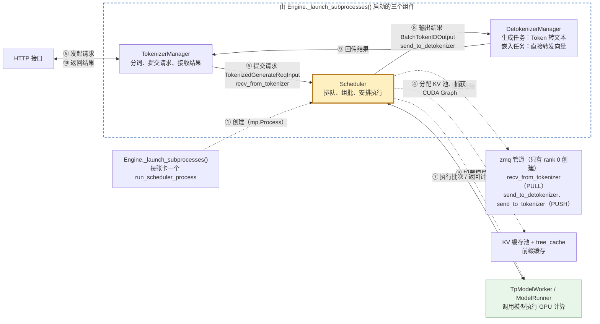
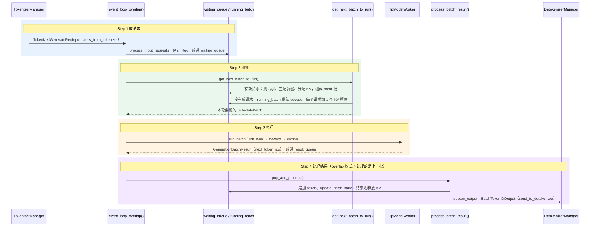
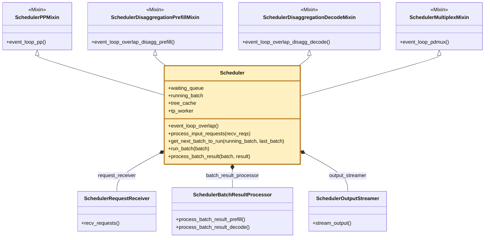

# 核心组件四：Scheduler

> **每张 GPU 一个 Scheduler 子进程：收请求、组批、调用模型执行、处理结果，并把新 token 发给 DetokenizerManager。**

## 1. 在核心链路中的位置

虚线是启动阶段（①–④），实线是请求处理链路（⑤–⑩）。

- **启动**：
  - ① Engine 按 `pp_rank × tp_rank` 为每张卡起一个 Scheduler 进程，入口是 [`run_scheduler_process`](../python/sglang/srt/managers/scheduler.py#L5386)。
  - ② [`init_ipc_channels`](../python/sglang/srt/managers/scheduler.py#L766)：只有 rank 0 创建管道，其他 rank 由 rank 0 广播请求。
  - ③④ [`init_model_worker`](../python/sglang/srt/managers/scheduler.py#L1031)：创建 TpModelWorker 并加载权重，再由 [`init_memory_pools`](../python/sglang/srt/managers/scheduler.py#L1004) 分配 KV 池，然后初始化注意力后端、捕获 CUDA Graph。
  - 最后 [`dispatch_event_loop`](../python/sglang/srt/managers/scheduler.py#L5287) 选主循环，默认是 `event_loop_overlap`。
- **要点**：
  - 一张 GPU 一个 Scheduler 进程；同一个 TP 组里的各个 rank 收到相同的请求，组出相同的批次，一起计算。
  - Scheduler 本身做 CPU 上的调度；GPU 计算由同一进程里的 TpModelWorker 和 ModelRunner 发起，是普通的函数调用，不走进程间通信。

### Scheduler 内部

```mermaid
flowchart LR
    TM["TokenizerManager"]
    DM["DetokenizerManager"]
    subgraph SP["Scheduler 进程（一张 GPU 一个）"]
        RR["SchedulerRequestReceiver<br/>recv_requests()"]
        PIR["process_input_requests()<br/>handle_generate_request()"]
        WQ["waiting_queue<br/>等待的请求"]
        RB["running_batch<br/>正在生成的请求"]
        G["get_next_batch_to_run()<br/>prefill 优先，否则 decode"]
        PA["PrefillAdder<br/>按预算逐个加入"]
        TC["tree_cache（RadixCache）<br/>前缀缓存"]
        POOL["KV 内存池<br/>req_to_token_pool / token_to_kv_pool_allocator"]
        RUN["run_batch()"]
        W["TpModelWorker<br/>init_new → forward → sample"]
        RQ["result_queue<br/>overlap：结果晚一轮处理"]
        PBR["process_batch_result()<br/>SchedulerBatchResultProcessor"]
        OS["SchedulerOutputStreamer<br/>stream_output()"]
    end
    TM -->|"① TokenizedGenerateReqInput<br/>recv_from_tokenizer"| RR
    RR -->|"② 按类型分发"| PIR
    PIR -->|"③ 创建 Req，入队"| WQ
    WQ -->|"④ 有新请求：组 prefill 批"| G
    RB -->|"⑤ 没有新请求：继续 decode"| G
    G <-->|"⑥ 匹配前缀"| TC
    G <-->|"⑦ 按预算逐个加入"| PA
    G -->|"⑧ 分配 KV 槽位"| POOL
    G -->|"⑨ 本轮 ScheduleBatch"| RUN
    RUN <-->|"⑩ 前向与采样"| W
    RUN -->|"⑪ 结果入队"| RQ
    RQ -->|"⑫ 下一轮取出"| PBR
    PBR -->|"⑬ 已结束：释放 KV，写入前缀缓存"| TC
    PBR -->|"⑭ 未结束：留在批次里继续 decode"| RB
    PBR -->|"⑮ 新 token"| OS
    OS -->|"⑯ BatchTokenIDOutput<br/>send_to_detokenizer"| DM
    style SP fill:none,stroke:#5684c4,stroke-width:2px,stroke-dasharray:6 4
    style W fill:#e8f5e9,stroke:#589765
    style PIR fill:#fff0c2,stroke:#b7791f,stroke-width:3px
    style G fill:#fff0c2,stroke:#b7791f,stroke-width:3px
    style RUN fill:#fff0c2,stroke:#b7791f,stroke-width:3px
    style PBR fill:#fff0c2,stroke:#b7791f,stroke-width:3px
```

- 编号对应主循环四步：①–③ 收请求，④–⑨ 组批，⑩–⑪ 执行，⑫–⑯ 处理结果；黄框是四步各自的入口方法。
- overlap 模式下，⑫ 要到下一轮才执行：本轮先下发 ⑩，再处理上一批的结果。
- 图中省略：显存不够时，`running_batch` 里的部分请求会退回 `waiting_queue`；太长的输入会分块，分几轮才做完 prefill。

## 2. 浅层时序图(Sequence Diagram)

- **Step 1 收请求**：详见[收请求](../python/sglang/srt/managers/scheduler.py.process_input_requests.md)。
  - [`recv_requests`](../python/sglang/srt/managers/scheduler_components/request_receiver.py#L76) 非阻塞地收一批消息；TP 大于 1 时由 rank 0 广播给其他 rank。
  - [`handle_generate_request`](../python/sglang/srt/managers/scheduler.py#L2511) 创建 [`Req`](../python/sglang/srt/managers/schedule_batch.py#L827)，再由 [`_add_request_to_queue`](../python/sglang/srt/managers/scheduler.py#L2902) 放进 `waiting_queue`。
- **Step 2 组批**：[`get_next_batch_to_run`](../python/sglang/srt/managers/scheduler.py#L3201)，详见[组批](../python/sglang/srt/managers/scheduler.py.get_next_batch_to_run.md)。
  - prefill 优先：等待队列里有能放进来的请求，就先组 prefill 批；上一轮做完 prefill 的请求并入 `running_batch`。
  - 挑请求：[`PrefillAdder`](../python/sglang/srt/managers/schedule_policy.py#L511) 按显存和 token 预算逐个加入；命中前缀缓存的部分不用重算，太长的输入分块处理。
  - decode：[`update_running_batch`](../python/sglang/srt/managers/scheduler.py#L3724) 每步给每个请求加 1 个 KV 槽位；显存不够时退回部分请求。
- **Step 3 执行**：[`run_batch`](../python/sglang/srt/managers/scheduler.py#L3870)，详见[执行与处理结果](../python/sglang/srt/managers/scheduler.py.run_batch.md)；TpModelWorker 和 ModelRunner 内部见[核心组件五](核心组件五：TpModelWorker与ModelRunner.md)。
  - [`forward_batch_generation`](../python/sglang/srt/managers/tp_worker.py#L598) 做三步：`ForwardBatch.init_new` → `model_runner.forward` → `model_runner.sample`。
  - overlap 模式下，下一轮的输入 token 先用占位值（FutureMap），结果异步拷回 CPU。
- **Step 4 处理结果**：[`process_batch_result`](../python/sglang/srt/managers/scheduler.py#L4212) 按 prefill / decode 交给 [`SchedulerBatchResultProcessor`](../python/sglang/srt/managers/scheduler_components/batch_result_processor.py#L79)。
  - 追加 token，用 [`update_finish_state`](../python/sglang/srt/managers/schedule_batch.py#L1654) 判断是否结束（停止词、结束符、最大长度）；结束就释放 KV，并把算过的内容写入前缀缓存。
  - [`stream_output`](../python/sglang/srt/managers/scheduler_components/output_streamer.py#L118) 组装 `BatchTokenIDOutput` 发给 Detokenizer，接上[核心组件三](核心组件三：DetokenizerManager.md)。
- **normal 和 overlap 的区别**：
  - [`event_loop_normal`](../python/sglang/srt/managers/scheduler.py#L1789)：每轮 `run_batch` 之后马上 `process_batch_result`，逻辑简单，但 GPU 要等 CPU 处理完。
  - [`event_loop_overlap`](../python/sglang/srt/managers/scheduler.py#L1824)（默认）：先下发本批，再处理上一批的结果，CPU 处理结果和 GPU 计算同时进行；代价是结果晚一轮处理。

## 3. 继承关系与职责

`class Scheduler(SchedulerDisaggregationDecodeMixin, SchedulerDisaggregationPrefillMixin, SchedulerMultiplexMixin, SchedulerPPMixin, SchedulerDllmMixin, SchedulerMlxOverlapMixin)`

| 类 | 职责 | 核心方法 | 说明 |
|---|---|---|---|
| [`Scheduler`](../python/sglang/srt/managers/scheduler.py#L396) | 主循环：收请求、组批、执行、处理结果 | `event_loop_overlap` / `event_loop_normal` | 默认走 overlap，由 `dispatch_event_loop` 选择 |
| - | - | `get_next_batch_to_run` | 决定这一轮跑 prefill 还是 decode，以及跑哪些请求 |
| - | - | `run_batch` / `process_batch_result` | 调用 TpModelWorker 执行，再处理结果 |
| 6 个 Mixin | 特殊部署方式下的主循环 | `event_loop_pp` 等 | PD 分离的 prefill / decode、流水线并行、多路复用、dLLM、MLX；默认路径都不用 |
| [`SchedulerRequestReceiver`](../python/sglang/srt/managers/scheduler_components/request_receiver.py#L49) | 从 TokenizerManager 收请求 | `recv_requests` | 非阻塞收取；TP 大于 1 时广播给其他 rank |
| [`SchedulerBatchResultProcessor`](../python/sglang/srt/managers/scheduler_components/batch_result_processor.py#L79) | 处理一批的结果 | `process_batch_result_prefill` / `process_batch_result_decode` | 追加 token、判断结束、释放 KV |
| [`SchedulerOutputStreamer`](../python/sglang/srt/managers/scheduler_components/output_streamer.py#L51) | 把新 token 发给 Detokenizer | `stream_output` | 按流式间隔决定发不发，组装 `BatchTokenIDOutput` |

- **为什么这样拆**：Mixin 放的是特殊部署方式下的另一套主循环，按特性分文件；`scheduler_components` 放从大类里拆出来的协作组件。`Scheduler` 属于代码量很大的中枢类，新逻辑优先放进这些组件，而不是继续往主文件里加。

## 术语与生词

| 术语或单词 | 中文释义 | 简明英文释义 |
|---|---|---|
| Scheduler /ˈskedʒuːlər/ | 调度器：决定每一轮让哪些请求上 GPU 计算 | The component that decides which requests run on the GPU each step. |
| Continuous Batching | 连续批处理：每轮都可以有请求加入或离开批次 | Batching where requests join and leave at every step. |
| Prefill /ˈpriːfɪl/ | 预填充：一次性处理输入，建立 KV 缓存 | Processing the whole input at once to build the KV cache. |
| Decode /diːˈkoʊd/ | 解码：每步为每个请求生成一个新 token | Generating one new token per request per step. |
| Overlap Scheduling | 重叠调度：CPU 处理上一批结果时，GPU 同时计算当前批 | Letting CPU result handling run while the GPU computes the next batch. |
| Retract /rɪˈtrækt/ | 退回：显存不够时把请求放回等待队列 | Moving a request back to the waiting queue when memory runs short. |
| Radix Cache | 基数树前缀缓存：多个请求共享相同前缀的 KV | A prefix tree that lets requests share KV for common prefixes. |

## 科普图

