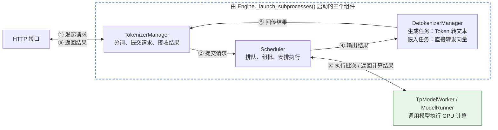

# 快速学习

## 方法学习指南

先讨论分析，帮助用户当下理解；用户明确要求落文档时，再整理讨论内容，供后续查阅。

1. 先讲清当前方法在核心链路中的位置，以下方「核心链路基础图」为底图扩充：
   - 保留原有节点、连线和样式，在相关节点旁补充当前方法及其直接上下游；用黄色粗框（`fill:#fff0c2,stroke:#b7791f,stroke-width:3px`）高亮当前方法。
   - 启动阶段的调用用虚线箭头，请求处理链路用实线箭头。
   - 连线标签按发生顺序用 ①②③… 编号：启动阶段先编号，请求处理链路接着往后编（例如启动占 ①–③，请求链路就从 ④ 开始），补充节点后序号随之顺延；双向连线在标签里分两行，上行写去程、下行写回程。完整示例见 [http_server.py._setup_and_run_http_server.md](python/sglang/srt/entrypoints/http_server.py._setup_and_run_http_server.md)。
2. 给方法加中文注释，说明它做什么；步骤较多时，在方法体内用 `【Step N】` 标出，与时序图的步骤对应。
3. 画浅层时序图(Sequence Diagram)：
   - 只展示直接交互的方法、实体及数据读写。
   - 按需用不同颜色和文字区分步骤，可以不拆分，步骤数量不限。
   - 图下紧跟一个无序列表作为阅读注释：每个步骤一个一级条目，细节用子列表写，说明对齐的代码、重点核对的数据或行为，以及图中省略的分支。
   - 图和注释中的命名、步骤标注尽量与代码一致。
4. 类有父类或 Mixin 时，讲清继承关系：
   - 画 Mermaid 类图（`classDiagram`），只列核心方法，当前类黄框高亮。
   - 图下用表格介绍各类，列为「类 / 职责 / 核心方法 / 说明」。
   - 每类最多 3 行，同类操作（如读和写）合成一行。
   - 续行的前两列填 `-`，单元格里不用 HTML，避免渲染错位。
   - 必要时补一两句设计原因，例如某项职责为什么放在这个类。

落文档时的章节结构：

- 章节从 1 开始编号：`## 1. 在核心链路中的位置`、`## 2. 浅层时序图(Sequence Diagram)`，有第 4 步时加 `## 3. 继承关系与职责`；阅读注释列表放在时序图下方，不单独成节。
- 末尾附不编号的「术语与生词」。
- 第 2 步的注释写在代码里，不在文档中单独成节。

### 核心链路基础图

## 文档存放与命名

- 文档开头直接呈现内容，不写“源码见……”“按本指南阅读……”等引导文字。
- 分析文档与对应代码文件放在同一目录。
- 文件名为 `代码文件名.方法名或类名.md`，例如 [engine.py._launch_subprocesses.md](python/sglang/srt/entrypoints/engine.py._launch_subprocesses.md)。
- 在对应方法或类的注释中放置分析文档的相对链接，方便从代码跳转阅读。

## 备注

我学习这个框架的快速学习心得：

1. 总体架构流程图，当前模块位置
2. 使用最简单的张量、向量例子来说明计算情况
3. 使用模型化科普图
4. 程序跑起来看日志
5. 有平静的时候让模型基于 学习上下文 提出改进意见
6. 先对 transformer 概念/架构 有一个总体的了解，信息来源可以是：douyin/B站 浅显的科普、论文、官方文档或者和chatgpt的聊天，建立起概念框架后在阅读代码，**不要通过代码拼凑整体概念，而是了解整体概念后取分析代码**。阅读某个代码模块同理，比如模型加载链路
7. 学习进度可视化、比如核心链路方法学了多少，了解当前要学习进度百分比// 待定，更多是心理鼓励
